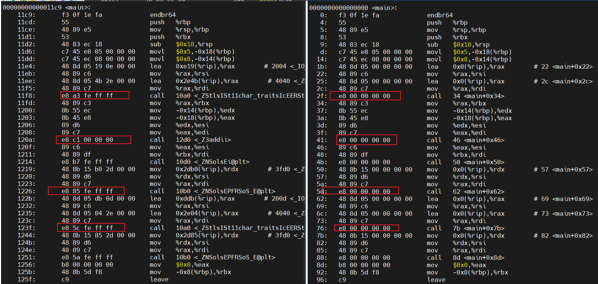
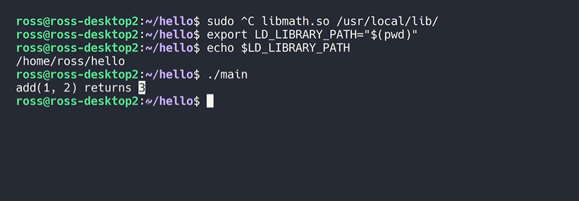
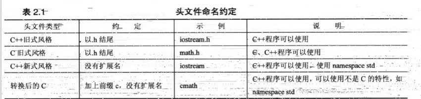

# NDK开发指南

## 第一章 c/c++编译

### 1.1 c/c++编译流程

**最基础四个编译步骤**

```shell
g++ -E main.cpp -o main.i // 预处理
g++ -S main.i -o main.s	// 编译
g++ -c main.s -o main.o	// 汇编
g++ main.o -o main // 链接
./main  // hello world
```

预处理：展开宏、头文件、条件编译、删除注释、空行、空白 

​	->生成main.i

编译：语法检查

​	->生成main.s 的汇编程序

汇编：汇编器（as）将hello.s翻译成机器语言指令，把这些指令打包成一种叫做**可重定位目标程序**的格式，并将结果	保存在目标文件hello.o中，hello.o是一个二进制文件。

ELF：Executable and Linkable Format （Linux）

PE：Portable Executable（Windows）

```
zjp@zjp:~/workspace/code/cplusplus$ file main.o
main.o: ELF 64-bit LSB relocatable, x86-64, version 1 (SYSV), not stripped
```

```
readelf -h main.o // 查看文件头部的可执行信息
```

```
objdump -s -d main.o // 查看反汇编指令

0000000000000000 <main>:
   0:   f3 0f 1e fa             endbr64
   4:   55                      push   %rbp
   5:   48 89 e5                mov    %rsp,%rbp
....
  2f:   e8 00 00 00 00          call   34 <main+0x34>
  34:   48 89 c3                mov    %rax,%rbx
...
  41:   e8 00 00 00 00          call   46 <main+0x46>
....

```

通过反汇编查看2f,41行对应的call指令，对应的就是add函数，但是跳转地址是0，这个0会在链接阶段被修正，

另外为了让连接器能定位到需要被修正的地址。在代码块中可以找到一张重定位表：

```
objdump -r main.o
RELOCATION RECORDS FOR [.text]:
OFFSET           TYPE              VALUE
000000000000001e R_X86_64_PC32     .rodata-0x0000000000000004
0000000000000028 R_X86_64_PC32     _ZSt4cout-0x0000000000000004
0000000000000030 R_X86_64_PLT32    _ZStlsISt11char_traitsIcEERSt13basic_ostreamIcT_ES5_PKc-0x0000000000000004
0000000000000042 R_X86_64_PLT32    _Z3addii-0x0000000000000004 add函数参数类型为两个int，偏移量42位置
```


链接：（ld）链接静态库或者动态库、数据段合并、地址回填生成可执行文件

```
g++ main.o math.o -o main	// 生成可执行文件
```

链接前后对比



所以链接其实就是将编译之后的所有目标文件连用用到的一些静态库、运行时库组合拼装成一个独立的可执行文件，其中就包括地址修正，ld连接器会根据我们的目标文件或者静态库中的重定位表，找到那些需要被重定位的函数，全局变量，修正地址。如果链接的时候忘记提供必须的目标文件，会报错“符号未定义”

#### 1.1.1 常用编译器


### 1.2 编译工具

#### 1.2.1 Makefile

Makefile实际上就是一颗依赖树，要构建一个目标就需要提供用到的一些节点文件，然后层层递归。

#### 1.2.2 CMake


### 1.3 动态链接库&静态链接库

#### 1.3.1 动态链接库

**什么是动态链接？**

>  我们知道静态链接会将编译产生的所有目标文件连同用到的各种库合并成一个独立的可执行文件，其中我们会去修正模块间函数的跳转地址，也可以叫做重定位，而动态链接实际上将链接的整个过程推迟到了程序加载的时候，比如我们去运行一个程序操作系统会首先将程序的数据代码连同它用到的一系列动态库先加载到内存，并且这个过程是递归的，比如我们的程序可能会用到一系列的动态库，而这些动态库有可能用到其他的动态库，其中每个动态库的加载地址都是不固定的，操作系统会根据当前地址空间的使用情况为他们动态分配一段内存，当动内裤被加载到内存以后，一旦它的内存地址被确定，我们就可以去修正动态库中的那些函数跳转地址了，也就是重定位C地址在程序加载之前不过只是一堆占位符而已，但这里有个问题有个问题，如果我们直接去修改代码段中的跳转地址，有一代码段的内容被修改，自然就不能被其他进程所共享了，因为我们需要在内存中保存多个不同的副本，这刚好与节约内存的目标就背道而驰了，那为了解决这个问题，动态链接采用了一种聪明的做法，不再修改代码段儿是在数据段中专门预留一片区域用来存放函数的调整励志，他也被叫做权力片表got里面专门用来存放全局变量和函数的跳转地址，于是我们在调用函数的时候会首先查表，然后根据表中的地址来进行跳转，这个地址在动态库加载的时候会被修改为真正的地址，而查表的过程也很容易实现，由于程序评选表与代码段的相对位置是固定的，我们完全可以利用CPU的相对选址来实现，有了全局偏移表，我们不再需要修改代码段，因此代码可以被所有进行共享。而全局边缘表虽然在每一个进程中保留一份副本，但由于占用空间很小，所以完全没有问题，采用这种方式实现的动态链接也被叫做PIC（地址无关代码）。换句话说我们的动态库不需要做任何修改，被加载到任意内存地址都能够正常运行，并且能够被所有进程共享，这也是为什么之前我们给编辑指定当fpsc参数的原因，另一方面由于动态链接在程序加载的时候，需要对大量函数进行重定位，追捕起来是非常耗时的，为了进一步降低开销，我们的操作系统还做了一些其他的优化，比如延迟绑定或者也叫pot，与其在程序开始就对所有函数进行重定位，不如将这个过程推迟到函数第1次被调用的时候，因为绝大多数动态库中的函数可能在程序运行期间一次都不会被使用到了，它的大概思路是qt中的跳转地址，默认会指向一段辅助代码，它也被叫做桩代码stub，在我们第1次调用函数的时候，这段代码会负责查询真正函数的跳转地址，并且是更新GPT表，于是我们再次调用函数的时候就会直接跳转到动态库中，真正的函数实现，当然具体的细节可能会稍微复杂一点，这里我们就不深入讨论了，总而言之动态链接实际上将链接的整个过程，比如符号查询地址的重定位，从编译时推迟到了程序的运行时，它虽然牺牲了一定的性能和程序加载时间，但绝对是无人所知的。因为动态链接能够更有效的利用磁盘空间和内存资源以及它方便的代码的更新和维护，更关键的是它实现了二进制级别的代码复用
>
> bilibili: https://www.bilibili.com/video/BV1vB4y1V7gR?spm_id_from=333.999.0.0&vd_source=22eb7196193d985ce5f7fbbceeb9c33b

下面这两个命令意思？

```
./main >/dev/null &
cat /proc/$!/maps
```


查看a.out需要用到的运行时库

```shell
zjp@zjp:~/workspace/code/cplusplus$ readelf -d a.out | grep NEEDED
 0x0000000000000001 (NEEDED)             共享库：[libstdc++.so.6]
 0x0000000000000001 (NEEDED)             共享库：[libc.so.6]
```

编译一个动态库

```shell
g++ -shared -fPIC math.cpp -o libmath.so
```

使用动态库

```c
g++ main.cpp -lmath -o main 	// -l 告诉链接器与libmath.so进行动态链接
/usr/bin/ld: 找不到 -lmath: 没有那个文件或目录
//**********************************************
注意 这个 -l 是有先后顺序的
 g++ -lmath -L./ main.cpp -o main // 这样编译是有问题的 
```

-l: 只能放到源文件后面

这里实际上是 /usr/bin/ld 目录下面去找有没有libmath.so 这个动态链接库 如何解决？

- 解决方式：指定`-L./`当前目录为搜索路径

运行可执行程序

```shell
./main
./main: error while loading shared libraries: libmath.so: cannot open shared object file: No such file or directory
```

某些时候我们编译没有问题，运行main程序的时候提示libmath.so找不到?

是因为Linux默认只会去`/usr/local/lib`下面去搜索这个so库

* 解决方式一：把这个libmath.so拷贝到系统的默认搜索目录
* 解决方式二：通过环境变量LD_LIBRARY_PATH指定动态库搜索路径



#### 1.3.2 静态链接库

什么是静态链接？

静态链接会将编译产生的所有目标文件及各种库合并形成一个独立的可执行文件，不需要额外依赖就可以运行，静态链接最大的问题在于生成的文件体积大，并且相当耗费内存资源（为啥耗费内存资源？）。比如很多程序都用到了libc.so，如果每一个程序都重复包含这个里面的大部分代码，会造成磁盘空间的浪费

### 1.4 交叉编译


## 第一章 C语言

## 第二章 C++语言

### 2.1 头文件

> C语言的传统是，头文件使用扩展名h，在C++里对老式的C头文件保留了扩展名h（c++程序仍然可以使用），C++头文件没有拓展名，有些C头文件被转换为C++头文件，这些文件被重新命名，去掉了扩展名h，并在文件名称前面加上前缀c（表明来自C语言），比如math.h->cmath
>
> 有时C头文件的C版本和C++版本先攻，而有时新版本做了一些修改。
>
> 对于纯粹的C++头文件，去掉h不只是形式上的变化，没有h的头文件也可以包含命名空间。



#### 2.1.1 名称空间

