# 深入理解Java虚拟机第三版

## 第二章 Java内存区域与内存溢出异常

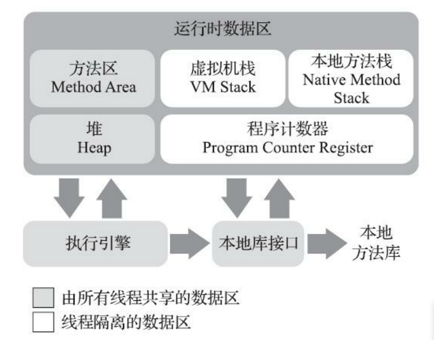

### 2.2.1 程序计数器

程序计数器（Program Counter Register）是一块较小的内存空间，它可以看作是当前线程所执行的字节码的行号指示器。它是程序控制流的指示器，分支、循环、跳转、异常处理、线程恢复等基础功能都需要依赖这个计数器来完成。

### 2.2.2 Java虚拟机栈

* 线程私有
* 生命周期与线程相同

描述的线程内存模型:	每个方法被执行的时候都会同步创建一个栈针, 用于存储局部变量表, 操作数栈, 动态链接, 方法出口等.

虚拟机栈内存区域规定了两类异常状况：如果线程请求的栈深度大于虚拟机所允许的深度，将抛出StackOverflowError异常；如果Java虚拟机栈容量可以动态扩展[2]，当栈扩 展时无法申请到足够的内存会抛出OutOfMemoryError异常。 (HotSpot虚拟机栈容量是不可以动态扩展的)

### 2.2.3 本地方发栈

用于执行Native方法,提供各种服务

### 2.2.4 堆

* 线程共享
* 虚拟机启动时创建

并非所有的实例都会在堆内存分配. 随着逃逸分析技术会让对象直接在栈上分配, 栈上分配的性能远大于堆上分配

### 2.2.5 方法区

方法区（Method Area）与Java堆一样，是各个线程共享的内存区域，它用于存储已被虚拟机加载 的类型信息、常量、静态变量、即时编译器编译后的代码缓存等数据。

**永久代?**

>说到方法区，不得不提一下“永久代”这个概念，尤其是在JDK 8以前，许多Java程序员都习惯在 HotSpot虚拟机上开发、部署程序，很多人都更愿意把方法区称呼为“永久代”（Permanent Generation），或将两者混为一谈。本质上这两者并不是等价的，因为仅仅是当时的HotSpot虚拟机设 计团队选择把收集器的分代设计扩展至方法区，或者说使用永久代来实现方法区而已，这样使得 HotSpot的垃圾收集器能够像管理Java堆一样管理这部分内存，省去专门为方法区编写内存管理代码的 工作。但是对于其他虚拟机实现，譬如BEA JRockit、IBM J9等来说，是不存在永久代的概念的。原则 上如何实现方法区属于虚拟机实现细节，不受《Java虚拟机规范》管束，并不要求统一。但现在回头 来看，当年使用永久代来实现方法区的决定并不是一个好主意，这种设计导致了Java应用更容易遇到 内存溢出的问题.
>
>考虑到HotSpot未来的发展，在JDK 6的 时候HotSpot开发团队就有放弃永久代，逐步改为采用本地内存（Native Memory）来实现方法区的计 划了[1]，到了JDK 7的HotSpot，已经把原本放在永久代的字符串常量池、静态变量等移出，而到了 JDK 8，终于完全废弃了永久代的概念，改用与JRockit、J9一样在本地内存中实现的元空间（Meta- space）来代替，把JDK 7中永久代还剩余的内容（主要是类型信息）全部移到元空间中。 

相对而言，垃圾收集行为在这个区域的 确是比较少出现的，但并非数据进入了方法区就如永久代的名字一样“永久”存在了。这区域的内存回 收目标主要是针对常量池的回收和对类型的卸载，一般来说这个区域的回收效果比较难令人满意，尤 其是类型的卸载，条件相当苛刻.

### 2.2.6 运行时常量池

运行时常量池（Runtime Constant Pool）是方法区的一部分。Class文件中除了有类的版本、字 段、方法、接口等描述信息外，还有一项信息是常量池表（Constant Pool Table），用于存放编译期生 成的各种字面量与符号引用，这部分内容将在类加载后存放到方法区的运行时常量池中。 

### 2.2.7 直接内存

它可以使用Native函数库直接分配堆外内存，然后通过一个存储在Java堆里面的 DirectByteBuffer对象作为这块内存的引用进行操作。这样能在一些场景中显著提高性能，因为避免了 在Java堆和Native堆中来回复制数据.	这说明这块区域虽然不受Java堆大小限制,但是会受到本机总内存限制

## 2.3 HotSpot虚拟机对象探秘

### 2.3.1 对象的创建

step1.当虚拟机遇到一条new指令时,首先会去根据指令参数看能否在常量池找到一个类的符号引用, 并检查这个符号代表的类是否被加载, 解析, 初始化过.如果没有则需要先执行相应的类加载过程.

step2.内存分配完后,会将分配到的内存空间全部初始化为0(不包括对象头)

step3.Java虚拟机对对象进行必要设置: 如何找到类的元数据信息,	对象的hash码,	偏向锁?, GC分代年龄, 这些信息会保存在对象头之中.

step4.到这里前三步对于虚拟机来说对象已经被创建好了,	但从Java程序视角来看并未完成,	这时<init>方法还未执行, Java编译器会对new生成两条指令: new和invokespecial, new完成前三步, invokespecial会调用对象的构造方法. 这时才算真正将对象创建出来.

**指针碰撞**	假设Java堆中内存是绝对规整的，所有被使用过的内存都被放在一 边，空闲的内存被放在另一边，中间放着一个指针作为分界点的指示器，那所分配内存就仅仅是把那 个指针向空闲空间方向挪动一段与对象大小相等的距离

**空闲列表**	但如果Java堆中的内存并不是规整的，已被使用的内存和空闲的内存相互交错在一起，那 就没有办法简单地进行指针碰撞了，虚拟机就必须维护一个列表，记录上哪些内存块是可用的，在分 配的时候从列表中找到一块足够大的空间划分给对象实例，并更新列表上的记录


由于对象的分配是很频繁的行为,	这种指针碰撞对象会引发线程安全问题, 那么如何解决这些问题呢?

- 一种是对分配内存空间的动作进行同步处理——实际上虚拟机是采用CAS配上失败 重试的方式保证更新操作的原子性
- 把内存分配的动作按照线程划分在不同的空间之中进 行，即每个线程在Java堆中预先分配一小块内存，称为本地线程分配缓冲（Thread Local Allocation Buffer，TLAB），哪个线程要分配内存，就在哪个线程的本地缓冲区中分配，只有本地缓冲区用完 了，分配新的缓存区时才需要同步锁定。

### 2.3.2 对象的内存布局

在HotSpot虚拟机里,对象在堆内存中的布局可以分为三部分:

- 对象头
  - 运行时数据
    - Hash码(25)
    - GC分代年龄(4),所以最大年龄是15
    - 锁状态标志,线程持有的锁,偏向线程ID,偏向时间戳
    - 如果是数组还存在数组长度的一块区域
  - 类型指针: 对象指向它的类型的元数据指针,用来确定对象是属于哪个类的实例.
- 实例数据
- 对齐填充:  非必然存在, 只起占位符的作用. 虚拟机内存管理系统要求对象是8字节的整数倍.

### 2.3.3 对象的访问定位

使用句柄池和直接指针访问

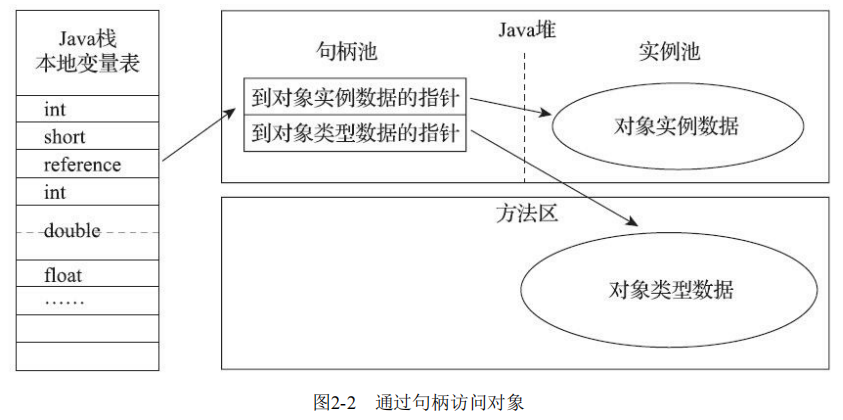

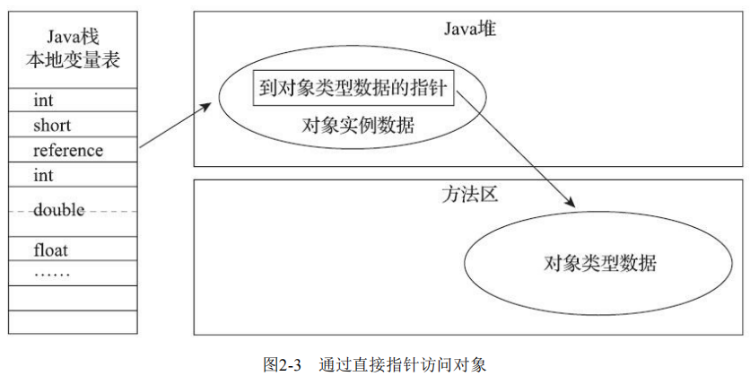

用句柄来访问的最大好处就是reference中存储的是稳定句柄地 址，在对象被移动（垃圾收集时移动对象是非常普遍的行为）时只会改变句柄中的实例数据指针，而 reference本身不需要被修改

使用直接指针来访问最大的好处就是速度更快，它节省了一次指针定位的时间开销，由于对象访 问在Java中非常频繁，因此这类开销积少成多也是一项极为可观的执行成本，(HotSpot采用直接指针)

## 2.4 内存溢出

### 2.4.2 虚拟机栈和本地方法栈溢出

- 如果线程请求的栈深度大于虚拟机所允许的最大深度，将抛出StackOverflowError异常。
- 如果虚拟机的栈内存允许动态扩展，当扩展栈容量无法申请到足够的内存时，将抛出 OutOfMemoryError异常。

**Windows平台的虚拟机中，Java的线程是映射到操作系统的内核线程上**


Q: 如果我们遇到创建多线程导致的OOM,在不能减少线程数的情况下如何换取更多的线程数?

A: 减少最大堆和减少栈容量


String.intern()

>String::intern()是一个本地方法，它的作用是如果字符串常量池中已经包含一个等于此String对象的 字符串，则返回代表池中这个字符串的String对象的引用；否则，会将此String对象包含的字符串添加 到常量池中，并且返回此String对象的引用。

从JDK1.7开始字符串常量池被移动到Java堆中;所以在如下的代码中几乎不会抛出OOM

```java
Set<String> set = new HashSet<>(1000000);
int i = 0;
while (true) {
    set.add(String.valueOf(i++).intern());
}
```

---

## 第3章 垃圾收集器与内存分配策略

## 3.2 如何判断对象已死?

### 3.2.1 引用计数算法

在对象中添加一个引用计数器，每当有一个地方 引用它时，计数器值就加一；当引用失效时，计数器值就减一；任何时刻计数器为零的对象就是不可 能再被使用的。

优点:

- 原理简单	判定效率高

缺点:

- 需要占用额外的空间进行引用计数
- 很难解决对象的相互循环引用问题

### 3.2.2 可达性分析算法 

通过 一系列称为“GC Roots”的根对象作为起始节点集，从这些节点开始，根据引用关系向下搜索，搜索过 程所走过的路径称为“引用链”（Reference Chain），如果某个对象到GC Roots间没有任何引用链相连， 或者用图论的话来说就是从GC Roots到这个对象不可达时，则证明此对象是不可能再被使用的。 

GC Roots 有哪些?

- 在虚拟机栈（栈帧中的本地变量表）中引用的对象，譬如各个线程被调用的方法堆栈中使用到的 参数、局部变量、临时变量等。 
- 在方法区中类静态属性引用的对象，譬如Java类的引用类型静态变量。
- 在方法区中常量引用的对象，譬如字符串常量池（String Table）里的引用。
- 在本地方法栈中JNI（即通常所说的Native方法）引用的对象。 
- Java虚拟机内部的引用，如基本数据类型对应的Class对象，一些常驻的异常对象（比如 NullPointExcepiton、OutOfMemoryError）等，还有系统类加载器。
- 所有被同步锁（synchronized关键字）持有的对象。
- 反映Java虚拟机内部情况的JMXBean、JVMTI中注册的回调、本地代码缓存等。

### 3.2.3 引用

* 强引用		Object o = new Object();  只要强引用关系存在, 虚拟机宁愿抛出OOM也不会回收
* 软引用        是用来描述一些还有用，但非必须的对象。只被软引用关联着的对象，在系统将要发生内 存溢出异常前，会把这些对象列进回收范围之中进行第二次回收，如果这次回收还没有足够的内存， 才会抛出内存溢出异常。
* 弱引用也是用来描述那些非必须对象，但是它的强度比软引用更弱一些，被弱引用关联的对象只 能生存到下一次垃圾收集发生为止。当垃圾收集器开始工作，无论当前内存是否足够，都会回收掉只 被弱引用关联的对象。
* 虚引用也称为“幽灵引用”或者“幻影引用”，它是最弱的一种引用关系。一个对象是否有虚引用的 存在，完全不会对其生存时间构成影响，也无法通过虚引用来取得一个对象实例。为一个对象设置虚 引用关联的唯一目的只是为了能在这个对象被收集器回收时收到一个系统通知。

### 3.2.4 是否回收?

要真正宣告一个对象死亡，至少要经历两次标记过程：如果对象在进行可达性分析后发现没 有与GC Roots相连接的引用链，那它将会被第一次标记，随后进行一次筛选，筛选的条件是此对象是 否有必要执行finalize()方法。假如对象没有覆盖finalize()方法，或者finalize()方法已经被虚拟机调用 过，那么虚拟机将这两种情况都视为“没有必要执行”。 		也就是说第一次被标记, 第二次筛选后就会回收; 任何一个对象的finalize()方法都只会被执行一次

### 3.2.5 回收方法区

方法区的垃圾收集主要回收两部分内容：废弃的常量和不再使用的类型。

回收不再使用的类型需同时具备一下三个条件:

- 该类所有的实例都已经被回收，也就是Java堆中不存在该类及其任何派生子类的实例。
- 加载该类的类加载器已经被回收，这个条件除非是经过精心设计的可替换类加载器的场景，如 OSGi、JSP的重加载等，否则通常是很难达成的。 
- 该类对应的java.lang.Class对象没有在任何地方被引用，无法在任何地方通过反射访问该类的方法

## 3.3 垃圾回收算法

垃圾收集类型

- 新生代收集（Minor GC/Young GC）：指目标只是新生代的垃圾收集。 

- 老年代收集（Major GC/Old GC）：指目标只是老年代的垃圾收集。目前只有CMS收集器会有单 独收集老年代的行为。另外请注意“Major GC”这个说法现在有点混淆，在不同资料上常有不同所指， 读者需按上下文区分到底是指老年代的收集还是整堆收集。 

- 混合收集（Mixed GC）：指目标是收集整个新生代以及部分老年代的垃圾收集。目前只有G1收集器会有这种行为。 ·整堆收集（Full GC）：收集整个Java堆和方法区的垃圾收集。

### 3.3.2 标记-清除算法 

算法分为“标记”和“清除”两个阶段：首先标记出所有需要回 收的对象，在标记完成后，统一回收掉所有被标记的对象，也可以反过来，标记存活的对象，统一回 收所有未被标记的对象。很多的垃圾回收算法都是以该算法为基础的。

缺点:

- 执行效率不稳定——标记和清除的执行效率会随着对象数的增加而降低
- 内存空间碎片化问题——标记清除后会产生大量内存碎片；会导致大对象在分配空间时无法找到合适位置而再次触发GC

### 3.3.3 标记-复制算法

将可用 内存按容量划分为大小相等的两块，每次只使用其中的一块。当这一块的内存用完了，就将还存活着 的对象复制到另外一块上面，然后再把已使用过的内存空间一次清理掉。

优点：

- 没有内存碎片，分配效率高

缺点：

- 浪费了一半内存空间

HotSpot虚拟机默认Eden和Survivor的大小比例是8∶1，也即每次新生代中可用内存空间为整个新 生代容量的90%（Eden的80%加上一个Survivor的10%），只有一个Survivor空间，即10%的新生代是会 被“浪费”的。当Survivor空间不足以容纳一次Minor GC之后存活的对象时，就需要依赖其他内存区域（实 际上大多就是老年代）进行分配担保（Handle Promotion）。 

### 3.3.4 标记-整理算法 

标记-复制算法在对象存活率较高时就要进行较多的复制操作，效率将会降低。更关键的是，如果 不想浪费50%的空间，就需要有额外的空间进行分配担保，以应对被使用的内存中所有对象都100%存 活的极端情况，所以在老年代一般不能直接选用这种算法。 

标记过程仍然与“标记-清除”算法一样，但后续步骤不是直接对可 回收对象进行清理，而是让所有存活的对象都向内存空间一端移动，然后直接清理掉边界以外的内存

移动则内存回收时会更复杂，不移动则内存分配时会更复杂。

## 3.4 HotSpot的算法细节实现

## 3.5 经典垃圾收集器 

### 3.5.1 Serial收集器

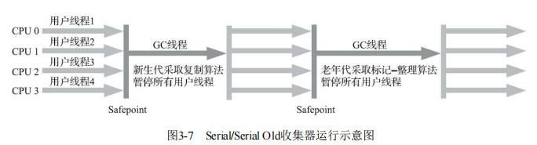

* 简单而高效（与其他收集器的单线程相比）
* 单核或者核心数较少时, 没有线程交互的开销
* 额外内存消耗最小

### 3.5.2 ParNew收集器 

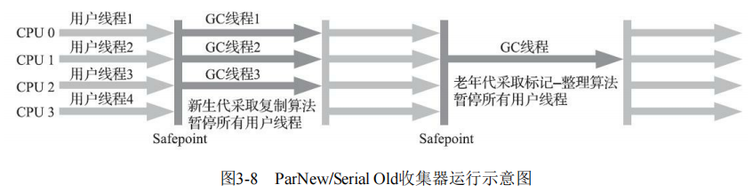

ParNew收集器实质上是Serial收集器的多线程并行版本	ParNew收集器在单核心处理器的环境中绝对不会有比Serial收集器更好的效果

### 3.5.3 Parallel Scavenge收集器 

特点:

1. 标记-复制

2. 关注吞吐量

吞吐量= 运行用户代码时间/运行用户代码时间 + 垃圾收集的时间；例如：99/99 + 1 = 99%

### 3.5.4 Serial Old收集器

特点：

1. 标记-整理

### 3.5.5 Parallel Old收集器

特点：

1. 标记-整理
2. 支持多线程并发收集

### 3.5.6 CMS收集器

特点：

1. 标记-清除
2. 以获取最短回收停顿时间为目标的收集器。
3. 并发收集、低停顿

缺点：

1. 会占用一部分线程资源，使程序变慢。核心数大于4垃圾收集的线程资源占用百分比会减小（CMS默认启动的回收线程数是（处理器核心数量 +3）/4
2. 浮动垃圾：并发清理阶段用户线程会不断产生新垃圾，而这部分是无法在这一次垃圾回收里面清理掉
3. 因为是标记清除，所以会产生空间碎片。会在FullGC前会进行碎片整理

垃圾收集四个步骤：

1）初始标记（CMS initial mark） 初始标记仅仅只是标记一下GCRoots能直接关联到的对象，速度很快

2）并发标记（CMS concurrent mark） 并发标记阶段就是从GC Roots的直接关联对象开始遍历整个对象图的过程，这个过程耗时较长但是不需要停顿用户线程，可以与垃圾收集线程一起并发运行

3）重新标记（CMS remark） 而重 新标记阶段则是为了修正并发标记期间，因用户程序继续运作而导致标记产生变动的那一部分对象的标记记录，这个阶段的停顿时间通常会比初始标记阶段稍长一 些，但也远比并发标记阶段的时间短

4）并发清除（CMS concurrent sweep）清理删除掉标记阶段判断的已经死亡的 对象，由于不需要移动存活对象，所以这个阶段也是可以与用户线程同时并发的。 

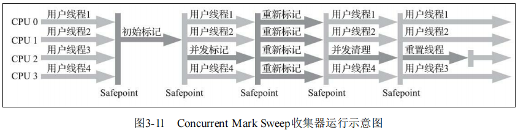


增量式并发收集器（了解即可）

> 并发标记、清理的时候让收集器线程、用户线程交替运行，尽量减少垃圾收集线程的独占资源的时间，这样整个垃圾收集的过程会更长，但对用户程序的影响就会显得较少一些，直观感受是速度变 慢的时间更多了，但速度下降幅度就没有那么明显。

### 3.5.7 Garbage First（G1）收集器 

G1与CMS比较：

**优势：**

* 可以指定最大停顿时间
* 分Region的内存布局
* 按收益动态确定回收集

G1从整体来看是基于“标记-整理”算法实现的收集器，但从局部（两个Region之间）上看又是基于“标记-复制”算法


**劣势：**

- 在用户程序运行过程 中，G1无论是为了垃圾收集产生的内存占用Footprint）还是程序运行时的额外执行负载 （Overload）都要比CMS要高。 
- G1用的卡表处理跨代指针，但是比CMS更加复杂，内存占用会更多
- G1收集器要比其他的传统垃 圾收集器有着更高的内存占用负担。根据经验，G1至少要耗费大约相当于Java堆容量10%至20%的额 外内存来维持收集器工作。 

总结：以上的优缺点对比仅仅是针对G1和CMS两款垃圾收集器单独某方面的实现细节的定性分析，通常 我们说哪款收集器要更好、要好上多少，往往是针对具体场景才能做的定量比较。按照笔者的实践经 验，目前在小内存应用上CMS的表现大概率仍然要会优于G1，而在大内存应用上G1则大多能发挥其 优势，这个优劣势的Java堆容量平衡点通常在6GB至8GB之间，当然，以上这些也仅是经验之谈，不 同应用需要量体裁衣地实际测试才能得出最合适的结论，随着HotSpot的开发者对G1的不断优化，也 会让对比结果继续向G1倾斜。 


## 3.6 低延迟垃圾收集器

衡量垃圾收集器的三项最重要的指标是：内存占用（Footprint）、吞吐量（Throughput）和延迟 （Latency），三者共同构成了一个“不可能三角[1]”。

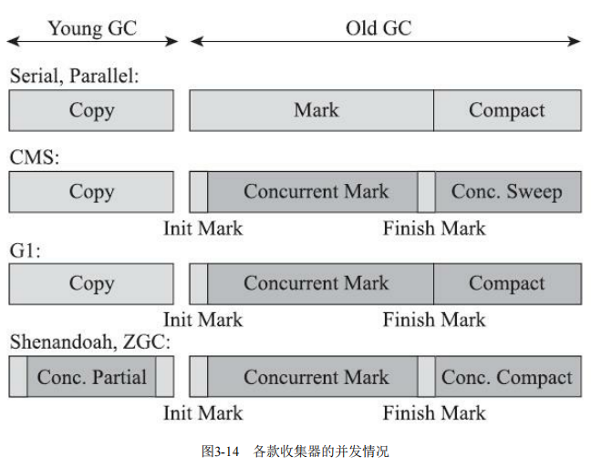

*浅色阶段表示必须挂起用户线程，深色表示收集器线程与用户线程是并发工作的。

### 3.6.1 Shenandoah收集器 

OpenJDK 12才有 而OracleJDK 一直在排挤

### 3.6.2 ZGC收集器

* 低延迟

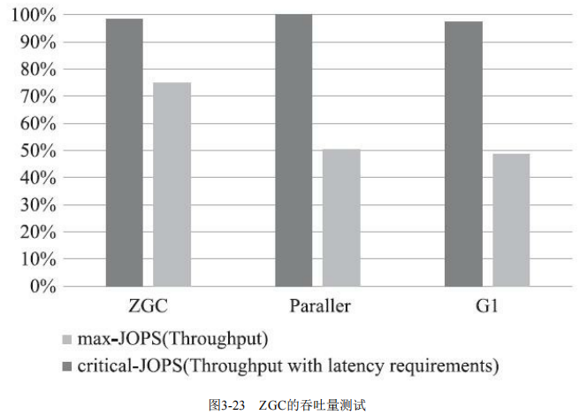


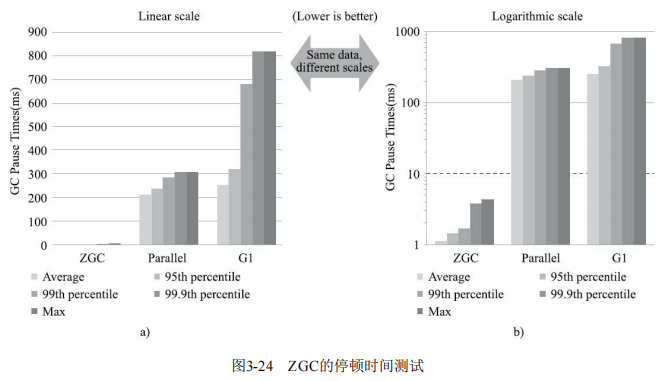

---

## 第4章 虚拟机性能监控、故障处理工具

### 4.2.7 基础工具总结

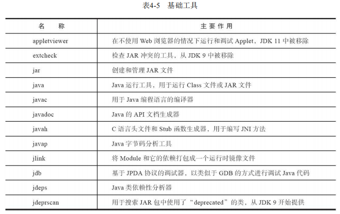

## 第6章 类文件结构 

“计算机只认识0和1，所以我们写的程序需要被编译 器翻译成由0和1构成的二进制格式才能被计算机执行。”十多年过去了，今天的计算机仍然只能识别0 和1，但由于最近十年内虚拟机以及大量建立在虚拟机之上的程序语言如雨后春笋般出现并蓬勃发展， 把我们编写的程序编译成二进制本地机器码（Native Code）已不再是唯一的选择，越来越多的程序语 言选择了与操作系统和机器指令集无关的、平台中立的格式作为程序编译后的存储格式。

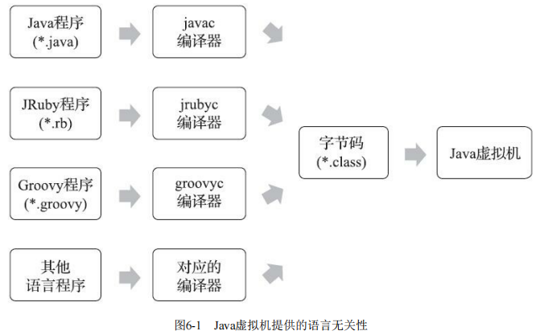

## 6.3 Class类文件的结构

任何一个Class文件都对应着唯一的一个类或接口的定义信息[1]，但是反过来说，类或 接口并不一定都得定义在文件里（譬如类或接口也可以动态生成，直接送入类加载器中）。

Class文件是一组以8个字节为基础单位的二进制流，各个数据项目严格按照顺序紧凑地排列在文 件之中，中间没有添加任何分隔符，这使得整个Class文件中存储的内容几乎全部是程序运行的必要数 据，没有空隙存在。当遇到需要占用8个字节以上空间的数据项时，则会按照高位在前[2]的方式分割 成若干个8个字节进行存储。 

根据《Java虚拟机规范》的规定，Class文件格式采用一种类似于C语言结构体的伪结构来存储数 据，这种伪结构中只有两种数据类型：“无符号数”和“表”。

- 无符号数属于基本的数据类型，以u1、u2、u4、u8来分别代表1个字节、2个字节、4个字节和8个 字节的无符号数，无符号数可以用来描述数字、索引引用、数量值或者按照UTF-8编码构成字符串 值。
- 表是由多个无符号数或者其他表作为数据项构成的复合数据类型，为了便于区分，所有表的命名 都习惯性地以“_info”结尾。表用于描述有层次关系的复合结构的数据，整个Class文件本质上也可以视 作是一张表，这张表由表6-1所示的数据项按严格顺序排列构成。 

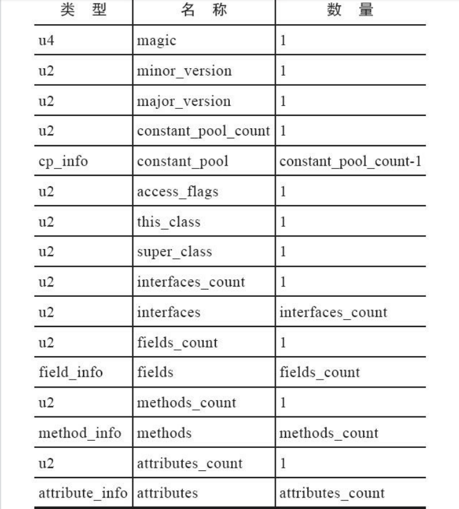

### 6.3.1 魔数与Class文件的版本

魔数：唯一作用是确定这个文件是否为 一个能被虚拟机接受的Class文件。不仅是Class文件，很多文件格式标准中都有使用魔数来进行身份识 别的习惯，譬如图片格式，如GIF或者JPEG等在文件头中都存有魔数。使用魔数而不是扩展名来进行识别主要是基于安全考虑，因为文件扩展名可以随意改动。

次版本号，主版本号：告诉虚拟机当前的可以被JDK几版本以上的虚拟机执行。

### 6.3.2 常量池 

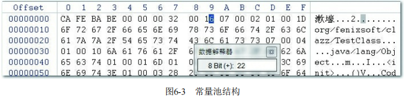

常量池中主要存放两大类常量：

- 字面量（Literal）
  - 文本字符串
  - 被声明为final的常量值

- 符号引用（Symbolic References）。

  - 被模块导出或者开放的包（Package） 
  - 类和接口的全限定名（Fully Qualified Name） 

  - 字段的名称和描述符（Descriptor） 

  - 方法的名称和描述符 

  - 方法句柄和方法类型（Method Handle、Method Type、Invoke Dynamic） 

  - 动态调用点和动态常量（Dynamically-Computed Call Site、Dynamically-Computed Constant）

  

  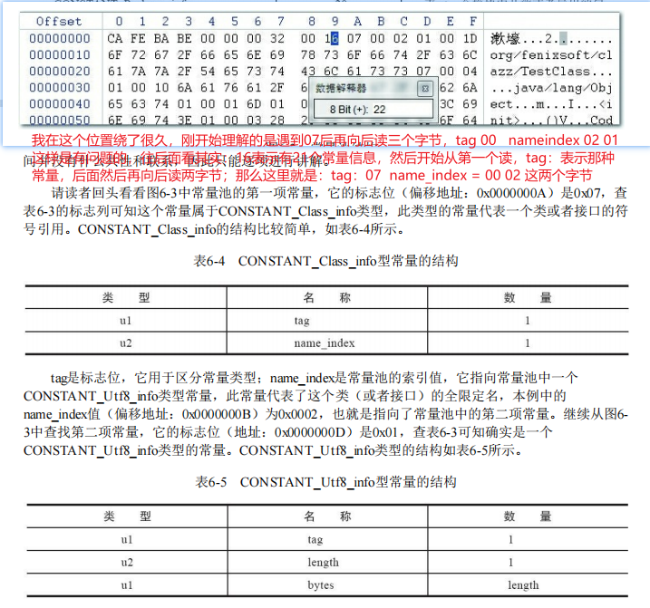![]

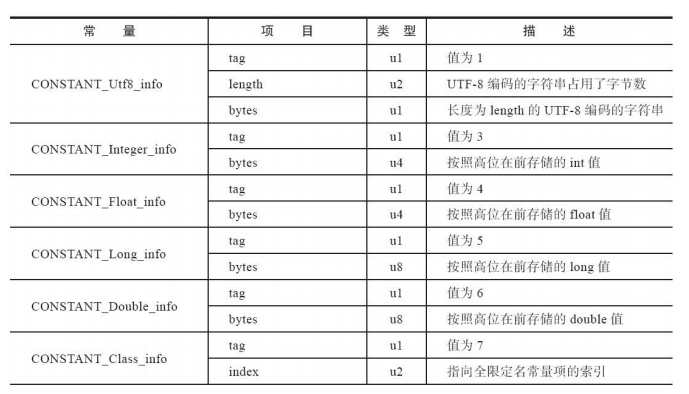

通过javap反编译得到如下结构：

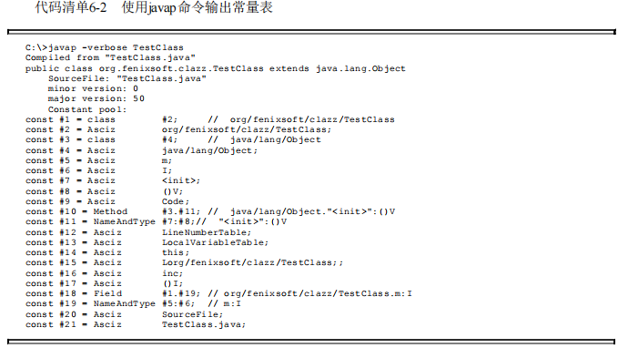

方法签名标识符：

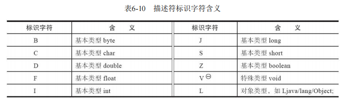

### 6.3.6 方法表结构


## 第7章 虚拟机类加载机制


## 第8章 虚拟机字节码执行引擎 


## 第9章 类加载及执行子系统的案例与实战