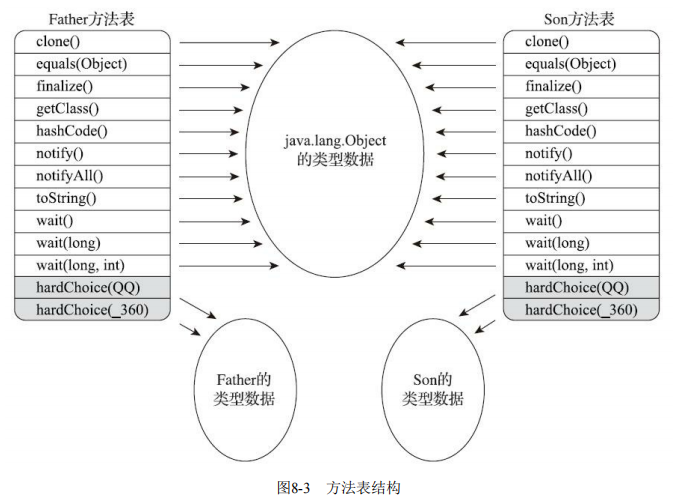
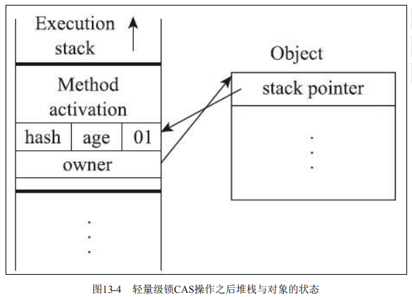

# 深入理解Java虚拟机第三版

## 第二章 Java内存区域与内存溢出异常


### 2.2.1 程序计数器

程序计数器（Program Counter Register）是一块较小的内存空间，它可以看作是当前线程所执行的字节码的行号指示器。它是程序控制流的指示器，分支、循环、跳转、异常处理、线程恢复等基础功能都需要依赖这个计数器来完成。

### 2.2.2 Java虚拟机栈

* 线程私有
* 生命周期与线程相同

描述的线程内存模型:	每个方法被执行的时候都会同步创建一个栈针, 用于存储局部变量表, 操作数栈, 动态链接, 方法出口等.

虚拟机栈内存区域规定了两类异常状况：如果线程请求的栈深度大于虚拟机所允许的深度，将抛出StackOverflowError异常；如果Java虚拟机栈容量可以动态扩展[2]，当栈扩 展时无法申请到足够的内存会抛出OutOfMemoryError异常。 (HotSpot虚拟机栈容量是不可以动态扩展的)

### 2.2.3 本地方发栈

用于执行Native方法,提供各种服务

### 2.2.4 堆

* 线程共享
* 虚拟机启动时创建

并非所有的实例都会在堆内存分配. 随着逃逸分析技术会让对象直接在栈上分配, 栈上分配的性能远大于堆上分配

### 2.2.5 方法区

方法区（Method Area）与Java堆一样，是各个线程共享的内存区域，它用于存储已被虚拟机加载 的类型信息、常量、静态变量、即时编译器编译后的代码缓存等数据。

**永久代?**

>说到方法区，不得不提一下“永久代”这个概念，尤其是在JDK 8以前，许多Java程序员都习惯在 HotSpot虚拟机上开发、部署程序，很多人都更愿意把方法区称呼为“永久代”（Permanent Generation），或将两者混为一谈。本质上这两者并不是等价的，因为仅仅是当时的HotSpot虚拟机设 计团队选择把收集器的分代设计扩展至方法区，或者说使用永久代来实现方法区而已，这样使得 HotSpot的垃圾收集器能够像管理Java堆一样管理这部分内存，省去专门为方法区编写内存管理代码的 工作。但是对于其他虚拟机实现，譬如BEA JRockit、IBM J9等来说，是不存在永久代的概念的。原则 上如何实现方法区属于虚拟机实现细节，不受《Java虚拟机规范》管束，并不要求统一。但现在回头 来看，当年使用永久代来实现方法区的决定并不是一个好主意，这种设计导致了Java应用更容易遇到 内存溢出的问题.
>
>考虑到HotSpot未来的发展，在JDK 6的 时候HotSpot开发团队就有放弃永久代，逐步改为采用本地内存（Native Memory）来实现方法区的计 划了[1]，到了JDK 7的HotSpot，已经把原本放在永久代的字符串常量池、静态变量等移出，而到了 JDK 8，终于完全废弃了永久代的概念，改用与JRockit、J9一样在本地内存中实现的元空间（Meta- space）来代替，把JDK 7中永久代还剩余的内容（主要是类型信息）全部移到元空间中。 

相对而言，垃圾收集行为在这个区域的 确是比较少出现的，但并非数据进入了方法区就如永久代的名字一样“永久”存在了。这区域的内存回 收目标主要是针对常量池的回收和对类型的卸载，一般来说这个区域的回收效果比较难令人满意，尤 其是类型的卸载，条件相当苛刻.

### 2.2.6 运行时常量池

运行时常量池（Runtime Constant Pool）是方法区的一部分。Class文件中除了有类的版本、字 段、方法、接口等描述信息外，还有一项信息是常量池表（Constant Pool Table），用于存放编译期生 成的各种字面量与符号引用，这部分内容将在类加载后存放到方法区的运行时常量池中。 

### 2.2.7 直接内存

它可以使用Native函数库直接分配堆外内存，然后通过一个存储在Java堆里面的 DirectByteBuffer对象作为这块内存的引用进行操作。这样能在一些场景中显著提高性能，因为避免了 在Java堆和Native堆中来回复制数据.	这说明这块区域虽然不受Java堆大小限制,但是会受到本机总内存限制

## 2.3 HotSpot虚拟机对象探秘

### 2.3.1 对象的创建

step1.当虚拟机遇到一条new指令时,首先会去根据指令参数看能否在常量池找到一个类的符号引用, 并检查这个符号代表的类是否被加载, 解析, 初始化过.如果没有则需要先执行相应的类加载过程.

step2.内存分配完后,会将分配到的内存空间全部初始化为0(不包括对象头)

step3.Java虚拟机对对象进行必要设置: 如何找到类的元数据信息,	对象的hash码,	偏向锁?, GC分代年龄, 这些信息会保存在对象头之中.

step4.到这里前三步对于虚拟机来说对象已经被创建好了,	但从Java程序视角来看并未完成,	这时<init>方法还未执行, Java编译器会对new生成两条指令: new和invokespecial, new完成前三步, invokespecial会调用对象的构造方法. 这时才算真正将对象创建出来.

**指针碰撞**	假设Java堆中内存是绝对规整的，所有被使用过的内存都被放在一 边，空闲的内存被放在另一边，中间放着一个指针作为分界点的指示器，那所分配内存就仅仅是把那 个指针向空闲空间方向挪动一段与对象大小相等的距离

**空闲列表**	但如果Java堆中的内存并不是规整的，已被使用的内存和空闲的内存相互交错在一起，那 就没有办法简单地进行指针碰撞了，虚拟机就必须维护一个列表，记录上哪些内存块是可用的，在分 配的时候从列表中找到一块足够大的空间划分给对象实例，并更新列表上的记录


由于对象的分配是很频繁的行为,	这种指针碰撞对象会引发线程安全问题, 那么如何解决这些问题呢?

- 一种是对分配内存空间的动作进行同步处理——实际上虚拟机是采用CAS配上失败 重试的方式保证更新操作的原子性
- 把内存分配的动作按照线程划分在不同的空间之中进 行，即每个线程在Java堆中预先分配一小块内存，称为本地线程分配缓冲（Thread Local Allocation Buffer，TLAB），哪个线程要分配内存，就在哪个线程的本地缓冲区中分配，只有本地缓冲区用完 了，分配新的缓存区时才需要同步锁定。

### 2.3.2 对象的内存布局

在HotSpot虚拟机里,对象在堆内存中的布局可以分为三部分:

- 对象头
  - 运行时数据
    - Hash码(25)
    - GC分代年龄(4),所以最大年龄是15
    - 锁状态标志,线程持有的锁,偏向线程ID,偏向时间戳
    - 如果是数组还存在数组长度的一块区域
  - 类型指针: 对象指向它的类型的元数据指针,用来确定对象是属于哪个类的实例.
- 实例数据
- 对齐填充:  非必然存在, 只起占位符的作用. 虚拟机内存管理系统要求对象是8字节的整数倍.

### 2.3.3 对象的访问定位

使用句柄池和直接指针访问


用句柄来访问的最大好处就是reference中存储的是稳定句柄地 址，在对象被移动（垃圾收集时移动对象是非常普遍的行为）时只会改变句柄中的实例数据指针，而 reference本身不需要被修改

使用直接指针来访问最大的好处就是速度更快，它节省了一次指针定位的时间开销，由于对象访 问在Java中非常频繁，因此这类开销积少成多也是一项极为可观的执行成本，(HotSpot采用直接指针)

## 2.4 内存溢出

### 2.4.2 虚拟机栈和本地方法栈溢出

- 如果线程请求的栈深度大于虚拟机所允许的最大深度，将抛出StackOverflowError异常。
- 如果虚拟机的栈内存允许动态扩展，当扩展栈容量无法申请到足够的内存时，将抛出 OutOfMemoryError异常。

**Windows平台的虚拟机中，Java的线程是映射到操作系统的内核线程上**


Q: 如果我们遇到创建多线程导致的OOM,在不能减少线程数的情况下如何换取更多的线程数?

A: 减少最大堆和减少栈容量


String.intern()

>String::intern()是一个本地方法，它的作用是如果字符串常量池中已经包含一个等于此String对象的 字符串，则返回代表池中这个字符串的String对象的引用；否则，会将此String对象包含的字符串添加 到常量池中，并且返回此String对象的引用。

从JDK1.7开始字符串常量池被移动到Java堆中;所以在如下的代码中几乎不会抛出OOM

```java
Set<String> set = new HashSet<>(1000000);
int i = 0;
while (true) {
    set.add(String.valueOf(i++).intern());
}
```

---

## 第3章 垃圾收集器与内存分配策略

## 3.2 如何判断对象已死?

### 3.2.1 引用计数算法

在对象中添加一个引用计数器，每当有一个地方 引用它时，计数器值就加一；当引用失效时，计数器值就减一；任何时刻计数器为零的对象就是不可 能再被使用的。

优点:

- 原理简单	判定效率高

缺点:

- 需要占用额外的空间进行引用计数
- 很难解决对象的相互循环引用问题

### 3.2.2 可达性分析算法 

通过 一系列称为“GC Roots”的根对象作为起始节点集，从这些节点开始，根据引用关系向下搜索，搜索过 程所走过的路径称为“引用链”（Reference Chain），如果某个对象到GC Roots间没有任何引用链相连， 或者用图论的话来说就是从GC Roots到这个对象不可达时，则证明此对象是不可能再被使用的。 

GC Roots 有哪些?

- 在虚拟机栈（栈帧中的本地变量表）中引用的对象，譬如各个线程被调用的方法堆栈中使用到的 参数、局部变量、临时变量等。 
- 在方法区中类静态属性引用的对象，譬如Java类的引用类型静态变量。
- 在方法区中常量引用的对象，譬如字符串常量池（String Table）里的引用。
- 在本地方法栈中JNI（即通常所说的Native方法）引用的对象。 
- Java虚拟机内部的引用，如基本数据类型对应的Class对象，一些常驻的异常对象（比如 NullPointExcepiton、OutOfMemoryError）等，还有系统类加载器。
- 所有被同步锁（synchronized关键字）持有的对象。
- 反映Java虚拟机内部情况的JMXBean、JVMTI中注册的回调、本地代码缓存等。

### 3.2.3 引用

* 强引用		Object o = new Object();  只要强引用关系存在, 虚拟机宁愿抛出OOM也不会回收
* 软引用        是用来描述一些还有用，但非必须的对象。只被软引用关联着的对象，在系统将要发生内 存溢出异常前，会把这些对象列进回收范围之中进行第二次回收，如果这次回收还没有足够的内存， 才会抛出内存溢出异常。
* 弱引用也是用来描述那些非必须对象，但是它的强度比软引用更弱一些，被弱引用关联的对象只 能生存到下一次垃圾收集发生为止。当垃圾收集器开始工作，无论当前内存是否足够，都会回收掉只 被弱引用关联的对象。
* 虚引用也称为“幽灵引用”或者“幻影引用”，它是最弱的一种引用关系。一个对象是否有虚引用的 存在，完全不会对其生存时间构成影响，也无法通过虚引用来取得一个对象实例。为一个对象设置虚 引用关联的唯一目的只是为了能在这个对象被收集器回收时收到一个系统通知。

### 3.2.4 是否回收?

要真正宣告一个对象死亡，至少要经历两次标记过程：如果对象在进行可达性分析后发现没 有与GC Roots相连接的引用链，那它将会被第一次标记，随后进行一次筛选，筛选的条件是此对象是 否有必要执行finalize()方法。假如对象没有覆盖finalize()方法，或者finalize()方法已经被虚拟机调用 过，那么虚拟机将这两种情况都视为“没有必要执行”。 		也就是说第一次被标记, 第二次筛选后就会回收; 任何一个对象的finalize()方法都只会被执行一次

### 3.2.5 回收方法区

方法区的垃圾收集主要回收两部分内容：废弃的常量和不再使用的类型。

回收不再使用的类型需同时具备一下三个条件:

- 该类所有的实例都已经被回收，也就是Java堆中不存在该类及其任何派生子类的实例。
- 加载该类的类加载器已经被回收，这个条件除非是经过精心设计的可替换类加载器的场景，如 OSGi、JSP的重加载等，否则通常是很难达成的。 
- 该类对应的java.lang.Class对象没有在任何地方被引用，无法在任何地方通过反射访问该类的方法

## 3.3 垃圾回收算法

垃圾收集类型

- 新生代收集（Minor GC/Young GC）：指目标只是新生代的垃圾收集。 

- 老年代收集（Major GC/Old GC）：指目标只是老年代的垃圾收集。目前只有CMS收集器会有单 独收集老年代的行为。另外请注意“Major GC”这个说法现在有点混淆，在不同资料上常有不同所指， 读者需按上下文区分到底是指老年代的收集还是整堆收集。 

- 混合收集（Mixed GC）：指目标是收集整个新生代以及部分老年代的垃圾收集。目前只有G1收集器会有这种行为。 ·整堆收集（Full GC）：收集整个Java堆和方法区的垃圾收集。

### 3.3.2 标记-清除算法 

算法分为“标记”和“清除”两个阶段：首先标记出所有需要回 收的对象，在标记完成后，统一回收掉所有被标记的对象，也可以反过来，标记存活的对象，统一回 收所有未被标记的对象。很多的垃圾回收算法都是以该算法为基础的。

缺点:

- 执行效率不稳定——标记和清除的执行效率会随着对象数的增加而降低
- 内存空间碎片化问题——标记清除后会产生大量内存碎片；会导致大对象在分配空间时无法找到合适位置而再次触发GC

### 3.3.3 标记-复制算法

将可用 内存按容量划分为大小相等的两块，每次只使用其中的一块。当这一块的内存用完了，就将还存活着 的对象复制到另外一块上面，然后再把已使用过的内存空间一次清理掉。

优点：

- 没有内存碎片，分配效率高

缺点：

- 浪费了一半内存空间

HotSpot虚拟机默认Eden和Survivor的大小比例是8∶1，也即每次新生代中可用内存空间为整个新 生代容量的90%（Eden的80%加上一个Survivor的10%），只有一个Survivor空间，即10%的新生代是会 被“浪费”的。当Survivor空间不足以容纳一次Minor GC之后存活的对象时，就需要依赖其他内存区域（实 际上大多就是老年代）进行分配担保（Handle Promotion）。 

### 3.3.4 标记-整理算法 

标记-复制算法在对象存活率较高时就要进行较多的复制操作，效率将会降低。更关键的是，如果 不想浪费50%的空间，就需要有额外的空间进行分配担保，以应对被使用的内存中所有对象都100%存 活的极端情况，所以在老年代一般不能直接选用这种算法。 

标记过程仍然与“标记-清除”算法一样，但后续步骤不是直接对可 回收对象进行清理，而是让所有存活的对象都向内存空间一端移动，然后直接清理掉边界以外的内存

移动则内存回收时会更复杂，不移动则内存分配时会更复杂。

## 3.4 HotSpot的算法细节实现

## 3.5 经典垃圾收集器 

### 3.5.1 Serial收集器


* 简单而高效（与其他收集器的单线程相比）
* 单核或者核心数较少时, 没有线程交互的开销
* 额外内存消耗最小

### 3.5.2 ParNew收集器 


ParNew收集器实质上是Serial收集器的多线程并行版本	ParNew收集器在单核心处理器的环境中绝对不会有比Serial收集器更好的效果

### 3.5.3 Parallel Scavenge收集器 

特点:

1. 标记-复制

2. 关注吞吐量

吞吐量= 运行用户代码时间/运行用户代码时间 + 垃圾收集的时间；例如：99/99 + 1 = 99%

### 3.5.4 Serial Old收集器

特点：

1. 标记-整理

### 3.5.5 Parallel Old收集器

特点：

1. 标记-整理
2. 支持多线程并发收集

### 3.5.6 CMS收集器

特点：

1. 标记-清除
2. 以获取最短回收停顿时间为目标的收集器。
3. 并发收集、低停顿

缺点：

1. 会占用一部分线程资源，使程序变慢。核心数大于4垃圾收集的线程资源占用百分比会减小（CMS默认启动的回收线程数是（处理器核心数量 +3）/4
2. 浮动垃圾：并发清理阶段用户线程会不断产生新垃圾，而这部分是无法在这一次垃圾回收里面清理掉
3. 因为是标记清除，所以会产生空间碎片。会在FullGC前会进行碎片整理

垃圾收集四个步骤：

1）初始标记（CMS initial mark） 初始标记仅仅只是标记一下GCRoots能直接关联到的对象，速度很快

2）并发标记（CMS concurrent mark） 并发标记阶段就是从GC Roots的直接关联对象开始遍历整个对象图的过程，这个过程耗时较长但是不需要停顿用户线程，可以与垃圾收集线程一起并发运行

3）重新标记（CMS remark） 而重 新标记阶段则是为了修正并发标记期间，因用户程序继续运作而导致标记产生变动的那一部分对象的标记记录，这个阶段的停顿时间通常会比初始标记阶段稍长一 些，但也远比并发标记阶段的时间短

4）并发清除（CMS concurrent sweep）清理删除掉标记阶段判断的已经死亡的 对象，由于不需要移动存活对象，所以这个阶段也是可以与用户线程同时并发的。 


增量式并发收集器（了解即可）

> 并发标记、清理的时候让收集器线程、用户线程交替运行，尽量减少垃圾收集线程的独占资源的时间，这样整个垃圾收集的过程会更长，但对用户程序的影响就会显得较少一些，直观感受是速度变 慢的时间更多了，但速度下降幅度就没有那么明显。

### 3.5.7 Garbage First（G1）收集器 

G1与CMS比较：

**优势：**

* 可以指定最大停顿时间
* 分Region的内存布局
* 按收益动态确定回收集

G1从整体来看是基于“标记-整理”算法实现的收集器，但从局部（两个Region之间）上看又是基于“标记-复制”算法


**劣势：**

- 在用户程序运行过程 中，G1无论是为了垃圾收集产生的内存占用Footprint）还是程序运行时的额外执行负载 （Overload）都要比CMS要高。 
- G1用的卡表处理跨代指针，但是比CMS更加复杂，内存占用会更多
- G1收集器要比其他的传统垃 圾收集器有着更高的内存占用负担。根据经验，G1至少要耗费大约相当于Java堆容量10%至20%的额 外内存来维持收集器工作。 

总结：以上的优缺点对比仅仅是针对G1和CMS两款垃圾收集器单独某方面的实现细节的定性分析，通常 我们说哪款收集器要更好、要好上多少，往往是针对具体场景才能做的定量比较。按照笔者的实践经 验，目前在小内存应用上CMS的表现大概率仍然要会优于G1，而在大内存应用上G1则大多能发挥其 优势，这个优劣势的Java堆容量平衡点通常在6GB至8GB之间，当然，以上这些也仅是经验之谈，不 同应用需要量体裁衣地实际测试才能得出最合适的结论，随着HotSpot的开发者对G1的不断优化，也 会让对比结果继续向G1倾斜。 


## 3.6 低延迟垃圾收集器

衡量垃圾收集器的三项最重要的指标是：内存占用（Footprint）、吞吐量（Throughput）和延迟 （Latency），三者共同构成了一个“不可能三角[1]”。


*浅色阶段表示必须挂起用户线程，深色表示收集器线程与用户线程是并发工作的。

### 3.6.1 Shenandoah收集器 

OpenJDK 12才有 而OracleJDK 一直在排挤

### 3.6.2 ZGC收集器

* 低延迟


---

## 第4章 虚拟机性能监控、故障处理工具

### 4.2.7 基础工具总结


## 第6章 类文件结构 

“计算机只认识0和1，所以我们写的程序需要被编译 器翻译成由0和1构成的二进制格式才能被计算机执行。”十多年过去了，今天的计算机仍然只能识别0 和1，但由于最近十年内虚拟机以及大量建立在虚拟机之上的程序语言如雨后春笋般出现并蓬勃发展， 把我们编写的程序编译成二进制本地机器码（Native Code）已不再是唯一的选择，越来越多的程序语 言选择了与操作系统和机器指令集无关的、平台中立的格式作为程序编译后的存储格式。


## 6.3 Class类文件的结构

任何一个Class文件都对应着唯一的一个类或接口的定义信息[1]，但是反过来说，类或 接口并不一定都得定义在文件里（譬如类或接口也可以动态生成，直接送入类加载器中）。

Class文件是一组以8个字节为基础单位的二进制流，各个数据项目严格按照顺序紧凑地排列在文 件之中，中间没有添加任何分隔符，这使得整个Class文件中存储的内容几乎全部是程序运行的必要数 据，没有空隙存在。当遇到需要占用8个字节以上空间的数据项时，则会按照高位在前[2]的方式分割 成若干个8个字节进行存储。 

根据《Java虚拟机规范》的规定，Class文件格式采用一种类似于C语言结构体的伪结构来存储数 据，这种伪结构中只有两种数据类型：“无符号数”和“表”。

- 无符号数属于基本的数据类型，以u1、u2、u4、u8来分别代表1个字节、2个字节、4个字节和8个 字节的无符号数，无符号数可以用来描述数字、索引引用、数量值或者按照UTF-8编码构成字符串 值。
- 表是由多个无符号数或者其他表作为数据项构成的复合数据类型，为了便于区分，所有表的命名 都习惯性地以“_info”结尾。表用于描述有层次关系的复合结构的数据，整个Class文件本质上也可以视 作是一张表，这张表由表6-1所示的数据项按严格顺序排列构成。 


### 6.3.1 魔数与Class文件的版本

魔数：唯一作用是确定这个文件是否为 一个能被虚拟机接受的Class文件。不仅是Class文件，很多文件格式标准中都有使用魔数来进行身份识 别的习惯，譬如图片格式，如GIF或者JPEG等在文件头中都存有魔数。使用魔数而不是扩展名来进行识别主要是基于安全考虑，因为文件扩展名可以随意改动。

次版本号，主版本号：告诉虚拟机当前的可以被JDK几版本以上的虚拟机执行。

### 6.3.2 常量池 

由于常量池中常量的数量是不固定的，所以在常量池的入口需要放置一项u2类型的数据，代表常 量池容量计数值（constant_pool_count）。与Java中语言习惯不同，这个容量计数是从1而不是0开始的，如图6-3所示，常量池容量（偏移地址：0x00000008）为十六进制数0x0016，即十进制的22，这就 代表常量池中有21项常量，索引值范围为1～21。在Class文件格式规范制定之时，设计者将第0项常量 空出来是有特殊考虑的，这样做的目的在于，如果后面某些指向常量池的索引值的数据在特定情况下 需要表达“不引用任何一个常量池项目”的含义，可以把索引值设置为0来表示。Class文件结构中只有 常量池的容量计数是从1开始，对于其他集合类型，包括接口索引集合、字段表集合、方法表集合等的 容量计数都与一般习惯相同，是从0开始。


常量池中主要存放两大类常量：

- 字面量（Literal）
  - 文本字符串
  - 被声明为final的常量值

- 符号引用（Symbolic References）。

  - 被模块导出或者开放的包（Package） 
  - 类和接口的全限定名（Fully Qualified Name） 

  - 字段的名称和描述符（Descriptor） 

  - 方法的名称和描述符 

  - 方法句柄和方法类型（Method Handle、Method Type、Invoke Dynamic） 

  - 动态调用点和动态常量（Dynamically-Computed Call Site、Dynamically-Computed Constant）

  

  ![]


通过javap反编译得到如下结构：


方法签名标识符：


### 6.3.6 通过简单例子分析class文件结构


```java
package com.havefun.javaapitest;

public class TestClass {
    private int m;

    public TestClass() {
    }

    public int inc() {
        return this.m + 1;
    }
}

字节码数据的表示：
-----------魔数与版本----------
CA FE BA BE：魔数
00 00 00 34：次版本与主版本
00 16      ：常量池数量 -> 0x16转换成10进制 = 22
------------常量池-------------
0A 00 04 00 12：(索引1)（这里的引用指向索引都是从）#4 #18
    0A 查表表示是method引用； 
    00 04：声明方法的类描述符在常量的索引   ->   java/lang/Object
    00 12：0x12 转10进制 = 18 名称及类型描述符的索引 -> "<init>":()V
09 00 03 00 13：(索引2) #3 #19 // com/havefun/javaapitest/TestClass 
    09：字段符号引用
    03：指向字段类接口信息的ClassInfo索引 -> m
    00 13：16进制转10 -> 19 名字和类型索引：->I
07 00 14：(索引3)                             -> // com/havefun/javaapitest/TestClass
    07：class info
    00 14： 全限定名常量项索引 0x14-> 20
07 00 15：(索引4)                             -> // java/lang/Object
    07：class info
    00 15： 全限定名常量项索引 0x15-> 21 
01 00 01 6D：(索引5)
    01：Utf8信息
    00 01：长度为1
    6D：转10进制=109 ASICC = m
01 00 01 49：(索引6)
    I
01 00 06 3C 69 6E 69 74 3E：(索引7)
    <init>
01 00 03 28 29 56：(索引8)
    ()V
01 00 04 43 6F 64 65：(索引9)
    Code
01 00 0F 4C 69 6E 65 4E 75 6D 62 65 72 54 61 62 6C 65：(索引10)
    LineNumberTable
01 00 12 4C 6F 63 61 6C 56 61 72 69 61 62 6C 65 54 61 62 6C 65：(索引11)
    LocalVariableTable
01 00 04 74 68 69 73：(索引12)
    this
01 00 23 4C 63 6F 6D 2F 68 61 76 65 66 75 6E 2F 6A 61 76 
    61 61 70 69 74 65 73 74 2F 54 65 73 71 43 6C 61 73 73 3B：(索引13)
    01： utf8 信息 23：字符长度
    Lcom/havefun/javaapitest/TestClass;
01 00 03 69 6E 63：(索引14)
    inc
01 00 03 28 29 49：(索引15)
    ()I
01 00 0A 53 6F 75 72 63 65 46 69 6C 65：(索引16)
    01：utf信息 0A：长度
    SourceFile
01 00 0E 54 65 73 74 43 6C 61 73 73 2E 6A 61 76 61：(索引17)
    TestClass.java
0C 00 07 00 08：(索引18) #7 #8
    0C: 字段或方法的部分符号引用
    07：字段或方法名称常量索引  -> <init>
    08：字段或方法描述符常量索引 -> ()V
0C 00 05 00 06：(索引19)    #5  #6
    0C：字段或方法的部分符号引用
    05：字段或方法名称常量索引  -> m
    06：字段或方法描述符常量索引 -> I
01 00 21 63 6F 6D 2F 68 61 76 65 66 75 6E 2F 6A 61 76 61 61 70 69
    74 65 73 74 2F 54 65 73 74 43 6C 61 73 73：(索引20)
    com/havefun/javaapitest/TestClass
01 00 10 6A 61 76 61 2F 6C 61 2F 6C 61 6E 67 2F 4F 62 6A 65 63 74：(索引21)
    java/lang/Object

--------------------常量池结束----------------------------
00 21：访问标记 -> 0x0020 | 0x0001 -> ACC_PUBLIC | ACC_SUPER

00 03：当前类的信息 03 常量池索引 对应 com/havefun/javaapitest/TestClass
00 04：父类信息     04 常量池索引 对应 java/lang/Object
00 00： 没有接口
00 01：  一个字段
----------------字段信息数组---------
00 02：ACC_PRIVATE
00 05：字段名索引5 -> m
00 06：描述符-> I 表示int类型
00 00
----------------方法信息----------
00 02：方法数量

00 01：ACC_PUBLIC
00 07：名称->从常量池查得到 <init>
00 08：方法签名描述符 ->  从常量池查得到  ()V
00 01： 方法属性数量 1
    00 09： attribute_name_index -> Code
    00 00 00 2F：    attribute_length-> 47
    00 01：  max_stack 操作数栈最大深度
    00 01：  局部变量所需空间 max_locals 单位是Slot，不超过32位的 每个局部变量占用一个slot
    00 00 00 05： code_length
        这里是4个字节理论上最大可以是2的32次幂，但是虚拟机规范限定了一个方法不允许超过65535条字节指令
    
    2A B7 00 01 B1：
        2A aload_0：第0个变量槽中为reference类 型的本地变量推送到操作数栈顶。
        B7 invokespecial：是以栈顶的reference类型的数据所指向的对象作为方法接收者，调用此对象的实例构造器方法、private方    法或者它的父类的方法。这个方法有一个u2类型的参数说明具体调用哪一个方法，它指向常量池中的一个CONSTANT_Methodre    f_info类型常量，即此方法的符号引用(01) -> #1 = Methodref  #4.#18  // java/lang/Object."<init>":()V
        
        B1 得0xB1对应的指令为return，含义是从方法的返回，并且返回值为void。这条指 令执行后，当前方法正常结束
    
    00 00：扩展表长度
    00 02：属性长度 2
        00 0A： -> LineNumberTable
        00 00 00 06：
        00 01：
            00 00：
            00 03：line_number:3
```

通过`javap -v`生成的反编译文件

```java
Classfile /C:/code/java-workspace/JavaAPITest/out/production/JavaAPITest/com/havefun/javaapitest/TestClass.class
  Last modified 2022-4-19; size 401 bytes
  MD5 checksum 7b310a43cc25a1de2d60bf2513c28ed4
  Compiled from "TestClass.java"
public class com.havefun.javaapitest.TestClass
  minor version: 0
  major version: 52
  flags: ACC_PUBLIC, ACC_SUPER
Constant pool:
   #1 = Methodref          #4.#18         // java/lang/Object."<init>":()V
   #2 = Fieldref           #3.#19         // com/havefun/javaapitest/TestClass.m:I
   #3 = Class              #20            // com/havefun/javaapitest/TestClass
   #4 = Class              #21            // java/lang/Object
   #5 = Utf8               m
   #6 = Utf8               I
   #7 = Utf8               <init>
   #8 = Utf8               ()V
   #9 = Utf8               Code
  #10 = Utf8               LineNumberTable
  #11 = Utf8               LocalVariableTable
  #12 = Utf8               this
  #13 = Utf8               Lcom/havefun/javaapitest/TestClass;
  #14 = Utf8               inc
  #15 = Utf8               ()I
  #16 = Utf8               SourceFile
  #17 = Utf8               TestClass.java
  #18 = NameAndType        #7:#8          // "<init>":()V
  #19 = NameAndType        #5:#6          // m:I
  #20 = Utf8               com/havefun/javaapitest/TestClass
  #21 = Utf8               java/lang/Object
{
  public com.havefun.javaapitest.TestClass();
    descriptor: ()V
    flags: ACC_PUBLIC
    Code:
      stack=1, locals=1, args_size=1
         0: aload_0
         1: invokespecial #1                  // Method java/lang/Object."<init>":()V
         4: return
      LineNumberTable:
        line 3: 0
      LocalVariableTable:
        Start  Length  Slot  Name   Signature
            0       5     0  this   Lcom/havefun/javaapitest/TestClass;

  public int inc();
    descriptor: ()I
    flags: ACC_PUBLIC
    Code:
      stack=2, locals=1, args_size=1
         0: aload_0
         1: getfield      #2                  // Field m:I
         4: iconst_1
         5: iadd
         6: ireturn
      LineNumberTable:
        line 7: 0
      LocalVariableTable:
        Start  Length  Slot  Name   Signature
            0       7     0  this   Lcom/havefun/javaapitest/TestClass;
}
SourceFile: "TestClass.java"
```

问：为什么构造方法和inc方法都是空参，而args_size却又=1？

答：Java语言里面的潜规则：在任何实例方法里面，都可以通过“this”关键字访问到此方 法所属的对象。这个规则只对实例方法有效，如果方法是static，那么argsize就会等于0。

### 6.3.7 try-catch执行流程


- 如果try语句块中出现属于Exception或其子类的异常，转到catch语句块处理；
- 如果try语句块中出现不属于Exception或其子类的异常，转到finally语句块处理；
- 如果catch语句块中出现任何异常，转到finally语句块处理。
- 如果finally有return一定会返回finally的值 

## 6.4 字节码指令简介

由于限制了Java虚 拟机操作码的长度为一个字节（即0～255），这意味着指令集的操作码总数不能够超过256条

比如在分析字节码的时候得到2A B7 00 01 B1; 2A=iload_0; B7= invokespecial B1= return

Java虚拟机基础执行模型：

```java
do {
    自动计算PC寄存器的值加1; 
    根据PC寄存器指示的位置，从字节码流中取出操作码; 
    if (字节码存在操作数) 从字节码流中取出操作数; 
    执行操作码所定义的操作; 
} while (字节码流长度 > 0);
```

### 6.4.2 加载和存储指令

- 将一个局部变量加载到操作栈：iload、iload_<n>、lload、lload_<n>、fload、fload_<n>、dload、dload_<n>、aload、aload_<n> 

- 将一个数值从操作数栈存储到局部变量表：istore、istore_<n>、lstore、lstore_<n>、fstore、 fstore_<n>、dstore、dstore_<n>、astore、astore_<n> 

- 将一个常量加载到操作数栈：bipush、sipush、ldc、ldc_w、ldc2_w、aconst_null、iconst_m1、 iconst_<i>、lconst_<l>、fconst_<f>、dconst_<d> 

- 扩充局部变量表的访问索引的指令：wide 

### 6.4.3 运算指令

- 加法指令：iadd、ladd、fadd、dadd 

- 减法指令：isub、lsub、fsub、dsub 

- 乘法指令：imul、lmul、fmul、dmul 

- 除法指令：idiv、ldiv、fdiv、ddiv

### 6.4.5 对象创建与访问指令

- 创建类实例的指令：new 

- 创建数组的指令：newarray、anewarray、multianewarray 

- 把一个数组元素加载到操作数栈的指令：baload、caload、saload、iaload、laload、faload、 

  daload、aaload 

### 6.4.6 操作数栈管理指令

* 将操作数栈的栈顶一个或两个元素出栈：pop、pop2

* 复制栈顶一个或两个数值并将复制值或双份的复制值重新压入栈顶：dup、dup2、dup_x1、 

  dup2_x1、dup_x2、dup2_x2

### 6.4.7 控制转移指令

- 条件分支：ifeq、iflt、ifle、ifne、ifgt、ifge、ifnull、
- 复合条件分支：tableswitch、lookupswitch 
- 无条件分支：goto、goto_w、jsr、jsr_w、ret

### 6.4.8 方法调用和返回指令 

- invokevirtual指令：用于调用对象的实例方法，根据对象的实际类型进行分派（虚方法分派）， 

  这也是Java语言中最常见的方法分派方式。

- invokeinterface指令：用于调用接口方法，它会在运行时搜索一个实现了这个接口方法的对象，找 

  出适合的方法进行调用。 

- invokespecial指令：用于调用一些需要特殊处理的实例方法，包括实例初始化方法、私有方法和 

  父类方法。 

- invokestatic指令：用于调用类静态方法（static方法）。

### 6.4.10 同步指令

编译器必须确保无论方法通过何种方式完成，方法中调用过的每条monitorenter指令都必须有其对应的monitorexit指令，而无论这个方法是正常结束还是异常结束。

---

## 第7章 虚拟机类加载机制 

## 7.2 类加载时机

一个类型从被加载到虚拟机内存中开始，到卸载出内存为止，它的整个生命周期将会经历加载（Loading）、验证（Verification）、准备（Preparation）、解析（Resolution）、初始化 （Initialization）、使用（Using）和卸载（Unloading）七个阶段，其中验证、准备、解析三个部分统称 为连接（Linking）。


面试题：关于在什么情况下需要开始类加载过程的第一个阶段“加载”？

- 遇到new、getstatic、putstatic或invokestatic这四条字节码指令时，如果类型没有进行过初始化，则需要先触发其初始化阶段。能够生成这四条指令的典型Java代码场景有：
  - 使用new关键字实例化对象的时候。 
  - 读取或设置一个类型的静态字段（被final修饰、已在编译期把结果放入常量池的静态字段除外）的时候。
  - 调用一个类型的静态方法的时候
- 使用java.lang.reflect包的方法对类型进行反射调用的时候，如果类型没有进行过初始化，则需要先触发其初始化。
- 当初始化类的时候，如果发现其父类还没有进行过初始化，则需要先触发其父类的初始化。
- 当虚拟机启动时，用户需要指定一个要执行的主类（包含main()方法的那个类），虚拟机会先初始化这个主类。 
- 当使用JDK 7新加入的动态语言支持时，如果一个java.lang.invoke.MethodHandle实例最后的解析结果为REF_getStatic、REF_putStatic、REF_invokeStatic、REF_newInvokeSpecial四种类型的方法句柄，并且这个方法句柄对应的类没有进行过初始化，则需要先触发其初始化。 
- 当一个接口中定义了JDK 8新加入的默认方法（被default关键字修饰的接口方法）时，如果有 这个接口的实现类发生了初始化，那该接口要在其之前被初始化。 

**“有且只有”这六种方式会触发类加载机制**

什么是被动引用？

```java
public static class SuperClass{
    static {
        System.out.println(" SuperClass init");
    }
    public static int value = 123;
}

public static class SubClass extends SuperClass{
    static {
        System.out.println(" SubClass init");
    }
}

System.out.println(SubClass.value); // 不会初始化SubClass
```

* 通过数组定义来引用类，不会触发此类的初始化 
* 通过子类引用父类的静态字段，不会导致子类初始化
* 常量在编译阶段会存入调用类的常量池中，本质上没有直接引用到定义常量的类，因此不会触发定义常量的类的初始化 

## 7.3 类加载的过程 

### 7.3.1 加载

在加载阶段，Java虚拟机需要完成以下三件事情：

- 通过一个类的全限定名来获取定义此类的二进制字节流。
- 将这个字节流所代表的静态存储结构转化为方法区的运行时数据结构。
- 在内存中生成一个代表这个类的java.lang.Class对象，作为方法区这个类的各种数据的访问入口。

这里只要获取二进制字节流，至于从哪里获取并没有明确规定，可以从内存、网络、磁盘等方式生成。就如上一张分析的class文件格式一样都行：CAFEBABE000000340016...

**\*数组类本身不通过类加载器创建，它是由Java虚拟机直接在内存中动态构造出来的。**但数组类与类加载器仍然有很密切的关系，因为数组类的元素类型（ElementType，指的是数组去掉所有维度的类型）最终还是要靠类加载器来完成加载，一个数组类（下面简称为C）创建过程遵循以下规则：

* 如果数组的组件类型（Component Type，指的是数组去掉一个维度的类型，注意和前面的元素类型区分开来）是引用类型，那就递归采用本节中定义的加载过程去加载这个组件类型，数组C将被标识在加载该组件类型的类加载器的类名称空间上
* 如果数组的组件类型不是引用类型（例如int[]数组的组件类型为int），Java虚拟机将会把数组C标记为与引导类加载器关联。
* 数组类的可访问性与它的组件类型的可访问性一致，如果组件类型不是引用类型，它的数组类的可访问性将默认为public，可被所有的类和接口访问到。 


加载阶段结束后，Java虚拟机外部的二进制字节流就按照虚拟机所设定的格式存储在方法区之中了，方法区中的数据存储格式完全由虚拟机实现自行定义，《Java虚拟机规范》未规定此区域的具体数据结构。类型数据妥善安置在方法区之后，会在Java堆内存中实例化一个java.lang.Class类的对象，这个对象将作为程序访问方法区中的类型数据的外部接口。

### 7.3.2 验证

确保Class文件的字节流中包含的信息符合《Java虚拟机规范》的全部约束要求，保证这些信息被当作代码运行后不会危害虚拟机自身的安全。

1.文件格式验证

第一阶段要验证字节流是否符合Class文件格式的规范，并且能被当前版本的虚拟机处理。这一阶段可能包括下面这些验证点： 

- 是否以魔数0xCAFEBABE开头。 

- 主、次版本号是否在当前Java虚拟机接受范围之内。 

- 常量池的常量中是否有不被支持的常量类型（检查常量tag标志）。 

- 指向常量的各种索引值中是否有指向不存在的常量或不符合类型的常量。 

- CONSTANT_Utf8_info型的常量中是否有不符合UTF-8编码的数据。 

- Class文件中各个部分及文件本身是否有被删除的或附加的其他信息。

2.元数据验证 

- 这个类是否有父类（除了java.lang.Object之外，所有的类都应当有父类）。 

- 这个类的父类是否继承了不允许被继承的类（被final修饰的类）。 

- 如果这个类不是抽象类，是否实现了其父类或接口之中要求实现的所有方法。 

3.字节码验证

- 保证任何跳转指令都不会跳转到方法体以外的字节码指令上。 
- 保证任意时刻操作数栈的数据类型与指令代码序列都能配合工作，例如不会出现类似于“在操作栈放置了一个int类型的数据，使用时却按long类型来加载入本地变量表中”这样的情况。

4.符号引用验证 

- 符号引用中通过字符串描述的全限定名是否能找到对应的类。 
- 在指定类中是否存在符合方法的字段描述符及简单名称所描述的方法和字段。 
- 符号引用中的类、字段、方法的可访问性private、protected、public、<package>）是否可被当前类访问。 

### 7.3.3 准备

准备阶段是正式为类中定义的变量（即静态变量，被static修饰的变量）分配内存并设置类变量初始值的阶段，这里的内存分配仅包括类变量，而不包括实例变量。

```java
public static int value = 123; // 准备阶段这个值还是0；value=123会到类的初始化阶段才会执行。
public static final int value = 123; // 因为有final这里会直接就是123
```

char 的零值：'\u0000'

### 7.3.4 解析

解析阶段是Java虚拟机将常量池内的符号引用替换为直接引用的过程

解析阶段中所说的“直接引用”与“符号引用”又有什么关联呢？ 

- 符号引用（Symbolic References）：符号引用以一组符号来描述所引用的目标，符号可以是任 形式的字面量，只要使用时能无歧义地定位到目标即可。符号引用与虚拟机实现的内存布局无关，引用的目标并不一定是已经加载到虚拟机内存当中的内容。各种虚拟机实现的内存布局可以各不相同，但是它们能接受的符号引用必须都是一致的，因为符号引用的字面量形式明确定义在Java虚拟机规范》的Class文件格式中。 
- 直接引用（Direct References）：直接引用是可以直接指向目标的指针、相对偏移量或者是一个能间接定位到目标的句柄。直接引用是和虚拟机实现的内存布局直接相关的，同一个符号引用在不同虚拟机实例上翻译出来的直接引用一般不会相同。如果有了直接引用，那引用的目标必定已经在虚拟机的内存中存在。

1.类或接口的解析

2.字段解析

3.方法解析 

4.接口方法解析 

### 7.3.5 初始化

初始化阶段就是执行类构造器`<clinit>()`方法的过程。

- `<clinit>()`方法是由编译器自动收集类中的所有类变量的赋值动作和静态语句块（static{}块）中的语句合并产生的。

- <clinit>()方法对于类或接口来说并不是必需的，如果一个类中没有静态语句块，也没有对变量的 

  赋值操作，那么编译器可以不为这个类生成<clinit>()方法。 

- Java虚拟机必须保证一个类的<clinit>()方法在多线程环境中被正确地加锁同步

## 7.4 类加载器

比较两个类是否相等？

只有在这两个类是由同一个类加载器加载的前提下才有意义，否则，即使这两个类来源于同一个Class文件，被同一个Java虚拟机加载，只要加载它们的类加载器不同，那这两个类就必定不相等。

### 7.4.2 双亲委派模型 

**双亲委派模型的工作过程是：**如果一个类加载器收到了类加载的请求，它首先不会自己去尝试加载这个类，而是把这个请求委派给父类加载器去完成，每一个层次的类加载器都是如此，因此所有的加载请求最终都应该传送到最顶层的启动类加载器中，只有当父加载器反馈自己无法完成这个加载请求（它的搜索范围中没有找到所需的类）时，子加载器才会尝试自己去完成加载。

3个系统类加载器：

* 启动类加载器（Bootstrap Class Loader）：前面已经介绍过，这个类加载器负责加载存放在 <JAVA_HOME>\lib目录，
* 扩展类加载器（Extension Class Loader）：这个类加载器是在类sun.misc.Launcher$ExtClassLoader中以Java代码的形式实现的。它负责加载<JAVA_HOME>\lib\ext目录中，或者被java.ext.dirs系统变量所指定的路径中所有的类库。
* 应用程序类加载器（Application Class Loader）：这个类加载器由sun.misc.Launcher$AppClassLoader来实现。由于应用程序类加载器是ClassLoader类中的getSystem-ClassLoader()方法的返回值，所以有些场合中也称它为“系统类加载器”。它负责加载用户类路径（ClassPath）上所有的类库。

-----


## 第8章 虚拟机字节码执行引擎

## 8.1 概述

> 执行引擎是Java虚拟机核心的组成部分之一。“虚拟机”是一个相对于“物理机”的概念，这两种机器都有代码执行能力，其区别是物理机的执行引擎是直接建立在处理器、缓存、指令集和操作系统层面上的，而虚拟机的执行引擎则是由软件自行实现的，因此可以不受物理条件制约地定制指令集与执行引擎的结构体系，能够执行那些不被硬件直接支持的指令集格式。 

## 8.2 运行时栈帧结构 


### 8.2.1 局部变量表 

局部变量表（Local Variables Table）是一组变量值的存储空间，**用于存放方法参数和方法内部定义的局部变量**。在Java程序被编译为Class文件时，就在方法的Code属性的max_locals数据项中确定了该方法所需分配的局部变量表的最大容量。 

局部变量表的容量以变量槽（Variable Slot）为最小单位，每个变量槽都应该能存放一个boolean、byte、char、short、int、float、reference或returnAddress类型的数据，这8种数据类型，都可以使用32位或更小的物理内存来存储。

```java
public static void main(String[] args)() { 
    { 
        byte[] placeholder = new byte[64 * 1024 * 1024];  // 如果这个变量不用这个括号包裹起来，变量槽就不会被复用， 包裹起来后变量a再分配时会使用placeholder的变量槽，原64M内存就可以被回收
    }
    int a = 0; 
    System.gc();
}
```

### 8.2.2 操作数栈 

### 8.2.3 动态连接

每个栈帧都包含一个指向运行时常量池[1]中该栈帧所属方法的引用，持有这个引用是为了支持方法调用过程中的动态连接（Dynamic Linking）。通过第6章的讲解，我们知道Class文件的常量池中存有大量的符号引用，字节码中的方法调用指令就以常量池里指向方法的符号引用作为参数。这些符号引用一部分会在类加载阶段或者第一次使用的时候就被转化为直接引用，这种转化被称为静态解析。另外一部分将在每一次运行期间都转化为直接引用，这部分就称为动态连接。

以上是官方解释：

个人对这话理解是：一个方法里面的局部变量比如a，b，c以及方法名add等都是存在常量池的，一部分在类加载的时候做了转化把符号引用转化为直接引用，还有一部分是在运行期将符号引用转化为直接引用，这部分就属于动态链接。

再说说个人对直接引用与符号引用的区别：

```java
public int add() {
    int a = 2;
    int b = 3;
    int c = add(a, b);
    return c;
}

public int add(int e, int f) {
    e *= 2;
    f *= 2;
    return e + f;
}

下面是部分字节码：
Constant pool:
   #1 = Methodref          #4.#23         // java/lang/Object."<init>":()V
   #2 = Methodref          #3.#24         // com/havefun/javaapitest/TestInstruct.add:(II)I
   #3 = Class              #25            // com/havefun/javaapitest/TestInstruct
   #4 = Class              #26            // java/lang/Object
   #5 = Utf8               <init>
   ......
   #18 = Utf8               (II)I
7: invokevirtual #2                  // Method add:(II)I
descriptor: (II)I

```

直接引用：在类加载过程中直接把常量池里的字符拿过来用，比如`descriptor: (II)I`的`(II)I`就是直接引用

符号引用：运行时还需要去常量池找一下这个符号对应的常量字符，比如`invokevirtual #2`这个#2 对应的就是常量池的2的方法+方法签名，这个#2符号引用

## 8.3 方法调用

### 8.3.1 解析

> 所有方法调用的目标方法在Class文件里面都是一个常量池中的符号引用，在类加载的解析阶段，会将其中的一部分符号引用转化为直接引用，这种解析能够成立的前提是：方法在程序真正运行之前就有一个可确定的调用版本，并且这个方法的调用版本在运行期是不可改变的。换句话说，调用目标在程序代码写好、编译器进行编译那一刻就已经确定下来。这类方法的调用被称为解析（Resolution）

只要能被invokestatic和invokespecial指令调用的方法，都可以在解析阶段中确定唯一的调用版本，Java语言里符合这个条件的方法共有静态方法、私有方法、实例构造器、父类方法4种，再加上被final修饰的方法（尽管它使用invokevirtual指令调用），这5种方法调用会在类加载的时候就可以把符号引用解析为该方法的直接引用。这些方法统称为“非虚方法”（Non-Virtual Method），与之相反，其他方法就被称为“虚方法”（Virtual Method）。 

**动态链接方法解析步骤**

1）找到操作数栈顶的第一个元素所指向的对象的实际类型，记作C。 

2）如果在类型C中找到与常量中的描述符和简单名称都相符的方法，则进行访问权限校验，如果通过则返回这个方法的直接引用，查找过程结束；不通过则返回java.lang.IllegalAccessError异常。 

3）否则，按照继承关系从下往上依次对C的各个父类进行第二步的搜索和验证过程。

4）如果始终没有找到合适的方法，则抛出java.lang.AbstractMethodError异常。

单分派与多分派

择目标方法的依据有两点：一是静态类型是什么，二是方法参数是什么。



虚方法表中存放着各个方法的实际入口地址。如果某个方法在子类中没有被重写，那子类的虚方法表中的地址入口和父类相同方法的地址入口是一致的，都指向父类的实现入口。如果子类中重写了这个方法，子类虚方法表中的地址也会被替换为指向子类实现版本的入口地址。

### 8.4.3 java.lang.invoke包

```java
public static class MethodHandleTest {
    static class ClassA{
        public void println(String s) {
            System.out.println(s);
        }
    }

    public static void main(String[] args) throws Throwable {
        Object obj = System.currentTimeMillis() % 2 == 0 ? System.out : new ClassA();
        // 无论obj最终是哪个实现类，下面这句都能正确调用到println方法。
        getPrintlnMH(obj).invokeExact("icyfenix");
    }

    public static MethodHandle getPrintlnMH(Object receiver) throws NoSuchMethodException, IllegalAccessException {
        // MethodType：代表“方法类型”，包含了方法的返回值（methodType()的第一个参数）和 具体参数（methodType()第二个及以后的参数）。
        MethodType mt = MethodType.methodType(void.class, String.class);
        // lookup()方法来自于MethodHandles.lookup，这句的作用是在指定类中查找符合给定的方法 名称、方法类型，并且符合调用权限的方法句柄。
        // 因为这里调用的是一个虚方法，按照Java语言的规则，方法第一个参数是隐式的，代表该方法的接 收者，
        // 也即this指向的对象，这个参数以前是放在参数列表中进行传递，现在提供了bindTo() 方法来完成这件事情。
        return lookup().findVirtual(receiver.getClass(), "println", mt).bindTo(receiver);
    }
}
```

上面这段代码演示了动态绑定，正常来说在编译期就能确定println是哪个类，这种方式把绑定延迟到了运行期。

### 8.4.4 invokedynamic指令

## 8.5 基于栈的字节码解释执行引擎 

### 8.5.1 解释执行 


### 8.5.2 基于栈的指令集与基于寄存器的指令集 

对 1 + 1 这个操作，基于栈和基于寄存器指令集对比：

基于栈的指令集——这种指令通常是不带参数的

```java
iconst_1	// 将两个常量1压入栈
iconst_1	// 将两个常量1压入栈
iadd		// iadd指令把栈顶的两个值出栈、相加，然后把结果 放回栈顶
istore_0	// 把栈顶的值放到局部变量表的第0个变量槽中。
```

基于寄存器指令

```c
mov eax, 1	// mov指令把EAX寄存器的值设为1
add eax, 1	// 后add指令再把这个值加1,结果就保存在EAX寄存器里面
```

基于栈指令集的优点：

* 基于栈的指令集主要优点是可移植，因为寄存器由硬件直接提供，程序直接依赖这些硬件寄存器则不可避免地要受到硬件的约束。
* 代码相对更加紧凑（字节码中每个字节就对应一条指令，而多地址指令集中还需要存放参数）
* 编译器实现更加简单（不需要考虑空间分配的问题，所需空间都在栈上操作）

缺点：

- 理论上执行速度相对来说会稍慢一些（解释执行的情况），如果运行JIT即时编译输出物理机上的汇编指令流，就与虚拟机采用那种指令集没有关系。
- 指令数量会变多，出栈入栈都需产生额外的指令，基于栈的也会更频繁访问内存，更重要的是栈实现在内存中，频繁的栈访问也就意味着频繁的内存访问，相对于处理器来说，内存始终是执行速度的瓶颈。尽管虚拟机可以采取栈顶缓存的优化方法，把最常用的操作映射到寄存器中避免直接内存访问，但这也只是优化措施而不是解决本质问题的方法。

### 8.5.3 基于栈的解释器执行过程 

以下面的代码做分析：

```java
public int calc() {
    int a = 100;
    int b = 200;
    int c = 300;
    return (a + b) * c;
}

// 字节码如下：
public int calc(); 
	Code:Stack=2, Locals=4, Args_size=1 
        0: bipush 100 // bipush 将单字节的整形推入操作数栈顶 栈顶 100
        2: istore_1 	// 将栈顶的100存入局部变量表1   
        3: sipush 200 // 将200推入操作数栈
        6: istore_2 	// 将200存入局部变量表2
        7: sipush 300  // 将300推入操作数栈
        10: istore_3	 // 将300存入局部变量表3
        11: iload_1  // 将局部变量表1的数据压入栈顶  操作数栈：100
        12: iload_2 // 将局部变量表1的数据压入栈顶 操作数栈：100 200
        13: iadd 	// 将操作数栈的两个数相加 操作数栈：300
        14: iload_3 // 将局部变量表3的数压入操作数栈 操作数栈：300 300
        15: imul 	// 操作数相乘 300 *300
        16: ireturn  // 返回操作数栈顶的90000
}
```


---

## 第10章 前端编译与优化

```java
Integer a = 1;
Integer b = 2;
Integer c = 3;
Integer d = 3;
Integer e = 321;
Integer f = 321;
Long g = 3L;
System.out.println(c == d); // true
System.out.println(e == f); // false
System.out.println(c == (a + b)); // true
System.out.println(c.equals(a + b));    // false
System.out.println(g == (a + b));   // true
System.out.println(g.equals(a + b)); // false
```

“==”运算在不遇到算术运算的情况下不会自动拆箱，以及它们equals()方法不处理数据转型的关系。

----

## 第12章 Java内存模型与线程 

## 12.2 硬件的效率与一致性 

**缓存一致性（Cache Coherence）：**

在多路处理器系统中，每个处理器都有自己的高速缓存，而它们又共享同一主内存（Main Memory），这种系统称为共享内存多核系统（Shared Memory Multiprocessors System），如图12-1所示。当多个处理器的运算任务都涉及 同一块主内存区域时，将可能导致各自的缓存数据不一致。

**内存模型：**它可以理解为在特定的操作协议下，对特定的内存或高速缓存进行读写访问的过程抽象。


## 12.3 Java内存模型

### 12.3.1 主内存与工作内存


主内存主要对应于Java堆中的对象实例数据部分。

工作内存则对应于虚拟机栈中的部分区域。

### 12.3.2 内存间交互操作

于主内存与工作内存之间具体的交互协议，即一个变量如何从主内存拷贝到工作内存、如何从工作内存同步回主内存这一类的实现细节，Java内存模型中定义了以下8种操作来完成：

- lock（锁定）：作用于主内存的变量，它把一个变量标识为一条线程独占的状态。 

- unlock（解锁）：作用于主内存的变量，它把一个处于锁定状态的变量释放出来，释放后的变量才可以被其他线程锁定。 

- read（读取）：作用于主内存的变量，它把一个变量的值从主内存传输到线程的工作内存中，以便随后的load动作使用。 

- load（载入）：作用于工作内存的变量，它把read操作从主内存中得到的变量值放入工作内存的变量副本中。 

* use（使用）：作用于工作内存的变量，它把工作内存中一个变量的值传递给执行引擎，每当虚拟机遇到一个需要使用变量的值的字节码指令时将会执行这个操作。 

* assign（赋值）：作用于工作内存的变量，它把一个从执行引擎接收的值赋给工作内存的变量，每当虚拟机遇到一个给变量赋值的字节码指令时执行这个操作。 

- store（存储）：作用于工作内存的变量，它把工作内存中一个变量的值传送到主内存中，以便随后的write操作使用。 

- write（写入）：作用于主内存的变量，它把store操作从工作内存中得到的变量的值放入主内存的变量中

执行上述8种基本操作时必须满足如下规则： 

- 不允许read和load、store和write操作之一单独出现，即不允许一个变量从主内存读取了但工作内存不接受，或者工作内存发起回写了但主内存不接受的情况出现。 

- 不允许一个线程丢弃它最近的assign操作，即变量在工作内存中改变了之后必须把该变化同步回主内存。

* 不允许一个线程无原因地（没有发生过任何assign操作）把数据从线程的工作内存同步回主内存中。

- 一个新的变量只能在主内存中“诞生”，不允许在工作内存中直接使用一个未被初始化（load或assign）的变量，换句话说就是对一个变量实施use、store操作之前，必须先执行assign和load操作。 

* 一个变量在同一个时刻只允许一条线程对其进行lock操作，但lock操作可以被同一条线程重复执行多次，多次执行lock后，只有执行相同次数的unlock操作，变量才会被解锁。 

* 如果对一个变量执行lock操作，那将会清空工作内存中此变量的值，在执行引擎使用这个变量前，需要重新执行load或assign操作以初始化变量的值。 

* 如果一个变量事先没有被lock操作锁定，那就不允许对它执行unlock操作，也不允许去unlock一个被其他线程锁定的变量。 

* 对一个变量执行unlock操作之前，必须先把此变量同步回主内存中（执行store、write操作）。

### 12.3.3 对于volatile型变量的特殊规则 

先看代码：

```java
public static volatile int race = 0;
public static void increase() {
	race++;	// 这并不是一个原子操作
}
// 字节码
0: getstatic	// 把race的值取到操作栈顶
3: iconst_1
4: iadd
5: putstatic	// 把race的值同步到主内存
8: return
    
// 执行iconst_1、iadd这 些指令的时候，其他线程可能已经把race的值改变了
```

于volatile变量只能保证可见性，在不符合以下两条规则的运算场景中，我们仍然要通过加锁（使用synchronized、java.util.concurrent中的锁或原子类）来保证原子性：

1. 运算结果并不依赖变量的当前值，或者能够确保只有单一的线程修改变量的值。 
2. 变量不需要与其他的状态变量共同参与不变约束。

volatile的两个特性：

1. 第一项是保证此变量对所有线程的可见性，这里的“可见性”是指当一条线程修改了这个变量的值，新值对于其他线程来说是可以立即得知的。
2. 第二个语义是禁止指令重排序优化，普通的变量仅会保证在该方法的执行过程中所有依赖赋值结果的地方都能获取到正确的结果，而不能保证变量赋值操作的顺序与程序代码中的执行顺序一致。


### 12.3.5 原子性、可见性与有序性 

1.原子性（Atomicity） 

由Java内存模型来直接保证的原子性变量操作包括read、load、assign、use、store和write这六个，我们大致可以认为，基本数据类型的访问、读写都是具备原子性的。

2.可见性（Visibility） 

可见性就是指当一个线程修改了共享变量的值时，其他线程能够立即得知这个修改。

3.有序性（Ordering） 

如果在本线程内观察，所有的操作都是有序的；如果在一个线程中观察另一个线程，所有的操作都是无序的。前半句是指“线程内似表现为串行的语义”（Within-Thread As-If-SerialSemantics），后半句是指“指令重排序”现象和“工作内存与主内存同步延迟”现象。

### 12.3.6 先行发生原则 

> 先行发生是Java内存模型中定义的两项操作之间的偏序关系，比如说操作A先行发生于操作B，其实就是说在发生操作B之前，操作A产生的影响能被操作B观察到，“影响”包括修改了内存中共享变量的值、发送了消息、调用了方法等。

“天然的”先行发生关系：

* 程序次序规则（Program Order Rule）：在一个线程内，按照控制流顺序，书写在前面的操作先行发生于书写在后面的操作。注意，这里说的是控制流顺序而不是程序代码顺序，因为要考虑分支、循环等结构。 

- 管程锁定规则（Monitor Lock Rule）：一个unlock操作先行发生于后面对同一个锁的lock操作。这里必须强调的是“同一个锁”，而“后面”是指时间上的先后。 

- volatile变量规则（Volatile Variable Rule）：对一个volatile变量的写操作先行发生于后面对这个变量的读操作，这里的“后面”同样是指时间上的先后。·线程启动规则（Thread Start Rule）：Thread对象的start()方法先行发生于此线程的每一个动作。 

* 线程终止规则（Thread Termination Rule）：线程中的所有操作都先行发生于对此线程的终止检测，我们可以通过Thread::join()方法是否结束、Thread::isAlive()的返回值等手段检测线程是否已经终止执行。

* 线程中断规则（Thread Interruption Rule）：对线程interrupt()方法的调用先行发生于被中断线程的代码检测到中断事件的发生，可以通过Thread::interrupted()方法检测到是否有中断发生。 

* 对象终结规则（Finalizer Rule）：一个对象的初始化完成（构造函数执行结束）先行发生于它的finalize()方法的开始。 

* 传递性（Transitivity）：如果操作A先行发生于操作B，操作B先行发生于操作C，那就可以得出操作A先行发生于操作C的结论。 

## 12.4 Java与线程

### 12.4.1 线程的实现

**实现线程主要有三种方式：使用内核线程实现（1：1实现），使用用户线程实现（1：N实现），使用用户线程加轻量级进程混合实现（N：M实现）。**

1.内核线程实现

使用内核线程实现的方式也被称为1：1实现。内核线程（Kernel-Level Thread，KLT）就是直接由操作系统内核（Kernel，下称内核）支持的线程，这种线程由内核来完成线程切换，内核通过操纵调度器（Scheduler）对线程进行调度，并负责将线程的任务映射到各个处理器上。每个内核线程可以视为内核的一个分身，这样操作系统就有能力同时处理多件事情，支持多线程的内核就称为多线程内核（Multi-Threads Kernel）。

程序一般不会直接使用内核线程，而是使用内核线程的一种高级接口——轻量级进程（Light Weight Process，LWP），轻量级进程就是我们通常意义上所讲的线程，由于每个轻量级进程都由一个内核线程支持，因此只有先支持内核线程，才能有轻量级进程。这种轻量级进程与内核线程之间1：1的关系称为一对一的线程模型，如图12-3所示。


2.用户线程实现 


3.混合实现


### 12.4.2 Java线程调度 

线程调度是指系统为线程分配处理器使用权的过程，调度主要方式有两种，分别是协同式（Cooperative Threads-Scheduling）线程调度和抢占式（Preemptive Threads-Scheduling）线程调度。 

协同的缺点：线程执行时间不可控制，甚至如果一个线程的代码编写有问题，一直不告知系统进行线程切换，那么程序就会一直阻塞在那里。

**主流虚拟机上的Java线程是被映射到系统的原生线程上来实现的**

### 12.4.3 状态转换

Java语言定义了6种线程状态，在任意一个时间点中，一个线程只能有且只有其中的一种状态，并 

且可以通过特定的方法在不同状态之间转换。这6种状态分别是：

1. ·新建（New）：创建后尚未启动的线程处于这种状态。 

2. ·运行（Runnable）：包括操作系统线程状态中的Running和Ready，也就是处于此状态的线程有可能正在执行，也有可能正在等待着操作系统为它分配执行时间。 

3. ·无限期等待（Waiting）：处于这种状态的线程不会被分配处理器执行时间，它们要等待被其他线程显式唤醒。以下方法会让线程陷入无限期的等待状态： 

​	■没有设置Timeout参数的Object::wait()方法； 

​	■没有设置Timeout参数的Thread::join()方法； 

​	■LockSupport::park()方法。 

4. 限期等待（Timed Waiting）：处于这种状态的线程也不会被分配处理器执行时间，不过无须等待被其他线程显式唤醒，在一定时间之后它们会由系统自动唤醒。以下方法会让线程进入限期等待状态：

​	■Thread::sleep()方法； 

​	■设置了Timeout参数的Object::wait()方法； 

​	■设置了Timeout参数的Thread::join()方法； 

​	■LockSupport::parkNanos()方法； 

​	■LockSupport::parkUntil()方法。 

5. 阻塞（Blocked）：线程被阻塞了，“阻塞状态”与“等待状态”的区别是“阻塞状态”在等待着获取到一个排它锁，这个事件将在另外一个线程放弃这个锁的时候发生；而“等待状态”则是在等待一段时间，或者唤醒动作的发生。在程序等待进入同步区域的时候，线程将进入这种状态。 

6. 结束（Terminated）：已终止线程的线程状态，线程已经结束执行。 


## 第13章 线程安全与锁优化 

## 13.2 线程安全

> 当多个线程同时访问一个对象时，如果不用考虑这些线程在运行时环境下的调度和交替执行，也不需要进行额外的同步，或者在调用方进行任何其他的协调操作，调用这个对象的行为都可以获得正确的结果，那就称这个对象是线程安全的。

### 13.2.2 线程安全的实现方法 

1.互斥同步 

互斥同步（Mutual Exclusion & Synchronization）是一种最常见也是最主要的并发正确性保障手段。同步是指在多个线程并发访问共享数据时，保证共享数据在同一个时刻只被一条（或者是一些，当使用信号量的时候）线程使用。而互斥是实现同步的一种手段，临界区（Critical Section）、互斥量（Mutex）和信号量（Semaphore）都是常见的互斥实现方式。因此在“互斥同步”这四个字里面，互斥是因，同步是果；互斥是方法，同步是目的。


在Java里面，最基本的互斥同步手段就是synchronized关键字，这是一种块结构（Block Structured）的同步语法。synchronized关键字经过Javac编译之后，会在同步块的前后分别形成monitorenter和monitorexit这两个字节码指令。这两个字节码指令都需要一个reference类型的参数来指明要锁定和解锁的对象。如果Java源码中的synchronized明确指定了对象参数，那就以这个对象的引用作为reference；如果没有明确指定，那将根据synchronized修饰的方法类型（如实例方法或类方法），来决定是取代码所在的对象实例还是取类型对应的Class对象来作为线程要持有的锁。


在执行monitorenter指令时，首先要去尝试获取对象的锁。如果这个对象没被锁定，或者当前线程已经持有了那个对象的锁，就把锁的计数器的值增加一，而在执行monitorexit指令时会将锁计数器的值减一。一旦计数器的值为零，锁随即就被释放了。如果获取对象锁失败，那当前线程就应当被阻塞等待，直到请求锁定的对象被持有它的线程释放为止。

 synchronized注意事项：

- ·被synchronized修饰的同步块对同一条线程来说是可重入的。这意味着同一线程反复进入同步块也不会出现自己把自己锁死的情况。 

- ·被synchronized修饰的同步块在持有锁的线程执行完毕并释放锁之前，会无条件地阻塞后面其他线程的进入。这意味着无法像处理某些数据库中的锁那样，强制已获取锁的线程释放锁；也无法强制正在等待锁的线程中断等待或超时退出。

**在主流Java虚拟机实现中，Java的线程是映射到操作系统的原生内核线程之上的，如果要阻塞或唤醒一条线程，则需要操作系统来帮忙完成，这就不可避免地陷入用户态到核心态的转换中，进行这种状态转换需要耗费很多的处理器时间。尤其是对于代码特别简单的同步块（譬如被synchronized修饰的getter()或setter()方法），状态转换消耗的时间甚至会比用户代码本身执行的时间还要长。因此才说，synchronized是Java语言中一个重量级的操作，有经验的程序员都只会在确实必要的情况下才使用这种操作。而虚拟机本身也会进行一些优化，譬如在通知操作系统阻塞线程之前加入一段自旋等待过程，以避免频繁地切入核心态之中。**


ReentrantLock与synchronized相比增加了一些高级功能，主要有以下三项：等待可中断、可实现公平锁及锁可以绑定多个条件。 

- ·等待可中断：是指当持有锁的线程长期不释放锁的时候，正在等待的线程可以选择放弃等待，改为处理其他事情。可中断特性对处理执行时间非常长的同步块很有帮助。 

- ·公平锁：是指多个线程在等待同一个锁时，必须按照申请锁的时间顺序来依次获得锁；而非公平锁则不保证这一点，在锁被释放时，任何一个等待锁的线程都有机会获得锁。synchronized中的锁是非公平的，ReentrantLock在默认情况下也是非公平的，但可以通过带布尔值的构造函数要求使用公平锁。不过一旦使用了公平锁，将会导致ReentrantLock的性能急剧下降，会明显影响吞吐量。 

- ·锁绑定多个条件：是指一个ReentrantLock对象可以同时绑定多个Condition对象。在synchronized中，锁对象的wait()跟它的notify()或者notifyAll()方法配合可以实现一个隐含的条件，如果要和多于一个的条件关联的时候，就不得不额外添加一个锁；而ReentrantLock则无须这样做，多次调用newCondition()方法即可。 


在JDK1.5的Lock和synchronized性能对比：


在JDK6对synchronized做了很多优化，性能基本能和Lock持平，所以基于以下两点优先使用synchronized

1. synchronized是在Java语法层面的同步，足够清晰，也足够简单。每个Java程序员都熟悉synchronized，但J.U.C中的Lock接口则并非如此。因此在只需要基础的同步功能时，更推荐synchronized。 

2. Lock应该确保在finally块中释放锁，否则一旦受同步保护的代码块中抛出异常，则有可能永远不会释放持有的锁。这一点必须由程序员自己来保证，而使用synchronized的话则可以由Java虚拟机来确保即使出现异常，锁也能被自动释放。

 

2.非阻塞同步 

互斥同步面临的主要问题是进行线程阻塞和唤醒所带来的性能开销，因此这种同步也被称为阻塞同步（Blocking Synchronization）。

从解决问题的方式上看，互斥同步属于一种悲观的并发策略，其总是认为只要不去做正确的同步措施（例如加锁），那就肯定会出现问题，无论共享的数据是否真的会出现竞争，它都会进行加锁（这里讨论的是概念模型，实际上虚拟机会优化掉很大一部分不必要的加锁），这将会导致用户态到核心态转换、维护锁计数器和检查是否有被阻塞的线程需要被唤醒等开销。随着硬件指令集的发展，我们已经有了另外一个选择：基于冲突检测的乐观并发策略，通俗地说就是不管风险，先进行操作，如果没有其他线程争用共享数据，那操作就直接成功了；如果共享的数据的确被争用，产生了冲突，那再进行其他的补偿措施，最常用的补偿措施是不断地重试，直到出现没有竞争的共享数据为止。这种乐观并发策略的实现不再需要把线程阻塞挂起，因此这种同步操作被称为非阻塞同步（Non-Blocking Synchronization），使用这种措施的代码也常被称为无锁（Lock-Free）编程。


硬件保证某些从语义上看起来需要多次操作的行为可以只通过一条处理器指令就能完成，这类指令常用的有：

- 测试并设置（Test-and-Set）； 

- 获取并增加（Fetch-and-Increment）； 

- 交换（Swap）； 

- 比较并交换（Compare-and-Swap，下文称CAS）； 

- 加载链接/条件储存（Load-Linked/Store-Conditional，下文称LL/SC）。 

**CAS指令？**

CAS指令需要有三个操作数，分别是内存位置（在Java中可以简单地理解为变量的内存地址，用V表示）、旧的预期值（用A表示）和准备设置的新值（用B表示）。CAS指令执行时，当且仅当V符合A时，处理器才会用B更新V的值，否则它就不执行更新。


CAS从语义上来说并不完美，存在如下问题：

* ABA问题？

​	在这段期间它的值曾经被改成B，后来又被改回为A，那CAS操作就会误认为它从来没有被改变过。这个漏洞称	为CAS操作的“ABA问题”。

如何解决ABA问题？

J.U.C包为了解决这个问题，提供了一个带有标记的原子引用类AtomicStampedReference，它可以通过控制变量值的版本来保证CAS的正确性。不过目前来说这个类处于相当鸡肋的位置，大部分情况下ABA问题不会影响程序并发的正确性，如果需要解决ABA问题，改用传统的互斥同步可能会比原子类更为高效。 


3.无同步方案

可重入代码（Reentrant Code）：这种代码又称纯代码（Pure Code），是指可以在代码执行的任何时刻中断它，转而去执行另外一段代码（包括递归调用它本身），而在控制权返回后，原来的程序不会出现任何错误，也不会对结果有所影响。

判断代码是否具备可重入性：如果一个方法的返回结果是可以预测的，只要输入了相同的数据，就都能返回相同的结果，那它就满足可重入性的要求，当然也就是线程安全的。 


线程本地存储（Thread Local Storage）：

每一个线程的Thread对象中都有一个ThreadLocalMap对象，这个对象存储了一组以ThreadLocal.threadLocalHashCode为键，以本地线程变量为值的K-V值对，ThreadLocal对象就是当前线程的ThreadLocalMap的访问入口，每一个ThreadLocal对象都包含了一个独一无二的threadLocalHashCode值，使用这个值就可以在线程K-V值对中找回对应的本地线程变量。 


## 13.3 锁优化

高效并发是从JDK 5升级到JDK 6后一项重要的改进项，HotSpot虚拟机开发团队在这个版本上花费了大量的资源去实现各种锁优化技术，如适应性自旋（Adaptive Spinning）、锁消除（Lock Elimination）、锁膨胀（Lock Coarsening）、轻量级锁（Lightweight Locking）、偏向锁（Biased Locking）等，这些技术都是为了在线程之间更高效地共享数据及解决竞争问题，从而提高程序的执行效率。

### 13.3.1 自旋锁与自适应自旋

自旋锁：

自旋等待本身虽然避免了线程切换的开销，但它是要占用处理器时间的，所以如果锁被占用的时间很短，自旋等待的效果就会非常好，反之如果锁被占用的时间很长，那么自旋的线程只会白白消耗处理器资源，而不会做任何有价值的工作，这就会带来性能的浪费。因此自旋等待的时间必须有一定的限度，如果自旋超过了限定的次数仍然没有成功获得锁，就应当使用传统的方式去挂起线程。自旋次数的默认值是十次，用户也可以使用参数-XX：PreBlockSpin来自行更改。

自适应自旋：

JDK 6中对自旋锁的优化，引入了自适应的自旋。自适应意味着自旋的时间不再是固定的了，而是由前一次在同一个锁上的自旋时间及锁的拥有者的状态来决定的。 

A情况：如果在同一个锁对象上，自旋等待刚刚成功获得过锁，并且持有锁的线程正在运行中，那么虚拟机就会认为这次自旋也很有可能再次成功，进而允许自旋等待持续相对更长的时间，比如持续100次忙循环。

B情况：如果对于某个锁，自旋很少成功获得过锁，那在以后要获取这个锁时将有可能直接省略掉自旋过程，以避免浪费处理器资源。


### 13.3.2 锁消除 

锁消除是指虚拟机即时编译器在运行时，对一些代码要求同步，但是对被检测到不可能存在共享数据竞争的锁进行消除。

```java
public String concatString(String s1, String s2, String s3) { 
	return s1 + s2 + s3; 
}
// JDK5以后会优化成 因为有逃逸分析的存在所以是线程安全的
public String concatString(String s1, String s2, String s3) {
    StringBuffer sb = new StringBuffer();
    sb.append(s1);
    sb.append(s2);
    sb.append(s3);
	return sb.toString(); 
}
```

### 13.3.3 锁粗化

原则上，我们在编写代码的时候，总是推荐将同步块的作用范围限制得尽量小——只在共享数据的实际作用域中才进行同步，这样是为了使得需要同步的操作数量尽可能变少，即使存在锁竞争，等待锁的线程也能尽可能快地拿到锁。 如果一系列的连续操作都对同一个对象反复加锁和解锁，甚至加锁操作是出现在循环体之中的，那即使没有线程竞争，频繁地进行互斥同步操作也会导致不必要的性能损耗。

如果虚拟机探测到有这样一串零碎的操作都对同一个对象加锁，将会把加锁同步的范围扩展（粗化）到整个操作序列的外部。

### 13.3.4 轻量级锁

背景：

轻量级锁是JDK 6时加入的新型锁机制，它名字中的“轻量级”是相对于使用操作系统互斥量来实现的传统锁而言的，因此传统的锁机制就被称为“重量级”锁。轻量级锁并不是用来代替重量级锁的，它设计的初衷是在没有多线程竞争的前提下，减少传统的重量级锁使用操作系统互斥量产生的性能消耗。 


在代码即将进入同步块的时候，如果此同步对象没有被锁定（锁标志位为“01”状态），虚拟机首先将在当前线程的栈帧中建立一个名为锁记录（Lock Record）的空间，用于存储锁对象目前的Mark Word的拷贝（官方为这份拷贝加了一个Displaced前缀，即Displaced Mark Word），这时候线程堆栈与对象头的状态如图13- 3所示。


然后，虚拟机将使用CAS操作尝试把对象的Mark Word更新为指向Lock Record的指针。如果这个更新动作成功了，即代表该线程拥有了这个对象的锁，并且对象Mark Word的锁标志位（Mark Word的最后两个比特）将转变为“00”，表示此对象处于轻量级锁定状态。这时候线程堆栈与对象头的状态如图13-4所示。

 

如果这个更新操作失败了，那就意味着至少存在一条线程与当前线程竞争获取该对象的锁。虚拟机首先会检查对象的Mark Word是否指向当前线程的栈帧，如果是，说明当前线程已经拥有了这个对象的锁，那直接进入同步块继续执行就可以了，否则就说明这个锁对象已经被其他线程抢占了。如果出现两条以上的线程争用同一个锁的情况，那轻量级锁就不再有效，必须要膨胀为重量级锁，锁标志的状态值变为“10”，此时Mark Word中存储的就是指向重量级锁（互斥量）的指针，后面等待锁的线程也必须进入阻塞状态。

### 13.3.5 偏向锁 

偏向锁也是JDK 6中引入的一项锁优化措施，它的目的是消除数据在无竞争情况下的同步原语，进一步提高程序的运行性能。

偏向锁中的“偏”，就是偏心的“偏”、偏袒的“偏”。它的意思是这个锁会偏向于第一个获得它的线程，如果在接下来的执行过程中，该锁一直没有被其他的线程获取，则持有偏向锁的线程将永远不需要再进行同步。 

工作原理：

假设当前虚拟机启用了偏向锁，那么当锁对象第一次被线程获取的时候，虚拟机将会把对象头中的标志位设置为“01”、把偏向模式设置为“1”，表示进入偏向模式。同时使用CAS操作把获取到这个锁的线程的ID记录在对象的Mark Word之中。如果CAS操作成功，持有偏向锁的线程以后每次进入这个锁相关的同步块时，虚拟机都可以不再进行任何同步操作（例如加锁、解锁及对Mark Word的更新操作等）。

一旦出现另外一个线程去尝试获取这个锁的情况，偏向模式就马上宣告结束。根据锁对象目前是否处于被锁定的状态决定是否撤销偏向（偏向模式设置为“0”），撤销后标志位恢复到未锁定（标志位为“01”）或轻量级锁定（标志位为“00”）的状态，后续的同步操作就按照上面介绍的轻量级锁那样去执行。


问题：

当对象进入偏向状态的时候，Mark Word大部分的空间（23个比特）都用于存储持有锁的线程ID了，这部分空间占用了原有存储对象哈希码的位置，那原来对象的哈希码怎么办呢？ 

答：

在Java语言里面一个对象如果计算过哈希码，就应该一直保持该值不变（强烈推荐但不强制，因为用户可以重载hashCode()方法按自己的意愿返回哈希码），否则很多依赖对象哈希码的API都可能存在出错风险。而作为绝大多数对象哈希码来源的Object::hashCode()方法，返回的是对象的一致性哈希码（Identity Hash Code），这个值是能强制保证不变的，它通过在对象头中存储计算结果来保证第一次计算之后，再次调用该方法取到的哈希码值永远不会再发生改变。因此，当一个对象已经计算过一致性哈希码后，它就再也无法进入偏向锁状态了；而当一个对象当前正处于偏向锁状态，又收到需要计算其一致性哈希码请求[1]时，它的偏向状态会被立即撤销，并且锁会膨胀为重量级锁。在重量级锁的实现中，对象头指向了重量级锁的位置，代表重量级锁的ObjectMonitor类里有字段可以记录非加锁状态（标志位为“01”）下的Mark Word，其中自然可以存储原来的哈希码。 