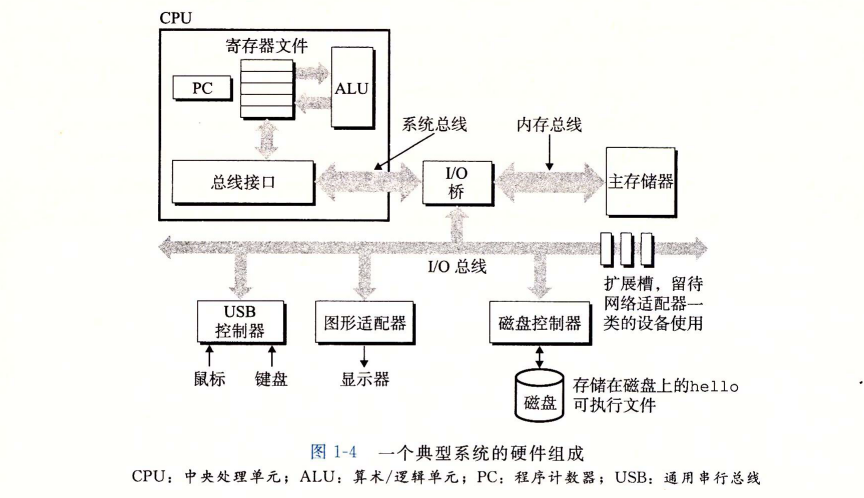
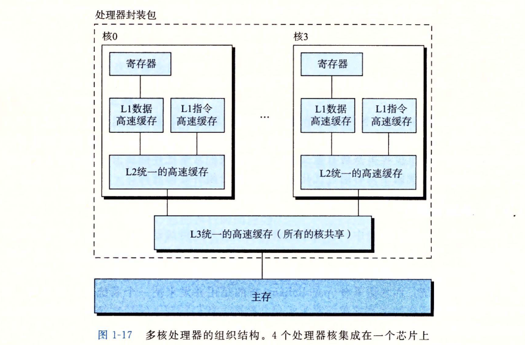
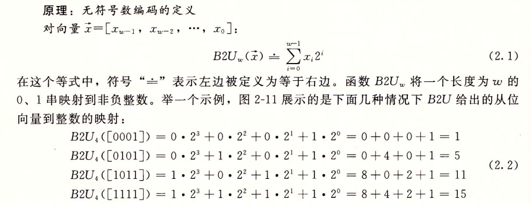
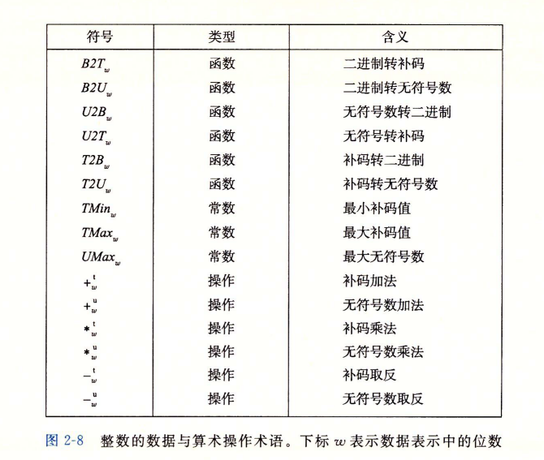
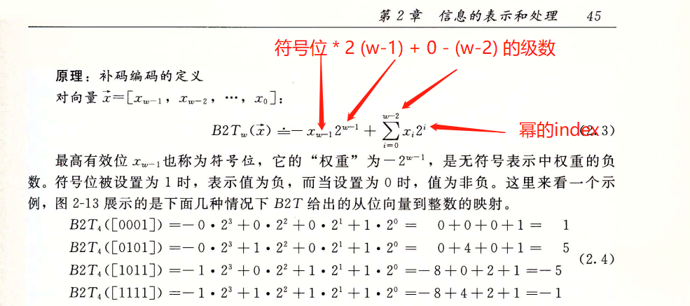
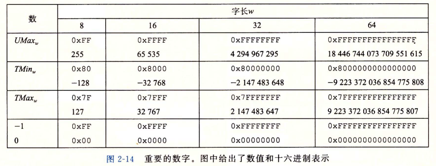
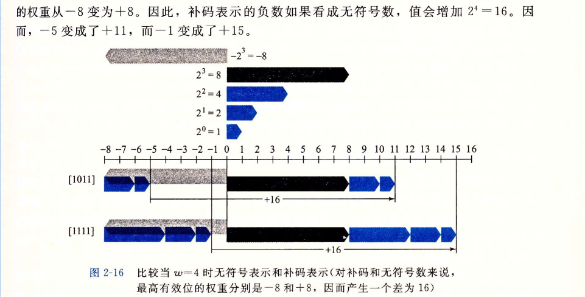

# 深入理解计算机系统

## 第一章 计算机系统漫游

### 1.2 程序被其他程序翻译成不同的格式


### 1.4 处理器读并解释存储在内存中的指令

#### 1.4.1 系统的硬件组成

**1. 总线**

> 贯穿整个系统的是一组电子管道,称作总线,它携带信息字节并负责在各个部件间传递.  通常总线被设计成传送定长的字节快, 也就是字(word). 字中的字节数(字长)是一个基本的系统参数,大多数机器的字长要么是4字节(32位),要么是8个字节(64位)

**2. I/O设备**



**3. 主存**

> 主存是一个临时存储社保,用来存放程序和程序处理的数据. 从物理上来说, 主存是由一组动态随机存储器(DRAM)芯片组成, 从逻辑上来说,存储器是一个线性的字节数组,每个字节都有其唯一的地址,这些地址是从零开始的. 组成程序的每条机器指令都由不同数量的字节构成.

**4. 处理器**


#### 1.4.2 运行hello程序


* 从键盘上读取hello命令
* 从磁盘加载可执行文件到主存
* 处理器还是执行hello程序的main程序中的机器指令语言指令,将"hello world\n"字符串中的字节从主存复制到寄存器,再从寄存器复制到显示设备

### 1.6 存储设备形成层次结构


### 1.7 操作系统管理硬件

操作系统基本功能:

* 防止硬件被失控的应用程序滥用
* 向应用程序提供简单一直的机制来控制复杂而又通常大不相同的低级硬件设备

操作系统通过几个基本的抽象概念(进程,虚拟内存和文件)来实现这两个功能.

#### 1.7.1 进程

**上下文: **操作系统保持跟踪进程运行所需的所有状态信息, 这种状态,被称为上下文.


#### 1.7.3 虚拟内存

> 虚拟内存是一个抽象概念, 它为每个进程提供了一个假象, 即每个进程都在独立地使用主存. 每个进程看到的内存都是一直的,称为**虚拟地址空间**

Linux虚拟地址空间分布:


虚拟内存的运作需要硬件和操作系统软件之间精密复杂的交互,包括对处理器生成的每个地址的硬件翻译. 基本思想是把一个进程虚拟内存的内容存储在磁盘是,然后用主存作为硬盘的告诉缓存.

#### 1.7.4  文件

> 每个I/O设备, 包括磁盘  键盘 显示器 网络都可以看成是文件

#### 1.9.2 并行和并发



#### 1.9.3 计算机系统中抽象的重要性

* 文件是对I/O设备的抽象
* 虚拟内存是对程序存储器的抽象
* 进程是对一个正在运行程序的抽象
* 虚拟机是提供对整个计算机的抽象

---

## 第二章 信息的表示和处理

```
ISO C99   >gcc -std=c99 prog.c	//指定C语音版本
ISO C11   >gcc -std=c11 prog.c
```

### 2.1 信息存储

> 计算机使用8位的块(字节byte),作为最小的可寻址的内存单位,  机器级程序将内存视为一个非常大的字节数组, 称为虚拟内存(virtual memory), 内存中的每个字节都由一个唯一的数字来标识 称为它的地址, 所有可能地址的集合都称为虚拟地址空间(Virtual Address Space)

#### 2.1.1 十六进制表示法

**当x是2的非负整数n次幂时 x=2<sup>n</sup>, n就可以表示成i + 4 j, 其中0≤i≤3, 可以把x写成开头的十六进制数字为1(i == 0), 2(i==1), 4(i == 2),8(i == 3), 比如x = 2048 = 2<sup>11</sup> 可以写成 n=11=3+4*2,那么十六进制就是0x800**

#### 2.1.2 字数据大小

```
gcc -m32 prog.c	//32位机器 64位都能运行
gcc -m64 prog.c	//64位机器
```


int32_t & int64_t 固定的4字节和8字节


#### 2.1.6 布尔代数简介

**位向量表示集合**

位向量a=[01101001] 表示集合 A= {0,3,5,6}

位向量b=[01010101] 表示集合B= {0,2,4,6}

取并集

​	01101001

& 01010101

​	01000001

a&b得到位向量01000001, 表示集合={0,6}

#### 2.2.3 补码编码

**机器数**

>一个数在计算机中的表现形式叫做机器数，这个数有正负之分，在计算机中用一个数的最高位（符号位）用来表示它的正负，其中0表示正数，1表示负数。

**真数**

> 计算机中的机器数对应的真实的值就是真数，对最高位（符号位）后面的二进制数转换成10进制，并根据最高位来确定这个数的正负。对于上面的00000111和10000111来说，对最高位后面的二进制数转换成10进制是7，在结合最高位的值，得出对应的真数分别是7和-7

**源码**:

> 用第一位表示符号，其余位表示值。因为第一位是符号位，所以8位二进制数的取值范围就是：[1111_1111 , 0111_1111]  即 [-127 , 127] ,原码是容易被人脑所理解的表达方式

**反码**

>正数的补码反码是其本身，负数的反码是符号位保持不变，其余位取反。例如正数1的原码是[0000_0001]，它的反码是是其本身[0000_0001],-1的原码是[1000_0001],其反码是[1111_1110]


**补码**

> 正数的补码是其本身，负数的补码是在其反码的基础上+1，例如正数1的原码是[0000_0001],他的补码是其本身[0000_0001],
>
> -1的补码是[1111_1111]

#### 2.2.2 无符号数的编码

一个整数数据类型有w位,可以写成  x(向量); 表示整个向量,或者可以写成[X<sub>w-1</sub>, X<sub>w-2</sub>,...,X<sub>0</sub>], 表示向量中都每一个位, 把x向量看做一个二进制表示都数,就获得了x向量的无符号表示,**每个位X<sub>i</sub>都为0或1**,






#### 2.2.3 补码编码





```c
typedef unsigned char *byte_pointer;

void show_bytes(byte_pointer start, size_t len) {
    size_t i;
    for (int i = 0; i < len; ++i) {
        printf(" %.2x", start[i]);
        printf("\n");
    }
}

int main() {
    short x = 12345;    //0011000000111001
    short mx = -x;      //1100111111000111  //-12345的补码
    show_bytes((byte_pointer) &x, sizeof(short));   // 39 30    小端
    show_bytes((byte_pointer) &mx, sizeof(short));  // C7 CF    小端
    return 0;
}
```


上图第二列是-12345的补码表示,当将进行T2U<sub>w</sub>会变成53191

无符号转换为有符号数:  函数 U2T<sub>w</sub>

有符号转换为无符号数:  函数 T2U<sub>w</sub>

T2U<sub>32</sub>(-1) = UMax<sub>32</sub> = 2<sup>32</sup> - 1 = 2<sup>31</sup> - 2 <sup>32</sup> = -2<sup>31</sup> = TMin<sub>32</sub>

在C语言里 有符号和无符号进行运算, C语言会隐式将有符号参数强制转换为无符号数


**二进制转补码B2T**




```
x		b        T2U4(x)
-8		1000		8
-3		1101		13
```


#### 2.2.5 C语言中都有符号数与无符号数


```c
x = -1; //二进制 11111111....1111 补码
//把-1 转换成无符号数 所以是 1x2(31) ... 2147..648
//将一个无符号数转换为补码会变成负数
    
```

#### 2.2.6 扩展一个数字都表示

无符号数的扩展: 高位补0

补码数的扩:  [X<sub>w-1</sub>,X<sub>w-1</sub>,X<sub>w-1</sub>,...]方式去填充,高位是啥就补啥

#### 2.2.7 截断数字

**截断无符号数字: 如果要将一个无符号数截断为K位, 直接 X mod 2<sup>k**</suP>


**截断补码数字: 如果要将一个补码截断为k位结果, 直接 X mod 2<sup>k</suP>, 然后再将结果转换为补码; 例如[1011 1101] 截取4位剩下[1101],转换成补码数 -1* 2<sup>k-1</sup> + 1* 2<sup>k-2</sup> + 1* 2<sup>0</sup> 结果为: -3;**


### 2.3 整数运算

> 假设一个4位数字表示, x= 9 y = 12; 和为21,表示为[10101]; 如果丢弃最高位就得到[0101] = 5 = 21 mod 16 = 5 ; 如果和的w+1表示最高位,如果是0表示不会溢出  如果是1表示溢出了, [10101]就溢出了


#### 2.3.2 补码加法

97page
