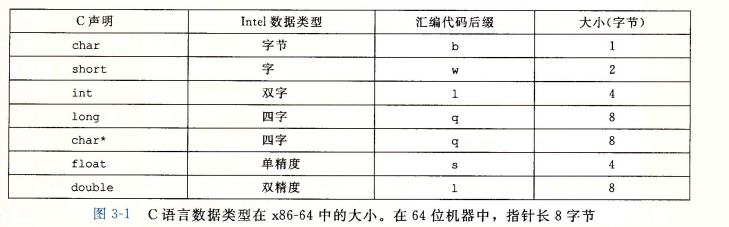
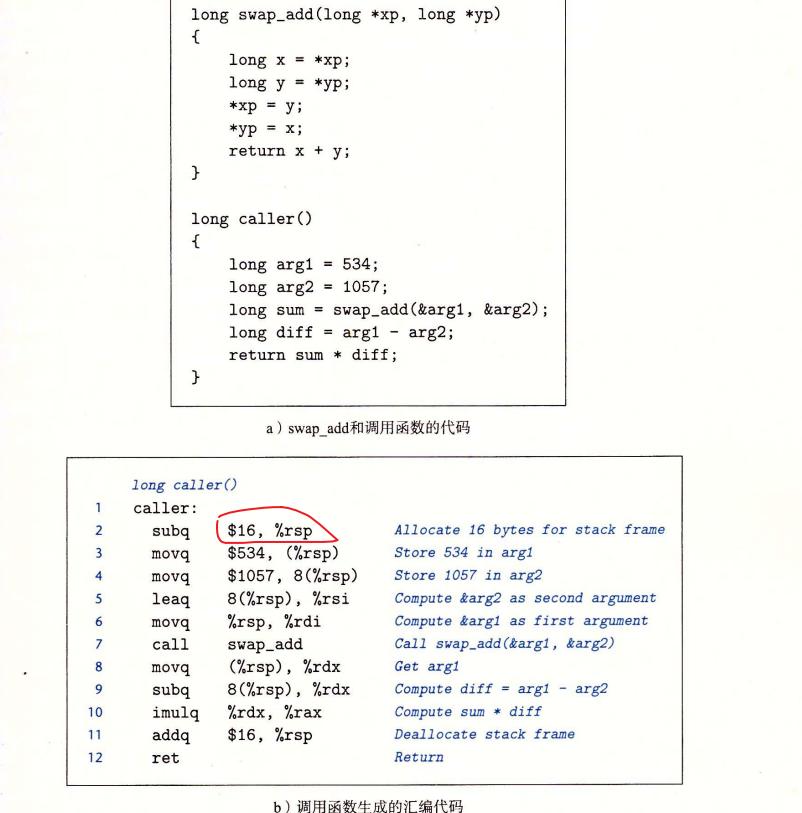

# 深入理解计算机系统

## 第一章 计算机系统漫游

### 1.2 程序被其他程序翻译成不同的格式


### 1.4 处理器读并解释存储在内存中的指令

#### 1.4.1 系统的硬件组成

**1. 总线**

> 贯穿整个系统的是一组电子管道,称作总线,它携带信息字节并负责在各个部件间传递.  通常总线被设计成传送定长的字节快, 也就是字(word). 字中的字节数(字长)是一个基本的系统参数,大多数机器的字长要么是4字节(32位),要么是8个字节(64位)

**2. I/O设备**


**3. 主存**

> 主存是一个临时存储社保,用来存放程序和程序处理的数据. 从物理上来说, 主存是由一组动态随机存储器(DRAM)芯片组成, 从逻辑上来说,存储器是一个线性的字节数组,每个字节都有其唯一的地址,这些地址是从零开始的. 组成程序的每条机器指令都由不同数量的字节构成.

**4. 处理器**


#### 1.4.2 运行hello程序


* 从键盘上读取hello命令
* 从磁盘加载可执行文件到主存
* 处理器还是执行hello程序的main程序中的机器指令语言指令,将"hello world\n"字符串中的字节从主存复制到寄存器,再从寄存器复制到显示设备

### 1.6 存储设备形成层次结构


### 1.7 操作系统管理硬件

操作系统基本功能:

* 防止硬件被失控的应用程序滥用
* 向应用程序提供简单一直的机制来控制复杂而又通常大不相同的低级硬件设备

操作系统通过几个基本的抽象概念(进程,虚拟内存和文件)来实现这两个功能.

#### 1.7.1 进程

**上下文: **操作系统保持跟踪进程运行所需的所有状态信息, 这种状态,被称为上下文.


#### 1.7.3 虚拟内存

> 虚拟内存是一个抽象概念, 它为每个进程提供了一个假象, 即每个进程都在独立地使用主存. 每个进程看到的内存都是一直的,称为**虚拟地址空间**

Linux虚拟地址空间分布:


虚拟内存的运作需要硬件和操作系统软件之间精密复杂的交互,包括对处理器生成的每个地址的硬件翻译. 基本思想是把一个进程虚拟内存的内容存储在磁盘是,然后用主存作为硬盘的告诉缓存.

#### 1.7.4  文件

> 每个I/O设备, 包括磁盘  键盘 显示器 网络都可以看成是文件

#### 1.9.2 并行和并发


#### 1.9.3 计算机系统中抽象的重要性

* 文件是对I/O设备的抽象
* 虚拟内存是对程序存储器的抽象
* 进程是对一个正在运行程序的抽象
* 虚拟机是提供对整个计算机的抽象

---

## 第二章 信息的表示和处理

```
ISO C99   >gcc -std=c99 prog.c	//指定C语音版本
ISO C11   >gcc -std=c11 prog.c
```

### 2.1 信息存储

> 计算机使用8位的块(字节byte),作为最小的可寻址的内存单位,  机器级程序将内存视为一个非常大的字节数组, 称为虚拟内存(virtual memory), 内存中的每个字节都由一个唯一的数字来标识 称为它的地址, 所有可能地址的集合都称为虚拟地址空间(Virtual Address Space)

#### 2.1.1 十六进制表示法

**当x是2的非负整数n次幂时 x=2<sup>n</sup>, n就可以表示成i + 4 j, 其中0≤i≤3, 可以把x写成开头的十六进制数字为1(i == 0), 2(i==1), 4(i == 2),8(i == 3), 比如x = 2048 = 2<sup>11</sup> 可以写成 n=11=3+4*2,那么十六进制就是0x800**

#### 2.1.2 字数据大小

```
gcc -m32 prog.c	//32位机器 64位都能运行
gcc -m64 prog.c	//64位机器
```


int32_t & int64_t 固定的4字节和8字节


#### 2.1.6 布尔代数简介

**位向量表示集合**

位向量a=[01101001] 表示集合 A= {0,3,5,6}

位向量b=[01010101] 表示集合B= {0,2,4,6}

取并集

​	01101001

& 01010101

​	01000001

a&b得到位向量01000001, 表示集合={0,6}

#### 2.2.3 补码编码

**机器数**

>一个数在计算机中的表现形式叫做机器数，这个数有正负之分，在计算机中用一个数的最高位（符号位）用来表示它的正负，其中0表示正数，1表示负数。

**真数**

> 计算机中的机器数对应的真实的值就是真数，对最高位（符号位）后面的二进制数转换成10进制，并根据最高位来确定这个数的正负。对于上面的00000111和10000111来说，对最高位后面的二进制数转换成10进制是7，在结合最高位的值，得出对应的真数分别是7和-7

**源码**:

> 用第一位表示符号，其余位表示值。因为第一位是符号位，所以8位二进制数的取值范围就是：[1111_1111 , 0111_1111]  即 [-127 , 127] ,原码是容易被人脑所理解的表达方式

**反码**

>正数的补码反码是其本身，负数的反码是符号位保持不变，其余位取反。例如正数1的原码是[0000_0001]，它的反码是是其本身[0000_0001],-1的原码是[1000_0001],其反码是[1111_1110]


**补码**

> 正数的补码是其本身，负数的补码是在其反码的基础上+1，例如正数1的原码是[0000_0001],他的补码是其本身[0000_0001],
>
> -1的补码是[1111_1111]

#### 2.2.2 无符号数的编码

一个整数数据类型有w位,可以写成  x(向量); 表示整个向量,或者可以写成[X<sub>w-1</sub>, X<sub>w-2</sub>,...,X<sub>0</sub>], 表示向量中都每一个位, 把x向量看做一个二进制表示都数,就获得了x向量的无符号表示,**每个位X<sub>i</sub>都为0或1**,


#### 2.2.3 补码编码


```c
typedef unsigned char *byte_pointer;

void show_bytes(byte_pointer start, size_t len) {
    size_t i;
    for (int i = 0; i < len; ++i) {
        printf(" %.2x", start[i]);
        printf("\n");
    }
}

int main() {
    short x = 12345;    //0011000000111001
    short mx = -x;      //1100111111000111  //-12345的补码
    show_bytes((byte_pointer) &x, sizeof(short));   // 39 30    小端
    show_bytes((byte_pointer) &mx, sizeof(short));  // C7 CF    小端
    return 0;
}
```


上图第二列是-12345的补码表示,当将进行T2U<sub>w</sub>会变成53191

无符号转换为有符号数:  函数 U2T<sub>w</sub>

有符号转换为无符号数:  函数 T2U<sub>w</sub>

T2U<sub>32</sub>(-1) = UMax<sub>32</sub> = 2<sup>32</sup> - 1 = 2<sup>31</sup> - 2 <sup>32</sup> = -2<sup>31</sup> = TMin<sub>32</sub>

在C语言里 有符号和无符号进行运算, C语言会隐式将有符号参数强制转换为无符号数


**二进制转补码B2T**


```
x		b        T2U4(x)
-8		1000		8
-3		1101		13
```


#### 2.2.5 C语言中都有符号数与无符号数


```c
x = -1; //二进制 11111111....1111 补码
//把-1 转换成无符号数 所以是 1x2(31) ... 2147..648
//将一个无符号数转换为补码会变成负数
    
```

#### 2.2.6 扩展一个数字都表示

无符号数的扩展: 高位补0

补码数的扩:  [X<sub>w-1</sub>,X<sub>w-1</sub>,X<sub>w-1</sub>,...]方式去填充,高位是啥就补啥

#### 2.2.7 截断数字

**截断无符号数字: 如果要将一个无符号数截断为K位, 直接 X mod 2<sup>k**</suP>


**截断补码数字: 如果要将一个补码截断为k位结果, 直接 X mod 2<sup>k</suP>, 然后再将结果转换为补码; 例如[1011 1101] 截取4位剩下[1101],转换成补码数 -1* 2<sup>k-1</sup> + 1* 2<sup>k-2</sup> + 1* 2<sup>0</sup> 结果为: -3;**


### 2.3 整数运算

> 假设一个4位数字表示, x= 9 y = 12; 和为21,表示为[10101]; 如果丢弃最高位就得到[0101] = 5 = 21 mod 16 = 5 ; 如果和的w+1表示最高位,如果是0表示不会溢出  如果是1表示溢出了, [10101]就溢出了

#### 2.3.2 补码加法


>解释推到过程:假设w=4   -7 + -7 = 1001 + 1001 =  9(T2U) + 9(T2U) = 18;   18 mod 2<sup>w</sup> = 2 = 0010;

#### 2.3.3 补码的非


> 理解:  k是最右边1的位置 ,那么将这个向量表示成[Xw-1,Xw-2,...,1,000],k左边的值按位取反,k不变

#### 2.3.4 无符号乘法


**无符号和补码乘法的位级等价性**


```
例如:  x = 1001 = -7   y = 0011 = 3; 无符号对应 x1 = 9, y1 = 3
x1 * y1 = 9 *3 = 27 = 0001 1011 ; -7 * 3 = -21  =  1110 1011; 
x1 * y1 = 3 * 9 mod 16 = 11 = 0000 1011;
截取后四位 = 1011;  
```

#### 2.3.5 补码乘法

补码的这两个两个数范围在-2<sup>w-1</sup> ~ 2<sup>w-1</sup> - 1内,那么他们的乘积取值范围就为-2<sup>2w-2</sup> + 2<sup>w-1</sup> ~ -2<sup>w-1</sup> * -2<sup>w-1</sup>  (如果w=4, 那么范围就是 -56 ~ 64); 

####  2.3.6 乘以常数

需要10个或者更多都时钟周期( 加法 减法 位级运算和移位 只需要1个时钟周期)

>有的编译器是可以将一些乘法转换成加法指令
>
>比如: 3 * 14  = 52
>
>编译器将14的二级制表达为一组01交替都序列; 14 = 01110,用n>= m表示这组连续的1的索引 , n = 3 ,m = 1; 则可以将乘积转换如下:
>
>x<<n + x<<(n-1)...+ x<<m = 3<< 3 + << 3 <<2 + << 3 << 1 +   <<
>
>11000 + 1100 + 110=24 + 12 + ...对不上


**偏置**: 比如我们要对一个小数转换成int,为了让这个值更精确采用四舍五入的方式, 比如99 50 = 1.98  转int = 1; 用(99 + 49) /50 = 2.96向下取整为2 ;  (x + (x<<k) -1) >> k ; k =4; x = 50; (50 + 15) / 16,让值更精确


#### 2.3.7 除以2的幂

整数除法需要30个或者更多都时钟周期

### 2.4 浮点数


#### 2.4.2 IEEE浮点表示

**IEEE(电子电器工程协会 eye-triple-ee)**


**NaN(Not a Number)**


**阶码:偏置形式表示的有符号整数: e是无符号数, Bias=2<sup>k-1</sup> -1 (单精度127,双精度1023)E = e - Bias; 那么单精度的取值范围是(-126 ~ + 127), 双精度的取值范围是: (-1022~+1023)** 

用一个例子来说明: 125.125D 在计算机里如何用二进制表示:

125 = [0111 1101] ; .125  可以用(1/8)表示 = 二进制的[001]

完整的二进制就表示为 1111101.001  = 1.111101001*2<sup>6</sup> 表示;

s: 0

**exp: e = ? - bias = 6:   最终填入exp里面的值就是 bias + 6 ;**

frac:111101001

对应如何填入到格式: 

31   -     30 		-		23						-				0

0 			1000 0101    11110100100000000000000

例子2:12345 = [11000000111001] = 1.1000000111001 * 10 <sup>13</sup>

s: 0;

exponent: 13 + 127 = 140 = [10001100]

fraction: 10000001110010000000000

结果:[0|10001100|10000001110010000000000]

## 第三章 程序的机器级表示

汇编代码是机器代码的文本表示

### 3.2 程序编码

```c
linux> gcc -Og -o p p1.c p2.c		
```

**-Og: **告诉编译器使用会生成复合原始C代码整体结构的机器代码的优化等级

实际中,从得到的程序性能考虑,较高级别的优化(**-O1和-O2(优化等级)**)被认为是较好的选择

**编译步骤**

* C预处理器:	扩展源代码,插入所有用#include命令指定的文件,并扩展所有#define声明指定的宏
* 编译器:     产生两个源文件的汇编代码p1.s p2.s
* 汇编器:     会将汇编代码转化成二进制目标代码文件p1.o 和p2.o, 目标代码是机器代码的一种形式, 它包含所有指令的二进制表示
* 链接器:     将两个目标代码文件与实现函数库(stdio.h)的代码合并,并产生最终可执行代码文件

#### 3.2.1 机器及代码

**计算机系统最重要的两种抽象形式: **

* **指令集体系结构或指令集架构(Instruction Set Architecture,ISA)来定义机器级别程序的格式和行为,定义类处理器状态, 指令的格式,每条指令对状态的影响**
* **机器级程序使用内存地址是虚拟地址,提供的内存模型看上去是一个非常大的字节数组,存储器系统的实际实现是将多个硬件存储和操作系统软件组合起来.**

会用到的源码:

```c
long mult2(long,long);

void multstore(long x, long y, long* dest) {
	long t = mult2(x,y);
    *dest = t;
}
```

```
linux> gcc -Og -S mstore.c		//生成汇编代码linux> gcc -Og -c mstore.c		//编译汇编生成目标代码文件(二进制格式)linux> objdump -d mstore.o		//通过反汇编器将机器代码产生一种类似于汇编代码格式.
```


#### 3.2.2 代码示例

需要注意机器代码和它的反汇编表示的特性值:

* x86-64 的指令长度从1-15个字节不等.常用的指令以及操作数较少的指令所需要的字节数少, 反之会字节数较多
* 设计指令格式的方式是,从某个给定位置开始,可以将字节唯一地解码成机器指令
* 反汇编器只是基于机器代码文件中的字节序列来确定汇编代码. 不需要访问该程序的源代码或汇编代码
* 反汇编器使用的指令命名规则与GCC生成的汇编代码有细微差别,gcc会省略"q",反汇编器会加上"q" 例如 call ret

#### 3.2.3 关于格式的注解


pushq %rbx	:	表示应该将寄存器%rbx的内容压入到程序栈中.

```
linux> gcc -Og -S -masm=intel mstore.c	//可以得到Intel格式汇编代码
```

**如何在C语言中插入汇编代码**

* 编写完整的函数,放进一个独立的汇编代码文件中,让汇编器和链接器把它和.c源代码合并.
* 用GCC的内联汇编特性, 用asm伪指令可以在C程序中包含简短的汇编代码

### 3.3 数据格式

> Intel用术语"字()word"表示16位数据类型, 32位数位"双字(double words)", 64位数位"4字(quad words)" 64位机器指针占用8字节



例如:movb(传送字节) movw(传送字) movl(传送双字) movq(传送四字)

### 3.4 访问信息

**x86-64的CPU包含一组16个存储64位值的通用目的寄存器,用来存储整数数据和指针**

常用:

1. %rax:	 返回值
2. %rbx:     被调用者保存
3. %rcx:     第四个参数
4. %rbp:     被调用者保存
5. %rsp:     栈指针
6. %rsi:      第二个参数
7. %rdi:      第一个参数
8. %r10-%r15:      调用者保存


对于生成小于8字节结果的指令,寄存器中剩下的字节遵循两条规则:

* 生成1字节和2字节数字的指令会保持剩下的字节不变; 
* 生成4字节数字的指令会把高位4个字节置为0

#### 3.4.1 操作数指示符

操作数可以分位三种类型:

* 立即数(immediate),用来表示常数值; 书写方式"$"后面跟一个用标准C指示法表示的整数
* 寄存器(register),表示某个寄存器的内容.16个寄存器的低位1,2,4,8中的一个作为操作数
* 内存引用: 会根据计算出来的地址,访问某个内存位值.M[addr]访问内存中的字节


#### 3.4.2 数据传送指令

MOV类 把数据从源位值复制到目的位值, 区别在于传送数据大小不同:

* movb : 	1字节
* movw:      2字节
* mov1:       4字节
* movq:       8字节

传送指令的两个操作数不能都指向内存位值: 只能拆分成两条指令,将原值加载到寄存器,第二条指令将寄存器的值写入目的地址


MOVZ: 把目的中剩余的字节填充为0

MOVS:通过符号扩展来填充(将最高位进行复制)

#### 3.4.3 数据传送示例

```c
long exchange(long *xp, long y) {
    long x = *xp;
    *xy = y;
    return x;
}
//对应的汇编指令
xp in %rdi, y in %rsi
exchange:
	movq (%rdi),%rax;	//(%rdi) 取指针指向的值 x = *xp
	movq %rsi,(%rdi);  	//*xp = y
	ret 
```

#### 3.4.4 压入和弹出栈数据

> 栈向下增长,栈顶元素的地址是所有栈元素地址中最低的

```
栈底  
0xFFFFFF;
0xFFFFF7;
0xFFFFF0
栈顶
```

* pushq把数据压栈 (两条指令: subq $8,%rsp, movq%rbp,(%rsp))
* popq出栈(两条指令: movq(%rsp), %rax; addq $8, %rsp)

### 3.5 算术和逻辑操作

加法指令分类:

- addb 字节加法
- addw 字加法
- addl   双字加法
- addq  四字加法

指令分组:

- 加载有效地址
- 一元操作
- 二元操作
- 位移

#### 3.5.3 移位操作

* **左指令只有两个名字SAL和SHL,都是右边补0**
* **右移指令分为SAR算术位移(填上符号位),SHR逻辑位移(补0)**


**以下是128位数字运算在汇编的表示**

```c
void store_uprod(uint128_t *dest, uint64_t x, uint64_t y) {
    *dest = x * (uint128_t) y;
}
```


### 3.6 控制

#### 3.6.1 条件码

* CF: 进位标志
* ZF: 零标志 zero flag
* SF: 符号标志 sign flag
* OF: 溢出标志 over flag

#### 3.6.4 跳转指令的编码


上图汇编代码解释: jmp 8 = 03 + 05 执行test  ,接着下一行跳转指令 jg .L3 5 = f8 + b  = 5 = -8 + 13得出L3的地址

* jmp *%rax: 用寄存器%rax中的值作为跳转目标
* jmp *(%rax): 以%rax中的值作为读地址,从内存中读出跳转目标


#### 3.6.5 条件控制


#### 3.6.6 用条件传送实现条件分支


3-17c的汇编代码第七行是一条基于条件传送的指令,对比3.6.5的条件控制性能更好, 处理器不需要预测测试都结果就可以执行条件传送. 条件控制面临预测失败的风险.  **使用条件传送也不总是会提高代码效率,因为then-expr或else-expr需要大量的计算,如果相应条件又不满足就浪费了计算资源. GCC只有当两个表达式都很容易计算时,它才会使用条件传送**

举例:

```
v = test-expr ? then-expr : else-expr;
//条件控制实现
    if(!test-expr) 
        goto false;
    v = then-expr;
    goto done;
false:
	v = else-expr;
done:

//条件传送实现;
v = then-expr;
ve = else-expr;
t = text-expr;
if(!t) v= ve;
```

#### 3.6.7 循环

* do{...} while()
* while
* for

GCC为for循环生成的代码是while循环的两种翻译之一,取决于优化等级

```c
//  goto 方式  
	init-expr;
    goto test;
loop:
	body-statement
    update-expr;
	if(t) 
        goto loop;

//guarded-do方式
	init-expr;
	t = test-expr;
	if (!t) 
        goto done;
loop:
	body-statement
    update-expr;
	if(t)
        goto loop;
done;
```


#### 3.6.8 switch 语句


上面这段话总结下来表达了两个点:

1. switch性能优于开关语句(if-else):  使用跳转表这种数据结构,case对应都就是其代码段的地址.
2. GCC在编译时会根据if-else的数量来决定是否要将其转换为switch结构


**表声明在".rodata"字段**

### 3.7 过程

> 过程是软件中一种很重要的抽象. 它提供了一种封装代码的方式, 用一组指定都参数和一个可选都返回值实现了某种功能. 然后可以在不同都地方调用这个函数.

过程都表现形式:

* 函数(function)
* 方法(method)
* 子例程(subroutine)
* 处理函数(handler)

#### 3.7.2 转移控制

> 比如函数P调用函数Q,只需要把程序计数器(PC)设置为Q的代码的起始位置. 从Q发挥都时候处理器必须记录好它接下来需要继续执行P的执行代码位置.在x86-64中,调用call Q指令时,会将callQ下面的一条指令压栈, 接着改变%rsp(栈顶) 和 %rip(程序计数器)的值, 当函数Q结束的调用ret指令,这时候会将程序计数器%rip的值改变为call Q函数的下一条指令的值,这时程序接着 函数P的下一条指令开始执行


#### 3.7.3 数据传送

> 当调用一个函数时,可以通过寄存器传递, 首先将参数复制到寄存器, P代码就可以通过访问寄存器里都值, 寄存器最多传递6个整型(整数和指针),  寄存器是有特殊顺序都, 使用的寄存器名字需要取决于数据类型的大小, 如果超出6个参数, 则需要通过栈传递. 通过栈传递的时候所有都数据大小都向8的倍数对齐.并且栈需要扩容


可以看到proc方法一共有8个参数,在红框的位置通过rsp+16来得到剩下两个参数的地址;  可以通过%rsp-8的方式得到

#### 3.7.4 栈上都局部存储



这个图主要是说明当一个局部变量的参数涉及到指针地址传递的时候需要开辟栈空间的这样才能获取到地址

**特殊情况局部数据必须存放在内存中:**

* 寄存器不足够存放所有的本地数据
* 对一个局部变量使用地址运算符"&", 因此必须能够为它产生一个地址
* 某些局部变量是数组或结构,因此必须能够通过数组或结构引用被访问到.

#### 3.7.5 寄存器中都局部存储空间

#### 3.7.6 递归过程

### 3.8 数组分配和访问

#### 3.8.1 基本原则

数据类型T和整型常数N,声明

T A\[N];

* X<sub>A</sub>: 起始位置
* L : 数据类型T的大小(单位为字节)
* A : 标识符,可以用A来作为指向数组开头都指针, 指针的值为X<sub>A</sub>
* 数组元素i会被存放在X<sub>A</sub> + L * i 的位置

#### 3.8.2 指针运算

单操作数操作符'&'和'*' 可以产生指针和间接引用指针, 表达式Expr 与 * &Expr是等价的, 数组引用A[i] = *(A+ i)


#### 3.8.3 嵌套的数组

T D\[R]\[C];对应都数组元素D\[i]\[j]的内存地址为:

&D\[i]\[j] = X<sub>D</sub> + L(C* i + j)

### 3.9 异质的数据结构

C语言提供了两种将不同类型都对象组合到一起创建数据类型的机制:

* 结构(structure)
* 联合(union)

#### 3.9.1 结构

> 将不同类型的对象聚合到一个对象中,用名字来引用各个组成部分,类似于数组的实现.结构的左右组成部分都存放在内存中一段连续的区域内,而指向结构的指针就是结构第一个字节的地址. 编译器维护关于每个结构类型信息,指示每个字段(field)的字节偏移.

```c
struct rect {
    long llx;
    long lly;
    unsigned long width;
    unsigned long height;
    unsigned color;
}
struct rect = {0,0,10,20,0XFF00FF};	//声明并初始化
```


#### 3.9.2 联合

```c
struct S3{
	char c;
	int i[2];
    double v;
}

union U3{
	char c;
	int i[2];
    double v;
}
```

> 一个联合的总的大小等于它最大字段的大小

#### 3.9.3 数据对齐

**计算机系统对基本数据类型的合法地址做了一些限制, 要求某种类型对象的地址必须是某个值K(通常是2,4,8)的倍数.  这种对齐简化了形成处理器和内存系统之间接口的硬件设计;**  例如, 假设一个处理器总是从内存中取8个字节,则地址必须为8的倍数,那么就可以用一个内存操作来读或者写值, 否则可能需要执行两次内存访问,因为对象可能被分钟两个8字节内存块中

```
.align 8 //汇编代码看到这种命令,保证它后面的数据是8的倍数.
```


```c
struct S2{
    int i;
    int j;
    char c;
}
//这种结构会采用尾部对齐,填充3个字节  总大小为12个字节
```

### 3.10 在机器级程序中将控制与数据结合

#### 3.10.1 理解指针

指针特性:

* 每个指针都对应一个类型

* 每个指针都有一个值

* 指针用"&"运算符创建

* *操作符用于间接引用指针

* 数组与指针紧密联系

* 将指针从一种类型转换成另一种类型,只改变它的类型,而不改变它的值. **强制类型转换的一个效果是改变指针运算的收缩**例如p是一个char\*类型的指针,它的值为p, 那么(int\*)p+7 = p+ 28; 而(int\*)(p+7) = p+7.

* 指针也可以指向函数

  ```c
  int fun(int x, int *p);
  
  int (*fp)(int,int*);
  fp = fun;
  
  // use
  int y = 1;
  int result = fp(3,&y);
  ```

  函数指针的值是该函数机器代码表示中第一条指令的地址

#### 3.10.2 应用: 使用GDB调试器

#### 3.10.3 内存越界引用和缓冲区溢出

缓冲区溢出后会破坏程序的信息; 比如输入一个字符串是24字节,那么其他地址就会有其他的作用,当输入内容超出了24字节,就会覆盖栈上存储 的某些信息

#### 3.10.4 对抗缓冲区溢出攻击

**1. 栈随机化: ** 以往程序都栈地址非常容易预测.对于所有运行同样程序和操作系统版本系统来说, 在不同机器之间, 栈的位置相对固定的.攻击者既要插入代码,也要插入指向这段代码的指针.**随机化**使栈的位置在程序每次运行时都有变化,  实现方式是:  程序开始时, 在栈上分配一段0~n字节之间都随机大小的空间, 分配的范围n必须足够大,才能获得足够多的栈地址变化,但是又要足够小,不至于浪费程序太多的空间

**2. 栈破坏检测: 加入了一种栈保护者机制,来检测缓冲区越界**


**3. 限制可执行代码区域**限制哪些内存区域能够存放可执行代码.在典型程序中,只有保存编译器产生的代码那部分内存才是需要执行的,其他部分可以被限制只允许读写.

#### 3.10.5 支持变长栈帧

> x86-64代码使用寄存器%rbp作为帧指针(frame pointer)(优势称为基指针(base pointer)), %rbp中bp的由来.

### 3.11 浮点代码

> Intel 和 AMD都引入了媒体指令,支持图形和图像处理. 这些指令本意是允许多个操作以并行模式执行.称为**单指令多数据或SIMD(sim-dee)**

* 寄存器组在MMX 中称为"MM"寄存器 64位
* SSE(流式SIMD扩张)中称为"XMM"寄存器  128位
* AVX(Advanced Vecotr Extension)中称为"YMM"寄存器  256位

**标量指令:**他们只对单个而不是一组封装好的数据值进行操作.数据要么保存在内存中(M32, M64)指明,要么保存在XMM寄存器中.

### 3.2.12 小结

Java的目标代码是一种特殊的二进制表示,称为java字节码. 这种代码可以看成是虚拟机的机器级程序.正如它的名字暗示的那样, 这种机器并不是直接用硬件实现的,而是用软件解释器处理字节代码模拟虚拟机的行为.

---

## 第四章 处理器体系结构

指令被编码为由一个或多个字节序列组成的二级制格式.一个处理器支持的指令和指令的字节级编码称为它的**指令集体系结构(Instruction-Set Architecture, ISA)**

### 4.1 Y86-64指令集体系结构

#### 4.1.2 Y86-64指令

* x86-64 的movq指令分成了不同指令:irmovq,rrmovq,mrmovq,rmmovq,立即数(i),寄存器(r),内存(m),第一个字母是源的类型,目的的是寄存器(r),内存(m)


**rA,rB : **寄存器指示符字节(register specifier byte),指定一个或两个寄存器,根据指令类型,可以指定用于数据源和目的的寄存器,或是用于地址计算的基址寄存器.如果只需要一个寄存器,那么另一个会设置成0xF

#### 4.1.3指令编码

每条指令需要1~10字节不等.**每条指令的第一个字节表明指令的类型. 这个字节分为两个部分,每部分4位: 高4位是代码部分,第四位是功能部分, 也就是上图的fn位置**


例如: 用十六进制来表示指令rmmovq %rsp, 0x123456789abcd(%rdx)的字节编码, (rmmovq rA,D(rB))第一个字节为40,源寄存器%rsp 与目标寄存器%rdx 42, 如果采用小端表示二进制编码为: 4042cdab896745230100

**指令集的一个重要性质就是字节编码必须有唯一的解释. 任意一个字节序列要么是一个唯一的指令序列编码,要么就不是一个合法的字节序列, 因为每条指令的第一个字节有唯一的代码和功能组合,给定这个字节,我们就可以决定所有其他附加字节的长度和含义. 这个性质保证了处理器可以无二义性地执行目标代码程序. 即时代码嵌入在程序的其他字节中,只要从序列的第一个字节开始处理, 我们仍然可以很容易地确定指令序列. 如果不知道一段代码序列的起始位置,就不能准确地确定怎样将序列划分成单独的指令**

**RISC 和 CISC 指令集**

* x86-64 有时被称为 "复杂指令集计算机" CISC sisk;
* 精简指令集计算机 RISC risk
* ARM(Acorn RISC Machine)

#### 4.1.4 Y86-64 异常


### 4.2 逻辑设计和硬件控制语言HCL

**硬件控制语言HCL(Hardware Control Language)**

#### 4.2.2 组合电路和HCL布尔表达式

将很多逻辑门组合成一个网,就能构建计算快(computational block), 称为组合电路(combinational circuits). 构建限制

* 每个逻辑门的输入必须连接到以下选项之一:
  * 一个系统输入(主输入)
  * 某个存储器单元的输出
  * 某个逻辑门的输出
* 两个或多个逻辑门的输出不能连在一起,否则他们可能会使线上的信号矛盾,可能会导致一个不合法的电压或电路故障
* 这个网必须是无环的. 在网中不能有路径经过一系列门而形成一个回路.

**多路复用器(multiplexor, 用"MUX"简写)**

**算术/逻辑单元(ALU)**


#### 4.2.5 存储器和时钟


### 4.3 Y86-64 的顺序实现

**SEQ("sequential"顺序的)处理器**

#### 4.3.2 SEQ硬件结构

Y86-64所需要的计算拆分成6个基本阶段:**取指,译码,执行,访存,写回,更新PC**

* **取指**(fetch): 取指阶段从内存读取指令字节,地址为程序计数器(PC)的值. 从指令中抽取出指令指示符字节的两个思维部分,称为icode(指令代码)和ifun(指令功能), 可能取出一个寄存器指示符字节 指明一个或两个寄存器操作数指示符rA,rB.还可能取出4字节常数valC,它按顺序方式计算当前指令的下一条指令的地址valP,也就是说**valP等于PC的值加上已取出指令的长度**将程序计数器寄存器作为地址,指令内存读取指令字节,PC增加器(PC incrementer)计算valP

* **译码**(decode):从寄存器文件读入最多两个操作数,得到值valA和valB,通常它读入指令rA和rB字段指明的寄存器.  寄存器文件有两个读端口A和B,从这两个端口同时读寄存器值valA 和valB

* **执行**(execute):根据指令类型,将算术/逻辑单元(ALU)用于不通的目的,对整数操作,要执行指令所指定的运算. 对于其他指令,会作为一个加法器来计算增加或减少栈指针,或计算有效地址.

  条件码寄存器(CC) 有三个条件码位,ALU负责计算条件码新值.当执行条件传送指令时,根据条件码和传送条件来计算决定是否更新目标寄存器.  当执行一条跳转指令时,会根据条件码和跳转类型来计算分支信号Cnd.

* **访存**(memory): 访存阶段可以将数据写入内存,或者从内存读出数据,读出的值为valM,     在执行访存操作时, 数据内存读出或写入一个内存字. 指令和数据内存访问的是相同的内存位值,但是用于不同的目的.

* **写回**(write back):寄存器文件有两个写端口,端口E用来写ALU计算出来的值,端口M用来写从数据内存中读出的值

* **PC更新**:程序计数器的新值选择自: valP: 下一条指令的地址; valC: 调用指令或跳转指令指定的目标地址; valM:从内存读取的返回地址.


**"←"表示一个分配操作符**

todo

### 4.4 流水线的通用原理

> 流水线提高了系统的吞吐量(throughput), 也会轻微地增加延迟(latency)

#### 4.4.1 计算流水线


* 电路延迟以微微秒或皮秒(picosecond,ps), 10<sup>-12</sup>秒为单位来计算.


**以下的计算都会以每秒千兆条指令(GIPS),也就是每秒十亿条指令为单位来计算吞吐量,从头到尾执行一条指令所需要的时间成为延迟(latency)**


如果不采用流水线一条指令的执行时间是320ps,吞吐量约为3.12GIPS,如果采用流水线,将时钟周期设置为120ps,吞吐量大约为8.33,一条指令需要3个时钟周期,所以流水线的延迟就是3x120=360ps,吞吐量提高了2.67倍,延迟增加了(360/320=1.12)

#### 4.4.3 流水线的局限性

**1.不一致的划分**

运行时钟的速率是由最慢的阶段的延迟限制的.

**2.流水线过深,收益反而下降**


上图系统的最小时钟周期为50+20=70ps,吞吐量为14.29GIPS,相对于4.4.1的流水线阶段数来说增加了2被,性能提高了14.29/8.33=1.71倍.延迟=420ps,

**为了提高时钟频率,现代处理器采用了很深的(15或更多的阶段)流水线.处理器架构师将指令的执行划分成很多非常简单的步骤,这样一来每个阶段的延迟就很小.**

----

## 第五章 优化程序性能

**编写高效程序需要做到几点:**

- **选择一组适当的算法和数据结构**
- **编写出编译器能够有效优化以转换成高效可执行代码的源代码**
- **对处理运算量特别大的计算,将一个任务分成多个部分**

### 5.1 优化编译器的能力和局限性

并非所有函数都能优化.例如:

```c
void twiddle1(long *xp, long *yp) {
    *xp += *yp;
    *xp += *yp;
}

void twiddle2(long *xp, long *yp) {
    *xp += 2 * *yp;
}
```

函数`twiddle2`效率更高,它只要求3次内存引用(读*xp, 读*yp, 写*xp), `twiddle1`需要6次(2次读\*xp,2次读\*yp,2次写\*xp)

如果xp等于yp的情况,`twiddle1`是xp增加了4倍,`twiddle2`增加3倍

类似例子例如:

```c
long f();
long func1(){
    return f() + f() + f() + f();
}

long func2() {
    return 4 * f();
}
//如果f函数是这样:
long counter = 0;
long f() {
    return counter++;
}
//func1 = 6;
//func2 = 0;
```

### 5.2 表示程序性能

表示程序性能并指导改进代码的方法表示:**每元素的周期数(Cycles Per Element, CPE)**

处理器活动顺序是由时钟控制的,时钟提供了某个频率的规律信号,通常用**千兆赫兹(GHz),即十亿周期每秒来表示**,例如4GHz表示处理器时钟运行频率为每秒4x10<sup>9</sup>个周期.一个4GHz的时钟周期为0.25纳秒,或者250皮秒.

### 5.3 程序示例

在一个具有Intel Core i7 Haswell 处理器的机器上测量这些函数的CPE性能,这个机器称为**参考机**


```c
void combine1(vec_ptr v, data_t *dest) {
    long i;
    *dest = IDENT;
    for(i = 0; i < vec_length(v); i++) {
        data_t val;
        get_vec_element(v, i, &val);
        *dest = *dest OP val;
    }
}

//优化
void combine2(vec_ptr v, data_t *dest) {
    long i;
    *dest = IDENT;
    
    long length = vec_length(v);
    
    for(i = 0; i < length; i++) {
        data_t val;
        get_vec_element(v, i, &val);
        *dest = *dest OP val;
    }
}
```


### 5.5 减少过程调用

```c
void combine3(vec_ptr v, data_t *dest) {
    long i;
    long length = vec_length(v);
    data_t *data = get_vec_start(v);
    
    *dest = IDENT;
    for(i = 0; i < length; i++) {
        *dest = *dest OP data[i];
    }
}

data_t *get_vec_start(vec_ptr v) {
    return v->data;
}
```


### 5.6 消除不必要的内存引用


性能浪费在1,3行,将内存里面的值读出保存到寄存器,第三行将寄存器的结果写入到内存.

优化后:


### 5.7 理解现代处理器

两种下界描述了程序的最大性能:

* **当一系列操作必须按照严格顺序执行时,会遇到延迟界限(latency bound),在下一条指令开始之前,这条指令必须结束.当代码中的数据相关限制了处理器利用指令集并行能力时,延迟界限能够限制程序性能**
* **吞吐量界限(throughput bound)刻画了处理器功能单元的原始计算能力,这个界限是程序性能的终极限制**

#### 5.7.1 整体操作

* 指令控制单元(Instruction Control Unit, ICU)
* 执行单元(Execution Unit,EU)
* 分支预测(branch prediction)
* 投机执行(speculative execution),处理器会开始取出位于它预测的分支会跳转到的地方的指令,并对指令译码,甚至在它确定分支预测是否正确之前就开始执行操作,只是最后确定分支预测错误,会将状态设置到分支点的状态,并开始取出和执行另一个方向上的指令

**Intel Core i7 Haswell功能单元**


### 5.8 循环展开


### 5.9 提高并行性


多个累积变量

### 5.13 应用: 性能提高技术

1) 高级设计. 为遇到的问题选择适当的算法和数据结构
2) 基本编码原则,避免限制优化的因素, 让编译器产生高效的代码
   * 消除连续的函数调用
   * 消除不必要的内存引用
3) 低级优化,结构化代码可以利用硬件功能
   - 展开循环,降低开销
   - 通过使用例如过个累积变量和重新结合等技术,找到方法提高指令集并行
   - 用功能性的风格重写条件操作,是的编译采用条件数据传送

在为了提高效率重写程序时避免引入错误, 因为在引入新变量,改变循环边界会使得代码整体上更复杂,很容易犯错误. 意向游泳的技术是在优化函数时,用检查代码来测试函数的每个版本,乙炔表在这个过程没有引入错误

### 5.14 确认和消除性能瓶颈

主要讲了调试器

---

## 第六章 存储器层次结构

### 6.1 存储技术

#### 6.1.1 随机访问存储器

**1.静态RAM(Static Random-Access Memory,)**

**2.动态RAM(Dynamic Random-Access Memory)**

**3.传动DRAM**


解释上图: 为了读出超单元(i,j)的内容,内存控制器将行地址i发送到DRAM, 然后是列地址j,行地址称为**RAS(Row Access Strobe 行访问选通脉冲)**请求,列地址j称为**CAS(Column Access Strobe, 列访问选通脉冲)**, 将读取的一行放入行缓冲区,随后列读取返回

**4.内存模块**

#### 6.1.2 磁盘存储


**磁盘一扇区大小的块来读写数据. 对扇区的访问时间*(access time)有三个部分:寻道时间(seek time),旋转时间(rotational latency)和传送时间(transfer time):**

* **寻道时间:**为了读取某个目标扇区的内容,传动臂首先将读/写头定位到包含模板扇区的磁道上.移动传动臂所需的时间称为寻道时间
* **旋转时间**:当读/写头定位到了期望的磁道,驱动器等待模板扇区的第一个位旋转到读/写头下. 这个步骤性能依赖于当读/写头到达模板扇区时盘面的位置以及磁盘的旋转速度. 最坏情况读写头刚错过了目标三区,必须等待磁盘转一整圈.
* **传送时间:**当目标扇区的第一个位位于读/写头下时, 驱动器就可以开始读写该扇区的内容,一个扇区的传送时间依赖于旋转速度和每条磁道的扇区数目

**4.逻辑磁盘块**

磁盘封装中有一个小的固件设备,称为磁盘控制器,维护着逻辑块号和实际(物理)磁盘扇区之间的映射关系,当操作系统想要执行一个I/O操作时, 操作系统会发送一个命令到磁盘控制器,让它读某个逻辑块号.控制器上的固件执行一个快速表查找,将一个逻辑块号翻译成一个(盘面,磁道,扇区)的三元组.这个三元组标识了唯一一个物理扇区

**5. 连接I/O设备**

显卡,显示器,鼠标,键盘,磁盘这类都是通过I/O总线,外围设备互联(Peripheral Component Interconnect,PCI)总线连接到CPU和主存.

三种不同类型的设备连接到总线:

* 通用串行总线(USB)
* 图形卡
* 主机总线


直接访问主存(Direct Memory Access, DMA) 不需要经过CPU

> 描述读取过程: 假设磁盘控制器映射到端口0xa0; 随后CPU可能通过执行三个对地址0xa0的存储指令,发起磁盘读: 第一条指令发送一个命令字,告诉磁盘发起一个读,同时还发送其他的参数(例如,读完成时是否中断CPU), 第二条指令指明应该读的逻辑块号. 第三条指令指明应该存储磁盘扇区内容的主存地址.  当磁盘控制器收到CPU读的指令后, 它将逻辑块号翻译成一个扇区地址,读该扇区的内容,然后将这些内容直接传送到主存.在DMA传送完成,磁盘扇区内容被安全的存储在主存以后,磁盘控制器通过给CPU发送一个中断信号来通知CPU. 其基本思想史中断会发信号到CPU芯片的外部引脚上, CPU会暂停当前的工作跳转到一个操作系统例程, 这个程序会记录下IO已经完成,然后将控制返回到CPU被中断的地方


#### 6.1.3 固态硬盘

固态硬盘(Solid State Disk, SSD), 固态硬盘打印进行100000次重复写之后,块就会磨损坏,一旦磨损坏之后就不能再使用了, 闪存翻译层中的平均磨损逻辑试图通过讲擦除平均分布在所有的块上来最大化每个块的寿命.


### 6.2 局部性

倾向于引用邻近于其他最近引用过的数据项的数据项,或者最近引用过的数据项本身.这种倾向性,被称为**局部性原理(principle of locality)**,

局部性的两种形式:

* 时间局部性(temporal locality): 被引用过一次的内存位置很可能在不远的将来再被多次引用.
* 空间局部性(spatial locality): 如果一个内存位置被引用了一次,那么程序很可能在不远的将来引用附近的一个内存位置

#### 6.2.3 局部性小结

量化评价程序中局部性的一些简单原则:

* 重复引用相同变量的程序有良好的时间局部性.
* 对于步长为k的引用模式的程序,步长越小,控件局部性越好.
* 对于取指令来说,循环有好的时间和空间局部性,循环体越小,循环迭代次数越多,局部性越好.

### 6.3 存储器层次结构

