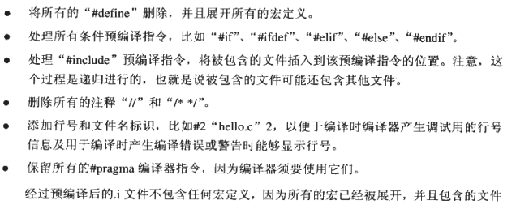

## 程序员的自我修养

### 第二章编译和链接

#### 2.1 被隐藏了的过程

```c
gcc hello.c

./a.out //hello wintersweett
```

四个步骤

* 预处理(Prepressing)
* 编译(Compilation)
* 汇编(Assembly)
* 链接(Linking)


##### 2.1.1 预编译

```c
gcc -E hello.c -o hello.i  //-E 表示只进行预编译 cpp hello.c > hello.i
```

预编译主要规则:



##### 2.1.2 编译

> 编译过程就是把预处理完的文件进行一系列的词法分析,语法分析,语义分析及优化后生成的汇编代码文件.(核心部分,)

```c
gcc -S hello.i -o hello.s //现代版本的gcc将预处理和编译两个步骤合二为一了,所以可以直接调用一个命令
gcc -S hello.c -o hello.s
```


##### 2.1.3 汇编

> 汇编器是将汇编代码转变成机器可以执行的命令,每一个汇编语句几乎对应一条机器指令. 相对于编译器比较简单,没有语法,没有语义,不需要指令优化,只需要根据汇编指令和机器指令的对照表一一翻译即可.

```c
as hello.s -o hello.o
```

或者

```c
gcc -c hello.s -o hello.o
```

或者直接从C源代码文件开始进行 预编译->编译->汇编

```
gcc -c hello.c -o hello.o
```

##### 2.1.4 链接

> 把一些指令对其他符号地址的引用加以修正.

#### 2.2 编译器做了什么

> 编译器将高级语音翻译成机器语音的工具

编译过程:

1. 扫描
2. 语法分析
3. 语义分析
4. 源代码优化
5. 代码生成
6. 目标代码优化


##### 2.2.5 目标代码生成与优化

> 源代码级优化器产生中间代码. 编译器后端主要包括 代码生成器 和 目标代码优化器.  目标代码器对目标代码进行优化, 会选择合适的寻址方式,使用位移来代替乘法运算,删除多余指令等.

#### 2.3 链接器

**发展史**

在早期如果将所有的源代码都写在一个文件中.后期可能长达几百万行,基本上无法维护这个程序.

最开始人们通过一种卡带上面记录程序,(穿孔0,未穿孔1)每条指令是1个字节8位,如果一条跳转指令是高四位表示跳转,低四位表示跳转地址.0001 0100, 如果后期出现代码需要更新,新增了一条指令,那么这个绝对地址就需要改动,那么之前计算好的位置都需要重新计算,这个重新计算的工程被称为**重定位(Relocation)**

后来产生汇编语言, jmp 表示跳转指令 jmp foo  这个"foo"被称为**符号(Symbol)**

这个时候由于汇编语言的产生已经极大提高了生产力,代码量也快速膨胀,就导致人们开始考虑将不通功能的代码已一定的方式组织起来,以便于日后重复利用.源代码最小单位是变量和函数,若干的变量和函数就组成了一个".c"的文件,然后源码文件按照目录结构组织,每个基本类是一个模块,若干模块组成了一个**包(Package)**

#### 2.4 模块拼接--静态链接

链接的过程主要包括了

1. 地址和空间分配(Address and Storage Allocation)
2. 符号决议(Symbol Resolution)
3. 重定位(Relocation)

链接过程


备注.o文件拓展名为.o或.obj,笔记后面都把它叫做**中间目标文件** 简称**目标文件**