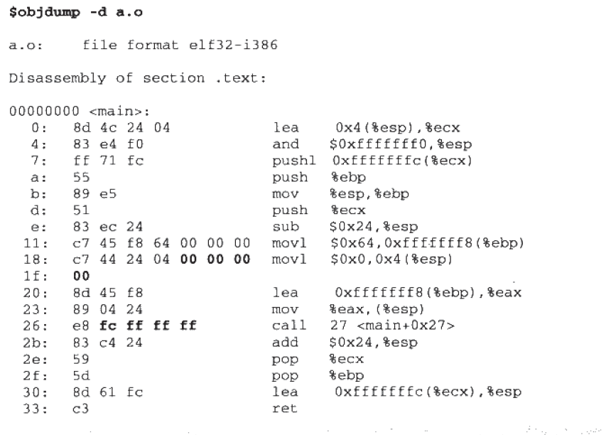
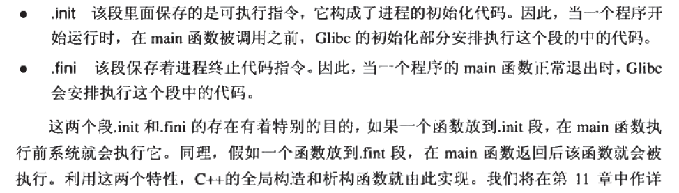

## 程序员的自我修养

### 第一章 计算机基础知识

**总线(Bus)**:总线（Bus）是计算机各种功能部件之间传送信息的公共通信干线，它是由[导线](https://baike.baidu.com/item/导线/1413914)组成的传输线束， 按照计算机所传输的信息种类，计算机的总线可以划分为[数据总线](https://baike.baidu.com/item/数据总线/272650)、[地址总线](https://baike.baidu.com/item/地址总线/4307936)和[控制总线](https://baike.baidu.com/item/控制总线/272568)，分别用来传输数据、数据地址和[控制信号](https://baike.baidu.com/item/控制信号/10329713)。

**南桥**:南桥设计用来处理低速信号，通过[北桥](https://baike.baidu.com/item/北桥)与[中央处理器](https://baike.baidu.com/item/中央处理器)联系。

**北桥**:北桥设计用来处理高速信号，通常处理[中央处理器](https://baike.baidu.com/item/中央处理器)、[存储器](https://baike.baidu.com/item/存储器)、[PCI Express](https://baike.baidu.com/item/PCI Express)显卡（早年是[AGP](https://baike.baidu.com/item/AGP)显卡）、高速PCI Express X16/X8的[端口](https://baike.baidu.com/item/端口)，还有与[南桥](https://baike.baidu.com/item/南桥)之间的通信。

> **计算机科学领域的任何问题都可以通过增加一个间接的中间层来解决**

**接口**:每个层次之间都必须要互相通信,通信协议一般称之为接口. 除了硬件和应用程序,其他都是所谓的中间层,**每个中间层都是对他下面那层得包装与拓展**

**应用程序编程接口**

**软件中断**

**多道程序(Multiprogramming)**:早期的监控程序,当某个程序无需使用CPU时,监控程序会把另个正在等待CPU资源的程序启动.缺点是:程序之间不分轻重缓急,比如急需CPU处理一些任务(用户交互),可能需要等很长时间.

**分时系统(Time-Sharing System)**:改为协作模式,每个程序允许一段时间以后都主动让出CPU给其他程序,使得一段时间内每个程序都有机会运行一小段.缺点是:当某一个程序在进行一个耗时计算,一直霸占CPU,那么操作系统也没有办法,其他程序只能等 例如while(true)

**多任务(Multi-Tasking)系统**:操作系统接管硬件资源,程序已进程的方式运行在比操作系统权限更低的级别,CPU由操作系统统一分配,每个进程都有机会得到CPU,如果运行超出一定时间,操作系统会暂停该进程.分配给其他等待的程序,这方方式被称为抢占式

----

**硬盘结构**:硬盘基本存储单位为扇区(Sector),每个扇区一般为512字节,一个硬盘往往会有多个盘片,每个盘片有两面,每面按照同心圆划分为若干个磁道,每个磁道划分若干个扇区. 比如一个硬盘有2个盘面,每个盘面分65536个磁道,每个磁道分为1024个扇区,那么硬盘的容量等于: 2x2x65536x1024x512=128GB. 如果是同心圆那么肯定外围的磁道密度会比内圈更加稀疏,如果不同磁道扇区数不同,计算就会很麻烦,为了屏蔽这些复杂的硬件细节,现代硬盘普遍使用LBA(Logical Block Address): 对硬盘中的所有扇区从0开始编号,一直到最后一个扇区,当给出一个逻辑扇区号时,硬盘的电子设备会将其换成实际的盘面,磁道等位置

**一些名词**

- 虚拟地址(Virtual Address)
- 虚拟地址空间(Virtual Address Space)
- 物理地址空间(Physical Address Space)
- 分段(Segmentation)
- 分页(Paging)
- 虚拟页(VP, Virtual Page)
- 物理页(PP,Physical Page)
- 磁盘页(DP,Disk Page)

关于页的交换方式:

假如一个进程的虚拟页VP1,VP2不在内存中,但是进程需要用的这两个页的时候,硬件会捕捉到这个消息,这就是**页错误(Page Fault)**, 然后操作系统接管进程,负责将VP1和VP2从磁盘读出来并装入内存, 然后将内存中的这两个页与VP1与VP2建立映射关系. 

将不同进程的虚拟页映射到同一个物理页,这样就可以实现**内存共享**

#### 1.6 

##### 1.6.1 线程基础

**什么是线程**

> 线程有时被称为轻量级进程(Lightweight Process LWP),是程序执行流的最小单元. 一个标准的线程由线程ID, 当前指令针,寄存器集合和堆栈组成,通常意义上,一个进程由一个到多个线程组成,各个线程之间共享进程的内存空间(代码段 ,数据段  堆等)及一些进程级资源(文件,和信号)


**线程调度(Thread Schedule)**

* 运行: 正在执行
* 就绪: 可以立刻运行,但CPU已经被占用
* 等待:等待某一件事(I/O)

主流**线程调度算法**

* **优先级调度(Priority Schedule)**:windows和linux都有提供方法设置线程的优先级,高优先级的线程会更早的执行,低优先级常常需要系统中没有高优先级的可执行线程存在时才能够执行
* **轮转法(Round Robin)**: 让各个线程轮流执行一小段时间

**线程分类:**

* 把频繁等待的线程称为**IO密集型线程(IO Bound Thread)**
* 把很少等待的线程称为**CPU密集型线程(CPU Bound Thread)**

**改变线程优先级的三种方式**

* 用户指定优先级
* 根据等待状态的频繁程度提升或降低优先级
* 长时间得不到执行而被提升优先级

**Linux的多线程**

> windows内核有明确的线程和进程概念. 可以通过`CreateProces`和`CreateThread`来创建.
>
> 但是Linux将所有的执行实体(进程或者线程)都称为任务(Task), 每一个任务概念上都类似于一个单线程的进程,具有内存控件,执行实体,文件资源等. Linux下不同的任务之间可以选择共享内存空间, 共享了同一个内存控件的多任务构成了一个进程,这些任务也就是进程里的线程


**关于fork**


使用clone可以产生新的任务,从指定的位置开始执行,并且(可选)共享当前线程的内存空间和文件.

##### 1.6.2 线程安全

把单指令称为**原子的(tomic)**

**同步与锁**

> 在一个线程访问数据为结束的时候,其他线程不得对同一个数据进行访问

常见同步方法

* 锁(Lock): 包含 获取(Acquire), 释放(Release)
* 二元信号量(Binary Semaphore): 只有占用与非占用两种状态
* 多元信号量简称**信号量(Semaphore)**


**可重入(Reentrant)与线程安全**

一个函数要被重入只有两种情况:

1. 多个线程同时执行这个函数
2. 递归

一个函数要称为可冲入的必须有如下特点:


**过度优化**

过度优化的两种情况:

* 为了提高效率可能交换指令顺序
* 编译器在进行优化的时候,也可能为了效率而交换毫不相干的两条指令的执行顺序(x = 1 和 r1 = y)

```java
//指令交换例子
x = y = 0;
Thread1          	Thread2
x = 1;				y = 1;
r1 = y;				r2 = x;
//优化过后------------------
x = y = 0;
Thread1          	Thread2
r1 = y;				y = 1;
x = 1;				r2 = x;
```

**volatile**

* 阻止编译器为了提高速度将一个变量缓存到寄存器而不回写
* 阻止编译器调整操作volatile变量的指令顺序

**volatile只能阻止编译器为了提高效率而交换两条指令,但是无法阻止CPU动态调度换序**

```java
//例子
volatile T pInst = null;
T getInstace() {
    if(pInst == null) {
        lock();
        if (pInst == null) {
            pInst = new T();
        }
        unlock();
    }
    return pInst;
}
```

C++new的步骤

1. 分配内存

2. 调用构造函数

   pInst = new T 包含三个步骤

   1. 分配内存
   2. 在内存的位置上调用构造函数
   3. 将内存的地址赋值给pInst.

   在 2 , 3 的顺序是可以颠倒的, 有可能出现这样的情况:pInst的值已经不是NULL,但对象仍没有构造完毕. 这时候出现另外一个对getInstance的并发调用,此时第一个if内的表达式pInst== NULL,为false,所以这个调用会直接返回尚未完全的对象的地址(pInst) 以提供给用户使用. 那么程序这个时候会不会崩溃就取决于这个类如何设计.

CPU提供了**barrier(不同版本名称可能不一样)**指令可以阻止CPU将该指令前的指令交换到barrier之后.

##### 1.6.3 多线程内部情况

1. **一对一模型**
   1. 优点
      1. 用户线程和内核线程一致
      2. 线程之间的并发是真正的并发
   2. 缺点
      1. 许多操作系统限制了内核线程的数量,因此一对一线程会让用户的线程数量收到限制
      2. 许多操作系统内核线程调度时,上下文切换的开销较大,导致用户线程执行效率下降


1. **多对一模型**:将多个用户线程映射到一个内核线程上,线程切换代码由用户态代码进行


1. **多对多模型**:将多个用户态线程映射到少数但不知一个内核线程上


----

### 第二章编译和链接

#### 2.1 被隐藏了的过程

```c
gcc hello.c

./a.out //hello wintersweett
```

四个步骤

* 预处理(Prepressing)
* 编译(Compilation)
* 汇编(Assembly)
* 链接(Linking)


##### 2.1.1 预编译

```c
gcc -E hello.c -o hello.i  //-E 表示只进行预编译 cpp hello.c > hello.i
```

预编译主要规则:


##### 2.1.2 编译

> 编译过程就是把预处理完的文件进行一系列的词法分析,语法分析,语义分析及优化后生成的汇编代码文件.(核心部分,)

```c
gcc -S hello.i -o hello.s //现代版本的gcc将预处理和编译两个步骤合二为一了,所以可以直接调用一个命令
gcc -S hello.c -o hello.s
```


##### 2.1.3 汇编

> 汇编器是将汇编代码转变成机器可以执行的命令,每一个汇编语句几乎对应一条机器指令. 相对于编译器比较简单,没有语法,没有语义,不需要指令优化,只需要根据汇编指令和机器指令的对照表一一翻译即可.

```c
as hello.s -o hello.o
```

或者

```c
gcc -c hello.s -o hello.o
```

或者直接从C源代码文件开始进行 预编译->编译->汇编

```
gcc -c hello.c -o hello.o
```

##### 2.1.4 链接

> 把一些指令对其他符号地址的引用加以修正.

#### 2.2 编译器做了什么

> 编译器将高级语音翻译成机器语音的工具

编译过程:

1. 扫描
2. 语法分析
3. 语义分析
4. 源代码优化
5. 代码生成
6. 目标代码优化


##### 2.2.5 目标代码生成与优化

> 源代码级优化器产生中间代码. 编译器后端主要包括 代码生成器 和 目标代码优化器.  目标代码器对目标代码进行优化, 会选择合适的寻址方式,使用位移来代替乘法运算,删除多余指令等.

#### 2.3 链接器

**发展史**

在早期如果将所有的源代码都写在一个文件中.后期可能长达几百万行,基本上无法维护这个程序.

最开始人们通过一种卡带上面记录程序,(穿孔0,未穿孔1)每条指令是1个字节8位,如果一条跳转指令是高四位表示跳转,低四位表示跳转地址.0001 0100, 如果后期出现代码需要更新,新增了一条指令,那么这个绝对地址就需要改动,那么之前计算好的位置都需要重新计算,这个重新计算的工程被称为**重定位(Relocation)**

后来产生汇编语言, jmp 表示跳转指令 jmp foo  这个"foo"被称为**符号(Symbol)**

这个时候由于汇编语言的产生已经极大提高了生产力,代码量也快速膨胀,就导致人们开始考虑将不通功能的代码已一定的方式组织起来,以便于日后重复利用.源代码最小单位是变量和函数,若干的变量和函数就组成了一个".c"的文件,然后源码文件按照目录结构组织,每个基本类是一个模块,若干模块组成了一个**包(Package)**

#### 2.4 模块拼接--静态链接

链接的过程主要包括了

1. 地址和空间分配(Address and Storage Allocation)
2. 符号决议(Symbol Resolution)
3. 重定位(Relocation)

链接过程


备注.o文件拓展名为.o或.obj,笔记后面都把它叫做**中间目标文件** 简称**目标文件**

**用文字描述这个过程**


```c
//上面的话用.c文件举例
/**
现在有A.c B.c两个文件
B.c编译后有一条指令: 
mov1 $0x2a, var
这条指令就是给这个var变量赋值,var = 42 编译后的指令码:
c705 	00 00 00 00		2a 00 00 00
这个时候B在编译阶段并不能确定这个var变量的目标地址,所以在编译的时候将这个目标地址置为0,到了链接阶段,链接器将AB两个文件链接起来的时候再对这个0x42进行修正,假设A在编译后已经能确定地址值是0x1000 那么链接器会将这个 mov指令的目标地址修改承0x1000
/
```

上述这个修正的过程也叫作**重定位(Relocation)**,每个要被修正的地方叫一个**重定位入口**(Relocation Entry)

----

### 第三章 目标文件里面有什么

编译器编译源代码后生成的文件叫做**目标文件**,这个时候还没有进行链接的

目标文件从结构上它是已经编译后的可执行文件格式,其中有些符号或者地址还没调整

#### 3.1 目标文件的格式

PC平台流行的**可执行文件格式(Executable)** 主要是windows下的**(Portable Executable) **和Linux的**ELF(Executable Linkable Format)**, 都是COFF(Common file format)格式的变种.因为目标文件和可执行文件内容与结构很相似,所以一般更可执行格式一起采用一种格式存储. 从广义上讲目标文件与可执行文件格式几乎是一样的.

**动态链接库(DLL, Dynamic Linking Library)**(windows的.dll Linux的.so)以及**静态链接库(Static Linking Library)**(windows.lib  Linux.a)都是按照可执行文件格式存储

ELF格式的文件分类:

* 可重定位文件(.o   .obj)
* 可执行文件(/bin/bash   .exe)
* 共享目标文件(.so  dll)
* 核心转储文件(Linux 下的 core dump)

```c
file /bin/bash	//查看文件类型
```


#### 3.2 目标文件是什么样的

目标文件里面包含编译后的机器指令码,数据,链接时所需要的信息(符号表,调试信息,字符串),一般目标文件将这些信息按照不同的属性,以"**节(Section)**"的形式存储,有时候也叫"**段(Segment)**"


**目标文件包含的段**

* **File Header**: 描述了文件属性, 是否可执行,静态链接还是动态链接以及入口地址(可执行文件),目标硬件,目标操作系统信息,文件头里面还包含一个**段表(Section Table)**:描述文件中的各个段的数组
* **代码段.text**:机器码
* **数据段.data**已初始化的全局变量和局部静态变量
* **.bss**:为未初始化的全局变量和局部静态变量预留位置
* **只读数据段(.rodata)**
* **注释信息段(.comment)**
* **堆栈提示段(.note.GNU-stack)**

**BSS(Block Started by Symbol)**

**总体上来说源代码被编译后主要分为两种段:   程序指令和程序数据**

分段的好处:

* 加载后,指令和数据会分别映射到两个不同的虚存区域,并且有可读可写与只读的权限划分,也可以防止程序指令被改写
* 指令和数据缓存分离,有利于提高CPU的缓存命中率
* 最重要的原因: 当系统中运行着多个该程序的副本是,因为指令都是一样的,所以内存中只需保存一份该程序的指令部分.因为是只读的,但是每个程序的数据是不一样的

#### 3.3 挖掘SimpleSection.o

```c
#include <stdio.h>

//Linux
// gcc -c SimpleSection.c
//windows
// 
int global_init_var = 84;
int global_uninit_var;

printf(const char* format, ...);

void func1(int i) {
	printf("%d\n", i);
}

int int main(int argc, char const *argv[])
{
	static int static_var = 85;
	static int static_var2;

	int a = 1;
	int b;
	func1(static_var + static_var2 + a + b);
	return a;
}
```

```
gcc -c SimpleSection.c
```

-c :  表示只编译不链接

```
objdump -h SimpleSection.o
```

-h : 把ELF文件的各个段的基本信息打印出来


##### 3.3.1 代码段

```c
objdump -s -d simpleSection.o	//-s将所有段的内容以16进制打出来  -d 将所有指定的段反汇编
```


.text的最左边是偏移量,中间4列是16进制内容,最后边是.text段的ASCII码形式,func1的第一个指令是55,结尾是c3,main的第一个指令也是55,结束指令是c3, 上面.text段的16进制对应的就是两个函数的指令.

.data 54000000 和 55000000 是小端字节序,转换过来就是84和85

.rodata 只读数据 25640a00 分别对应ASCII的 % d 换行符(这里的\n就是一个换行符,组合到一起了并非\和n分开算的) 00代表空字符,也就是\0

```c
//小测试
static int x1 = 0;	//.bss
static int x2 = 1;	//.data

//x1会放在.bss中 因为编译器认为值为0都是未初始化的.这样可以优化节约磁盘空间,因为.bss不占用磁盘空间
```

##### 3.3.4 其他段


备注:这些段名都是由"."表示前缀,表示这些表的名字是系统保留的,也可以自己使用一些非系统保留的名字作为段名.但是不能以"."作为前缀.

#### 3.4ELF文件结构描述


```c
readelf -h simpleSection.o	//查看ELF头文件内容
```


magic: 7F 45 4C 46   (后三位是ELF的ACSSII码)

```c
readelf -s SimpleSection.o //查看ELF段表内容
```


##### 3.4.3 重定位表

> .rel.text段 类型为 SHT_REL 说明是一个重定位表(Relocation Table)
>
> .rel.txt 说明是针对.text段的重定位表
>
> .rel.data 说明是针对.data段的重定位表

##### 3.4.5 字符串表(.shstrtable)

> ELF文件里面用到了很多字符,比如段名,变量名等.因为字符串长度往往是不定, 固定结构表示困难,所以会将字符串几种放到一个表,然后使用字符串在表中的便宜来引用字符串

#### 3.5 链接的接口符号

如果目标文件B 用到目标文件A的函数foo,目标文件A**定义(Define)**了函数,目标文件B**引用(Reference)**,在链接中,将函数和变量统称为**符号(Symbol)**,函数名变量名统称为**符号名(Symbol Name)**  

每个目标文件都会有相应的**符号表(Symbol Table)** 里面记录了目标文件中所用到的所有符号.每个定义的符号有一个对应的值,叫做**符号值(Symbol Value)**

```
nm SimpleSection.o //查看ELF符号表结构
```

##### 3.5.1 ELF符号表结构(.symtab)


**符号类型和绑定信息(st_info)**

> 这个ELF符号表结构(.symtab) 主要描述的是函数和变量信息的

```
readelf -s SimpleSection.o	//查看ELF文件的符号
```


**Ndx:**st_shndx:符号所属的段(对应的段的下标,比如.bss段 下标为3)

##### 3.5.2 特殊符号

> ld链接器提供了一些特殊符号


```c
//使用
printf("Executable start%X\n",__executable_start);//Executable start8048000
```

##### 3.5.3 符号修饰与函数签名

> 早期的富豪们与变量名和函数名字是一样的,  如果原来的源代码里面有一个函数名称为foo,如果一个C程序要使用这些库那么就不能再使用这个名字,所以后来UNIX下就规定C语音源代码或者全局变量经过编译后在符号前面加"_", 这种也可能产生符号冲突,后来就增加了名称空间(Namespace)来解决符号冲突问题.后来由于操作系统和编译器被重写了很多次这种下划线慢慢被去掉.但是windows保留了下来

GCC可以通过参数来决定是在C语言符号前面加_(-fleading-underscore)

**C++符号修饰**


备注:不通的编译器实现不一样,但是大致思路是一样的(上面是GCC, VisualC++ 编译器又不一样)

##### 3.5.4 extern "C"

```
extern "C" {
	int var;
	int func(int);
}
```

C++编译器会将在extern "C" 括号内部代码当做C语言处理,所以C++的名称修饰机制不会起作用.

```c
// 解决头文件被Ch或者C++代码包含
#ifdef __cplusplus
extern "C" {
#endif
void *memset(void*,int,size_t);
#ifdef __cplusplus
}
#endif
```

##### 3.5.5 强符号和弱符号

**__attribute__((weak))**来定义任何一个强符号为弱符号

```c
_attribute__((weak)) weak2 = 2;

_attribute__((weakref)) void foo();	//声明一个外服函数的引用为弱引用
```

#### 3.6调试信息

ELF文件采用一个标准的调试信息格式**DWARF(Debug With Arbitrary Record Format)**

****

### 第四章 静态链接

#### 4.1空间地址分配

##### 4.1.1 按序叠加


##### 4.1.2 相似段合并


现在的链接器都采用**两步链接(Tow-pass Linking)**


```
ld a.o b.o -e main -o ab	//链接
```

* -e main : 表示将main函数作为程序入口, ld链接器默认的程序入口为_start
* -o ab 表示链接输出文件名为ab, 默认为a.out

**VMA : Virtual Memory Address 虚拟地址**

**LMA : Load Memory Address 加载地址**

链接过程,目标文件各段分配,程序虚拟地址分配图:


#### 4.2 符号解析与重定位

链接前a.o的反汇编结果:



修正后ab的反汇编结果:


call 指令是一条**近址相对位移调用指令**,后面内容是调用指令的下一条指令的偏移量,下一条指令add的地址是:080480bf  偏移量为:0x00000009(小端), 最终swap地址为 0x080480bf + 9 = 0x080480c8

##### 4.2.2 重定位表

> ELF文件中有个重定位表(Relocation Table)的结构专门用来保存这些与重定位相关的信息   .rel.text   .rel.data

```
objdump -r a.o	//查看目标文件的重定位表
```


offset: 重定位入口所要修正的位置的第一个字节相对于起始段的偏移.

##### 4.2.3 符号解析

当链接不假如b.o


通过`readelf -s a.o`查看符号表 shared 和 swap 都是UND(undefined)

#### 4.4 C++相关问题

##### 4.4.1 重复代码消除


##### 4.4.2 全局构造与析构

ELF文件定义了两种特殊的段



##### 4.5静态库链接

> 可以把静态库可以简单地看成一组目标文件的集合. 通常用"ar"压缩程序将这些目标文件压缩到一起,并对其进行编号和索引,以便于查找和检索,就形成了libc.a这个静态库

```
ar -t libc.a  	//可以查看这个文件包含了哪些目标文件

objdump -t libc.a //查找某个函数所在的目标文件
```

尝试不用<stdio>文件

```
gcc -c -fno-builtin hello.c
```

静态库链接过程


```
gcc -static --verbose -fno-builtin hello.c //将整个编译链接过程打印出来
// 可以看到经过了这三个步骤  ccl   as    collect2(包装ld)
```

#### 4.7 BFD库

BFD库(Binary File Descriptor library): 提供统一处理方式

----

### 第五章 Windows PE/COFF

PE的文件结构与ELF基本一致,都是由COFF格式发展而来.只记录差异的地方.

PE中允许程序员将变量或函数放到自定义的段.在GCC中使用"\_\_attribute\_\_((section("name")))"拓展属性,在VISUAL C++中可以使用#pragma

```
#pragma data_seg("FOO")	//将global放到FOO段里面去
int global = 1;
#pragma data_seg(".data")	//切换回来
```


#### 5.2 PE的前身COFF

COFF的头文件包含了两部分

* **映像头(Image Header)**: 描述文件总体结构和属性
* **段表(Section Table)**:描述文件中包含的段属性

**映像**: 因为PE文件在装载时直接映射到进程的虚拟空间中运行,他是进程的虚拟空间的映像.所以PE可执行文件很多时候被称为**映像文件(Image File)**


**COFF段表结构**


#### 5.6 Windows PE

PE文件是基于COFF的扩展,比COFF多个几个结构,主要变化有两个:

* 文件最开始的部分不是COFF文件头,而是**DOS MZ可执行文件格式的头文件和桩代码(DOS MZ File Header and Stub)**
* 原COFF头文件中的IMAGE_FILE_HEADER部分拓展成了PE文件头结构IMAGE_NT_HEADERS,这个结构包含了原来的ImageHeader还新增了**PE拓展头部结构(PE Optional Header)**


---

### 第六章 可执行文件的装载与进程

**MMU(Memory Managment Unit)**

#### 6.1 进程虚拟地址空间

**寻址空间**:

> 在32位的硬件平台决定了虚拟地址空间的地址为0-2的32次方-1,0x0000000~0xFFFFFFFF,也就是4GB大小,  例如指针是一个int类型的值4字节,int在32位情况下最多有0-2的32次方-1个地址,超出会出现溢出或者重复

**PAE(Ppysical Address Extension)**

#### 6.2 装载方式

主流两种方式都是利用程序局部性原理

* 覆盖装入
* 页映射

##### 6.2.1 覆盖装入


##### 6.2.2页映射


利用LRU算法或者FIFO来回替换内存页

#### 6.3 从操作系统角度看可执行文件的装载

##### 6.3.1 进程的建立

程序执行三个步骤:

- 创建一个独立的虚拟地址空间
- 读取可执行文件头, 并且建立虚拟空间与可执行文件的映射关系.
- 将CPU的指令寄存器设置成可执行文件的入口地址,启动运行.

**创建虚拟地址空间:** 虚拟空间由一组页映射函数将虚拟空间的各个页映射至相应的物理空间, 创建虚拟空间并非是创建空间而是**创建映射函数所需要的相应数据结构**

**读取可执行文件头, 并且建立虚拟空间与可执行文件的映射关系:**虚拟空间与可执行文件的映射. 如图


这种映射关系只是保存在操作系统内部的一个数据结构, Linux中将进程虚拟空间的一个段叫做**虚拟内存区域(VMA, Virtual Memory Area)**, (在binder驱动有使用场景); 上面的图.text代码段的虚拟空间地址就为: 0x08048000~0x08049000

**将CPU的指令寄存器设置成可执行文件的入口地址,启动运行:**操作系统通过设置CPU的指令存储器将控制权交给进程,进程由此开始执行; 最复杂的一个步骤,设计内核堆栈和用户堆栈的切换,CPU运行权限的切换

##### 6.3.2 页错误

上面的三个步骤执行完后, 可执行的真正指令和数据还咩有被装入到内存中,相当于对虚拟空间的数据结构进行了初始化. 程序的入口地址为0x08048000,刚好是.text段的其实地址,当CPU打算执行这个地址指令时,发现页面0x08048000~0x08049000 是一个空页面,于是就认为是一个**页错误(Page Fault)**,  接着CPU将控制权交给操作系统, 会找到空页面所在的VMA


#### 6.4 进程虚存空间分布

##### 6.4.1 ELF文件链接视图和执行视图

**ELF文件中段的权限**只有基本三种:

* 以代码段为代表的权限为可读可执行的段
* 以数据段和BSS段为代表的权限为可读可写的段
* 以只读数据段为代表的权限为只读的段

对于相同权限的段,把它们合并到一起当作一个段进行映射,这样可以避免造成空间浪费


备注: 链接角度 ELF文件是按"Section"存储的, 从装载角度看ELF文件可以按照"Segment"划分

```
gcc -static SectionMapping.c -o SectionMapping.elf	//静态链接编译成可执行文件

readelf -S SectionMapping.elf	//查看可执行文件的分段

readelf -l SectionMapping.elf // 查看ELF文件如何被操作系统映射到进程的虚拟空间

```

描述"Section"属性的结构叫做段表

描述"Segment"的结构叫做**程序头(Program Header)**


##### 6.4.2 堆和栈

```
gcc -static hello.c -o hello.elf  //通过静态链接生成elf文件

./hello.elf &   //运行 并显示进程号
[12345] 

cat /proc/12345/maps 	//查看进程虚拟空间分布
```


rw-p :  "rwx"表示读写执行, "p"表示私有(COW, Copy on Write)

第五列"0": 表示未映射到文件中,这种VMA叫做**匿名虚拟内存区域(Anonymous Virtual Memory Area)**

08bb000-080de000 = 143360Byte = 140KB

**一个进程基本可以划分如下几种VMA区域**

* 代码VMA, r-x ; 有映像文件
* 数据VMA, rwx; 有映像文件
* 堆VMA,  rwx; 无映像文件,匿名,可向上扩展
* 栈VMA, rw-; 无映像文件,匿名, 可向下扩展

##### 6.4.5 进程栈初始化


进程初始化需要一些程序的环境变量,比如系统环境变量和进程的运行参数argv,操作系统在进程启动前会将这些信息提前保存到进程的虚拟空间的栈中(Stack VMA)

#### 6.5 Linux内核装载ELF过程

1. bash进程调用fork()系统调用创建新进程
2. 新进程执行execev()系统调用执行指定的ELF文件
3. sys_execev()->do_execev()查找到执行文件
4. 读取文件前128个字节判断可执行文件类型,比如.out  java程序 #!脚本程序
5. 通过魔术判断确定文件格式和类型,ELF(0x7F,e,l,f),java(c,a,f,e)
6. 调用search_binary_handle(),搜索匹配合适的可执行文件装载处理过程
7. 装载过程如下:


#### 6.6 Windows PE 装载过程


****

### 第七章 动态链接

**静态链接的缺陷: 浪费内存和磁盘空间,模块更新困难**


如上图程序1程序2都引用Program1,2两个模块,这两个模块都引用了Lib.o,在静态链接模式下,链接输出可执行文件时有两个副本,当同时运行Program1和program2Lib.o在磁盘和内存都有两份副本,**程序开发和发布**:如果厂商更新了Lib.o那么program1的厂商就需要拿到最新版的Lib.o,然后将其与Program1.o链接后将新的Program1整个发给用户,这对用户使用非常不友好

**动态链接**过程描述:


ELF动态链接文件被称为**动态共享对象(DSO Dynamic Shared Objects)**简称共享对象,一般以".so"为扩展名的一些文件,windows中动态链接文件被称为**动态链接库(Dynamicl Linking Library)** 以".dll"为拓展名的文件

链接工作是通过**动态链接器**完成的

动态链接与静态链接的性能损失大约在5%以下

#### 7.2 简单的动态链接例子

```
gcc -fPIC -shared -o Lib.so Libc //将Libc编译成一个共享文件对象
```


```
readelf -l Lib.so	//查看Lib.so的装载属性
```

**共享对象的最终转改地址在编译时是不确定的**

#### 7.3 地址无关代码(-fPIC)

静态链接的重定位称为**链接时重定位(Link Time Relocation)**,动态链接的重定位叫做**装载时重定位(Load Time Relocation)**又被称作**基址重置(Rebasing)**: **主要解决共享对象在被装载时,如何确定它在进程虚拟地址空间中的位置**

##### 7.3.3 地址无关代码

> PIC Position-independent Code

在动态链接下的可执行文件和共享对象都可以看做是程序的一个模块

地址引用分类:

* 模块内部的函数调用,跳转
* 模块内部的数据访问(模块内部的全局,静态变量)
* 模块外部的函数调用,跳转
* 模块外部数据访问(其他模块的全局变量)


**类型一 模块内部调用或跳转**

```
void bar() {
	....
}
void foo() {
	bar();
}
```

只要foo和bar的相对位置固定,这种指令不需要进行重定位

**类型二 模块内部数据访问**

```
static int a;

void func() {
	a = 1;
}
```

216